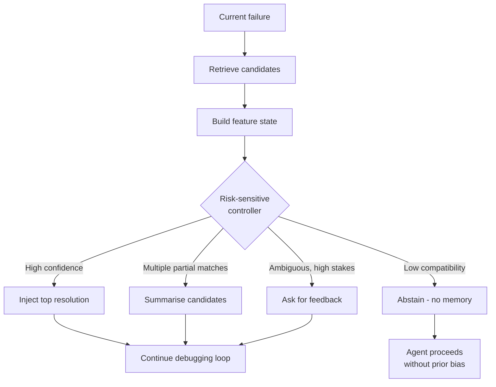

# Abstention-Aware Memory Retrieval

> Treat memory injection as a control decision with an asymmetric loss — abstaining is a first-class action when retrieved evidence is unsafe to inject.

## Top-k Is the Wrong Default

Coding-agent memory stores debugging episodes, repair traces, and repository-local operational knowledge so future failures can reuse prior work. The standard interface returns the top `k` most similar entries by embedding distance and injects them into context.

This treats memory as a search problem. It is not. Retrieved memory is useful only when the current failure is genuinely compatible with a previous one — superficial similarity in stack traces, terminal errors, paths, or configuration symptoms can lead to unsafe memory injection that biases the agent toward an inappropriate fix ([Iscan, 2026 — arXiv:2604.27283](https://arxiv.org/abs/2604.27283)).

The asymmetry matters: a missed reuse costs one extra debugging round, but a confidently injected wrong episode can drag a multi-turn loop down the wrong path before the agent recovers. Abstention-aware retrieval reframes the question — not *which* memory is most similar, but *whether any* retrieved memory is safe enough to influence the trajectory ([Iscan, 2026 — arXiv:2604.27283](https://arxiv.org/abs/2604.27283)).

## Abstention as a First-Class Action

A risk-sensitive controller decides between several actions on every retrieval, not just "return top-k". The action set in RSCB-MC includes:

- **No memory** — proceed without injection
- **Inject the top resolution** — high-confidence single-episode reuse
- **Summarise multiple candidates** — when several episodes are partially relevant
- **High-precision retrieval** — narrow filters, fewer candidates
- **High-recall retrieval** — broader search when the controller is uncertain
- **Abstain** — explicitly decline to inject and signal low confidence
- **Ask for feedback** — escalate to the user when stakes are high and signal is ambiguous

These are listed in the RSCB-MC paper's action space ([Iscan, 2026 — arXiv:2604.27283](https://arxiv.org/abs/2604.27283)). The shift from "rank and return" to "decide and possibly decline" is the load-bearing change.

## Features That Drive the Decision

A controller cannot decide on similarity alone. RSCB-MC converts each retrieval into a 16-feature contextual state covering:

- **Relevance** — embedding distance and lexical overlap
- **Uncertainty** — disagreement across candidates, score spread
- **Structural compatibility** — does the stored fix apply to the current code shape, framework, or environment
- **Feedback history** — how often this episode (or pattern) has been useful when injected before
- **False-positive risk** — historical rate at which similar matches misled the agent
- **Latency and token cost** — overhead of injection relative to its expected benefit

The full feature list is documented in the paper ([Iscan, 2026 — arXiv:2604.27283](https://arxiv.org/abs/2604.27283)). Two of these — feedback history and false-positive risk — require the controller to track outcomes over time, which means abstention-aware retrieval is not a static scoring layer but a learning system.

## Asymmetric Reward Design

The reward function shapes everything else. Symmetric loss — equal penalty for missed reuse and false-positive injection — recovers something close to top-k behaviour. The RSCB-MC reward instead penalises false-positive injection more strongly than missed reuse, which makes "no memory" and "abstain" the safe defaults whenever the controller is uncertain ([Iscan, 2026 — arXiv:2604.27283](https://arxiv.org/abs/2604.27283)).

In the paper's bounded smoke-scale and 200-case hot-path validations, RSCB-MC reports a 62.5% offline replay success rate and 60.5% proxy success rate respectively, both at 0.0% false-positive injection and a 331-microsecond p95 decision latency ([Iscan, 2026 — arXiv:2604.27283](https://arxiv.org/abs/2604.27283)). These are deterministic local artifacts, not production deployments — the principle is what transfers, not the absolute numbers.

## When the Pattern Pays Off

Abstention-aware retrieval is not free — it adds a learned policy, an outcome-tracking pipeline, and a feature pipeline in front of any memory store. It pays off when:

- The memory store is **large and heterogeneous** — episodes drawn from many projects, frameworks, or failure classes, where surface similarity routinely misleads
- **Feedback signals exist** — post-resolution validation (test outcomes, human review, regression checks) lets the controller learn its risk weights
- **False positives are expensive** — multi-turn debugging loops, autonomous agents, or production-adjacent flows where a wrong injection compounds across turns

It adds cost without value when the store is small and homogeneous, when feedback is sparse or noisy, during cold-start before the policy has trained, or in latency-sensitive paths where stacked controllers in multi-agent retrieval add visible overhead.

## Example

A repair-trace memory store accumulates fixes across a polyglot monorepo. A failing Python pytest run produces a `ConnectionRefusedError`, and the top retrieved episode is a Node.js test that hit the same exception class against a different mock harness.

**Top-k behaviour** — the agent injects the Node.js episode, infers it should mock the connection at the network layer, and spends three turns trying to apply a JavaScript-shaped fix to a Python codebase before recovering.

**Abstention-aware behaviour** — the controller's structural-compatibility feature scores the language and framework mismatch low, the false-positive-risk feature flags this as a known-misleading pattern, and the policy chooses **abstain**. The agent debugs from scratch, finds the test fixture issue, and stores a clean Python-specific episode for future retrieval.

The cost of abstaining was one missed reuse. The cost of injecting would have been three wasted turns plus a polluted memory entry that links Python failures to Node.js fixes.

## Key Takeaways

- Top-k retrieval optimises for similarity; abstention-aware retrieval optimises for safety under an asymmetric loss
- Abstain and no-memory are first-class actions, not failures of the retrieval system
- Decision features extend beyond similarity — uncertainty, structural compatibility, feedback history, and false-positive risk all matter
- The pattern earns its overhead when memory stores are large and heterogeneous and feedback signals support online learning

## Related

- [Episodic Memory Retrieval](episodic-memory-retrieval.md) — what to store and how to retrieve; this page covers whether to inject what was retrieved
- [Memory Reinforcement Learning (MemRL)](memory-reinforcement-learning.md) — utility-scored retrieval ranking; complementary to abstention-aware control
- [Agent Memory Patterns: Learning Across Conversations](agent-memory-patterns.md) — structural memory architecture this control layer sits in front of
- [Subtask-Level Memory for Software Engineering Agents](subtask-level-memory.md) — finer retrieval granularity that reduces but does not eliminate false-positive risk
- [Memory Synthesis from Execution Logs](memory-synthesis-execution-logs.md) — extracting reusable lessons from traces that this controller decides whether to inject
