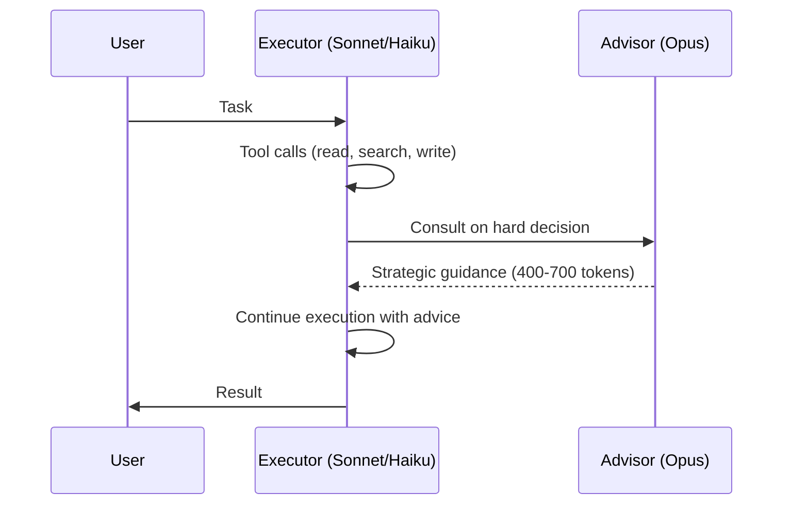

# The Advisor Strategy: Frontier Model as Strategic Advisor

> Pair a cost-effective executor model with a frontier advisor that provides strategic guidance on hard decisions — within a single API call, no orchestration required.

## The Pattern

Most agent turns are mechanical — reading files, running commands, writing code. A small number of turns require deep strategic reasoning: choosing an architecture, recovering from a dead end, verifying completeness. Running a frontier model on every turn wastes compute. Running only a cheap model misses the critical decisions.

The advisor strategy separates these concerns at the API level. A cost-effective executor (Sonnet or Haiku) handles end-to-end tool use and iteration. When facing a hard decision, it consults a frontier advisor (Opus) that reads the full transcript and returns strategic guidance. The executor continues, informed by the advice.

Anthropic's [`advisor_20260301` tool](https://platform.claude.com/docs/en/agents-and-tools/tool-use/advisor-tool) implements this as a server-side feature within a single `/v1/messages` request. No decomposition logic, no extra round-trips, no custom orchestration.



## How It Works

The executor decides when to call the advisor, just like any other tool. On invocation, the server runs a separate inference pass on the advisor model with the executor's full transcript (system prompt, tool definitions, all prior turns). The advisor returns strategic guidance as text — its thinking blocks are dropped. The executor resumes, informed by the advice.

The advisor never calls tools and never produces user-facing output. Guidance-only.

## API Integration

Add the advisor to the `tools` array alongside your existing tools. The beta header `advisor-tool-2026-03-01` is required during beta ([API docs](https://platform.claude.com/docs/en/agents-and-tools/tool-use/advisor-tool)):

```python
response = client.beta.messages.create(
    model="claude-sonnet-4-6",          # executor
    max_tokens=4096,
    betas=["advisor-tool-2026-03-01"],
    tools=[
        {
            "type": "advisor_20260301",
            "name": "advisor",
            "model": "claude-opus-4-6",  # advisor
            "max_uses": 3,               # per-request cap
        },
        # ... your other tools
    ],
    messages=[...],
)
```

| Parameter  | Type    | Default   | Purpose |
|-----------|---------|-----------|---------|
| `type`     | string  | required  | Must be `"advisor_20260301"` |
| `model`    | string  | required  | Advisor model ID — billed at this model's rates |
| `max_uses` | integer | unlimited | Per-request cap on advisor calls |
| `caching`  | object  | off       | Advisor-side prompt caching; breaks even at ~3 calls per conversation |

Supported executor-advisor pairs: Haiku 4.5 + Opus 4.6, Sonnet 4.6 + Opus 4.6, and Opus 4.6 + Opus 4.6. The advisor must be at least as capable as the executor ([API docs](https://platform.claude.com/docs/en/agents-and-tools/tool-use/advisor-tool)).

## Benchmark Results

Published benchmarks from [Anthropic's announcement](https://claude.com/blog/the-advisor-strategy):

| Configuration | Benchmark | Result | Cost Impact |
|--------------|-----------|--------|-------------|
| Haiku + Opus advisor | BrowseComp | 41.2% vs 19.7% solo (+109%) | 85% cheaper than Sonnet alone |
| Sonnet + Opus advisor | SWE-bench Multilingual | +2.7pp over Sonnet solo | -11.9% cost per agentic task |

The Haiku configuration more than doubles standalone performance while costing 85% less than Sonnet alone — though scoring 29% lower than Sonnet solo. The trade-off: near-Sonnet quality at Haiku prices.

## When to Consult the Advisor

The advisor adds value on decisions with high downstream cost if wrong. Anthropic's [recommended timing](https://platform.claude.com/docs/en/agents-and-tools/tool-use/advisor-tool) for coding tasks:

1. **After initial exploration** — once the executor has read enough files to understand the problem, consult the advisor before committing to an approach.
2. **When stuck** — errors recurring, approach not converging, results that do not fit.
3. **Before declaring done** — make the deliverable durable first (write the file, commit the change), then consult for a final review.

The advisor is a weaker fit for single-turn Q&A (nothing to plan), or workloads where every turn genuinely requires frontier capability.

## Cost Controls

Advisor tokens are billed at Opus rates; executor tokens at executor rates. The cost savings come from the advisor not generating the full output — only short strategic guidance ([API docs](https://platform.claude.com/docs/en/agents-and-tools/tool-use/advisor-tool)).

- **Per-request cap**: set `max_uses` to limit advisor calls within a single request.
- **Conversation-level cap**: track calls client-side. When you hit the ceiling, remove the advisor from `tools` and strip `advisor_tool_result` blocks from message history.
- **Output compression**: adding a conciseness instruction ("respond in under 100 words, enumerated steps") cut advisor output tokens by 35-45% in Anthropic's internal testing.
- **Effort pairing**: Sonnet at medium [effort](https://platform.claude.com/docs/en/agents-and-tools/tool-use/advisor-tool) + Opus advisor achieves comparable intelligence to Sonnet at default effort, at lower total cost.

## Relationship to General Patterns

The advisor strategy is an API-native implementation of established patterns:

- **[Cognitive reasoning vs execution separation](cognitive-reasoning-execution-separation.md)** — advisor as reasoning layer, executor as execution layer, boundary enforced server-side.
- **[Cost-aware agent design](cost-aware-agent-design.md)** — model routing by complexity without manual cascade logic.
- **[Reasoning budget allocation](reasoning-budget-allocation.md)** — the reasoning sandwich via selective advisor calls rather than per-phase model switching.

## Key Takeaways

- The advisor strategy pairs a cost-effective executor with a frontier advisor consulted only on hard decisions — no orchestration code required.
- A single API call handles the full flow: the executor invokes the advisor like any other tool, and the server manages context routing.
- Haiku + Opus advisor more than doubles standalone BrowseComp performance at 85% less cost than Sonnet alone.
- Cap advisor calls with `max_uses` (per-request) and client-side tracking (per-conversation) to control spend.
- Call the advisor after exploration, when stuck, and before declaring done — skip it on mechanical turns.

## Related

- [Cognitive Reasoning vs Execution: A Two-Layer Agent Architecture](cognitive-reasoning-execution-separation.md)
- [Cost-Aware Agent Design](cost-aware-agent-design.md)
- [Reasoning Budget Allocation](reasoning-budget-allocation.md)
- [Heuristic-Based Effort Scaling](heuristic-effort-scaling.md)
- [Evaluator-Optimizer Pattern](evaluator-optimizer.md)
- [Agent Turn Model](agent-turn-model.md)
