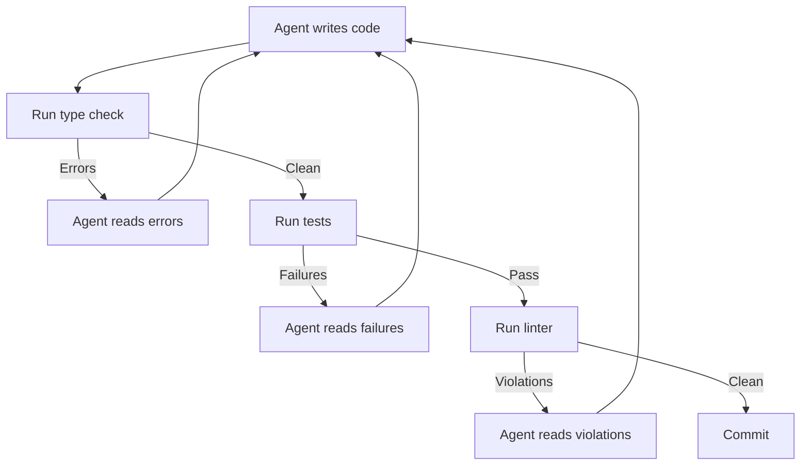

# Agent Backpressure: Automated Feedback for Self-Correction

> Automated tooling — type systems, test suites, linters, CI pipelines — creates feedback loops that agents use to self-correct without human intervention.

## What Backpressure Means

Backpressure, as defined by the [Latent Patterns glossary](https://latentpatterns.com/glossary), is the automated feedback signal that tells an agent when its output is wrong. The agent runs code, reads the error, fixes the issue, and runs again. No human review required in the loop.

The quality of an agent's output scales with the quality of the backpressure it operates against.

## Backpressure Sources

| Source | Signal | Precision |
|--------|--------|-----------|
| Type system / compiler | Type errors, compilation failures | Exact location and type of error |
| Test suite | Failing tests with assertion details | Exact expectation vs. actual |
| Linter | Convention violations with rule IDs | Exact rule and location |
| Formatter | Diff showing what changed | Deterministic, no ambiguity |
| CI pipeline | Integration-level failures | Cross-component issues tests miss |

Each source provides a different level of feedback precision. Type systems are the tightest loop — errors are immediate, precise, and unambiguous. CI pipelines catch integration issues that pass unit tests.

## Autonomy Scales with Backpressure

An agent operating in a codebase with strong types, comprehensive tests, and enforced linting can iterate to a correct solution autonomously. It doesn't need human feedback at each step because the tooling provides it. A [2025 survey of LLM agent feedback mechanisms](https://dl.acm.org/doi/10.24963/ijcai.2025/1175) identifies external environmental feedback — including compiler output and test results — as the most reliable category of feedback for agent self-correction.

An agent operating in a codebase with no types, no tests, and no linting produces output that looks syntactically correct but may be semantically wrong — and there's no automated signal to detect it.

## Enabling the Ralph Wiggum Loop

Backpressure pairs directly with the [Ralph Wiggum Loop](ralph-wiggum-loop.md): each iteration runs until the checks pass. The exit condition — all tests green, no type errors, linter clean — is defined by the tooling, not by the agent's self-assessment.

## Codebase Readiness

The value of backpressure is determined by the codebase, not the agent. Improving agent output quality in a given codebase means improving the codebase's backpressure coverage (see [Codebase Readiness for Agents](../workflows/codebase-readiness.md)):

- Add types where untyped code exists
- Add tests for logic the agent is likely to modify
- Enforce code style through CI rather than convention

These investments compound: they benefit both agents and human developers.

## Anti-Pattern: Operating Blind

Deploying agents against codebases with minimal backpressure maximizes the review burden on humans. Every agent output requires manual inspection because no automated signal catches errors. The agent produces more output faster than the team can review.

## When This Backfires

Backpressure is only as reliable as the signal quality. Three conditions where it misleads:

- **Test-gaming**: an agent can learn to make tests pass without solving the underlying problem — deleting assertions, hardcoding expected values, or writing tests that trivially succeed. Passing tests stop meaning "correct code" and start meaning "output the agent was able to satisfy." Mutation testing or property-based tests reduce this risk.
- **Domains with no reliable oracle**: creative work, user-facing copy, API design, and architectural decisions have no equivalent of a type error. In these domains backpressure either doesn't exist or is so coarse-grained (linter, formatter) that it can't catch the meaningful errors. Agents here require human review that backpressure was meant to replace.
- **Upfront investment cost**: comprehensive types, test coverage, and enforced linting take time to establish. For one-off tasks, short-lived scripts, or exploratory work, the investment to build quality backpressure exceeds the value of the autonomy it enables. The pattern pays off on large, long-lived, frequently modified codebases.

## Example

A TypeScript project with strict mode enabled gives an agent a tight backpressure loop. The agent adds a new function, runs `tsc --noEmit`, and receives an error: `Argument of type 'string' is not assignable to parameter of type 'number'`. The agent reads the error, fixes the type mismatch, and runs again. Clean. It then runs `jest` — two tests fail with assertion details showing the return value is off by one. The agent reads the failures, adjusts the logic, and reruns. All green. Finally it runs `eslint` — one violation: `no-unused-vars` on a helper it introduced. The agent removes the variable and reruns. Clean.

The full loop completes without human involvement. Each tool in the chain catches a different class of error; none overlap. The agent reaches a correct, reviewable state through automated feedback alone.

## Key Takeaways

- Backpressure is the automated feedback that enables agent self-correction without human intervention.
- Type systems, tests, linters, and CI each provide different levels of precision — use all of them.
- Agent autonomy scales directly with backpressure quality in the codebase.
- Improving codebase backpressure coverage is a high-leverage path to better agent output — it changes what errors the agent can detect, not just how it responds to them.

## Related

- [The Ralph Wiggum Loop](ralph-wiggum-loop.md)
- [Loop Strategy Spectrum](loop-strategy-spectrum.md)
- [Agent Self-Review Loop](agent-self-review-loop.md)
- [Evaluator-Optimizer](evaluator-optimizer.md)
- [Agent Pushback Protocol](agent-pushback-protocol.md)
- [Agent Composition Patterns](agent-composition-patterns.md)
- [Harness Engineering](harness-engineering.md) — making codebases agent-ready by building backpressure coverage into the repo
- [Cost-Aware Agent Design](cost-aware-agent-design.md)
- [Worktree Isolation](../workflows/worktree-isolation.md)
- [The Yes-Man Agent](../anti-patterns/yes-man-agent.md)
- [Agent Turn Model](agent-turn-model.md) — how the inference-tool-call loop operates within a single turn
- [Empowerment Over Automation](empowerment-over-automation.md)
- [Agent Harness](agent-harness.md) — initializer and coding agent pattern for structured long-running agent work
- [Agent Loop Middleware](agent-loop-middleware.md) — wrapping the agent loop with deterministic safety nets
- [Delegation Decision](delegation-decision.md) — matching task characteristics to agent strengths, including backpressure availability as a factor
- [Temporary Compensatory Mechanisms](temporary-compensatory-mechanisms.md) — compensating for model limitations through feedback loops and linter-based enforcement
- [Classical SE Patterns as Agent Design Analogues](classical-se-patterns-agent-analogues.md) — structural patterns for control and safety including feedback-driven iteration
