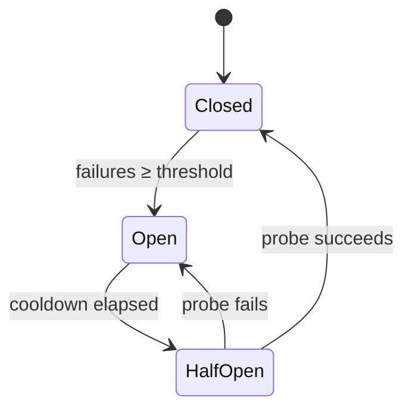

<!-- source: nibzard/awesome-agentic-patterns (Apache 2.0, https://github.com/nibzard/awesome-agentic-patterns) — retain attribution per license -->
---
title: "Agent Circuit Breaker"
description: "Wrap external tools with per-tool failure-tracking state machines that block calls during degraded states, preventing token waste on retry loops."
tags:
  - agent-design
  - tool-agnostic
aliases:
  - tool-level circuit breaker
  - circuit breaker pattern agents
---

# Agent Circuit Breaker

> Wrap each external tool in a per-tool state machine that tracks failures and automatically blocks calls when a tool is degraded — preventing agents from burning tokens on retry loops against unresponsive endpoints.

## The Problem

Agents using external tools (APIs, search engines, code executors) have a structural vulnerability: when a tool degrades mid-session, most agents enter retry loops. Each failed call consumes tokens, and the loop continues until context is exhausted or the session is abandoned. Simple retry logic with backoff doesn't solve this — it delays rather than prevents the waste.

The circuit breaker pattern, adapted from distributed systems, tracks per-tool failure rates and temporarily disables broken endpoints. Agents are then forced to attempt alternatives or degrade gracefully rather than repeating calls that will fail.

## State Machine

Each tool is tracked by an independent three-state machine ([nibzard/awesome-agentic-patterns](https://github.com/nibzard/awesome-agentic-patterns/blob/main/patterns/agent-circuit-breaker.md)):

| State | Behavior |
|-------|----------|
| **Closed** | Normal operation. Failures are counted. |
| **Open** | All calls blocked immediately — no invocation, no tokens spent. |
| **Half-Open** | One probe call allowed to test recovery. Success resets to Closed; failure returns to Open. |

The key distinction from simple retry: during Open state, the agent receives an immediate `CircuitOpenError` without making the tool call at all.

## Configuration

Thresholds vary by tool class. Fast tools fail quickly and recover quickly; slow tools need more patience before declaring failure:

| Tool type | Failure threshold | Cooldown |
|-----------|-------------------|----------|
| Fast APIs (search, weather) | 3 failures | 30 s |
| Slow tools (web scraping, compilation) | 2 failures | 120 s |
| Code executors | 2 failures | 60 s |

State is session-scoped — circuit breakers reset between agent sessions. This is intentional: a tool degraded during one session may recover before the next.

## Graceful Degradation

Circuit breakers are only useful if agents respond to `CircuitOpenError` by attempting alternatives rather than stopping. This requires:

1. **System prompt awareness** — the agent must know which tools are currently unavailable. Update the system prompt or provide a tool-status context block when a circuit opens.
2. **Fallback routing** — the agent attempts alternative tools for the same operation (e.g., a secondary search API when the primary opens).
3. **Explicit acknowledgment** — if no alternative exists, the agent reports the degradation to the user rather than silently looping.

Without graceful degradation logic, a circuit breaker stops token waste but also stops progress. The pattern requires both components.

## Distinct From Loop-Level Circuit Breakers

This pattern operates at the **tool call level** — each individual tool has its own state machine. This is different from loop-level stopping mechanisms (iteration limits, cost thresholds, repetition detection) covered in [Circuit Breakers for Agent Loops](../observability/circuit-breakers.md), which operate on the overall agent execution loop.

The two are complementary: loop-level breakers prevent runaway agents; tool-level breakers prevent token waste from degraded external dependencies.

## Unverified Claims

- **40–60% token savings** — this figure is sourced from the nibzard/awesome-agentic-patterns catalog (evidence grade: medium). No independent study has confirmed this range. Actual savings depend on session length, tool reliability, and whether graceful degradation is implemented.

## Key Takeaways

- Track failure state per-tool, not globally — one degraded API should not block unrelated tool calls
- Open state must block calls entirely, not just slow them — delayed retries still waste tokens
- Half-Open state enables automatic recovery without manual intervention or session restart
- Graceful degradation (fallback routing or user notification) is required alongside the circuit breaker; the state machine alone only stops waste, it does not preserve progress
- State is session-scoped by default; persistent state across sessions adds complexity without proportional benefit for most agent use cases

## Related

- [Exception Handling and Recovery Patterns](exception-handling-recovery-patterns.md) — broader taxonomy of agent failure modes and recovery strategies
- [Circuit Breakers for Agent Loops](../observability/circuit-breakers.md) — loop-level stopping mechanisms (iteration limits, cost thresholds)
- [Rollback-First Design: Every Agent Action Should Be Reversible](rollback-first-design.md) — designing operations to be undoable when failures occur
- [Agent Backpressure: Automated Feedback for Self-Correction](agent-backpressure.md) — using automated signals to steer agents away from failure states
