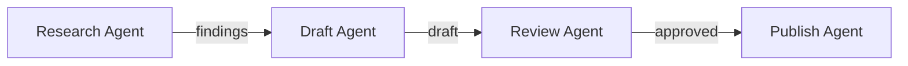
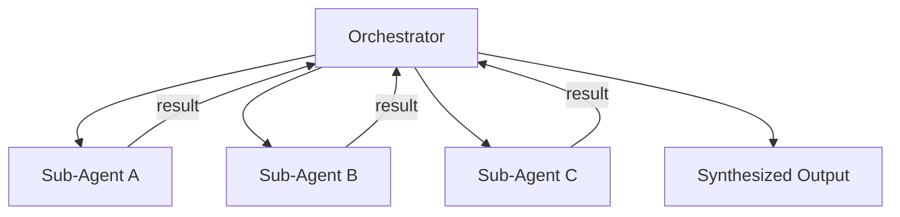
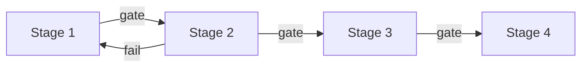

# Agent Composition Patterns: Chains, Fan-Out, Pipelines, Supervisors

> Multi-agent workflows follow four structural patterns — sequential chains, parallel fan-out, staged pipelines, and supervisor-coordinator — each suited to different task structures. Chaining tactics, model-level specialization, and agent portability extend these into production.

!!! note "Also known as"
    Parallel Dispatch, Scatter-Gather, Orchestrator-Worker, Sub-Agents Fan-Out. For specific variants, see [Fan-Out Synthesis](../multi-agent/fan-out-synthesis.md), [Orchestrator-Worker](../multi-agent/orchestrator-worker.md), and [Sub-Agents Fan-Out](../multi-agent/sub-agents-fan-out.md).

## Why Composition

A single agent hits two limits: context exhaustion (too much work for one window) and scope confusion (too many concerns for one prompt). Composition distributes work across agents with focused scope and isolated context. The wrong pattern adds overhead.

## Sequential Chain

Each agent's output becomes the next agent's input. A → B → C.



**When to use:** Strict dependencies — B cannot start until A completes.

**Trade-off:** No parallelism; latency accumulates across steps.

**Example:** [Content pipeline](../workflows/content-pipeline.md) — research → draft → review → publish.

### Multi-Phase Chain Tactics

Production chains span four phases ([Source: ClaudeLog](https://claudelog.com/mechanics/custom-agent-tactics)): research, analysis, implementation, and validation. Each handoff is an explicit artifact — findings document, patch set, or test report.

In Claude Code, chain subagents through the main conversation — each completes before the next dispatches ([Sub-Agents docs](https://code.claude.com/docs/en/sub-agents)):

```
Use the code-reviewer subagent to find performance issues,
then use the optimizer subagent to fix them
```

Subagents cannot spawn other subagents — the main conversation coordinates chaining.

## Parallel Fan-Out

One agent spawns N sub-agents for independent work, then synthesizes results.



**When to use:** N independent tasks — reviewing N files, fetching N URLs, analyzing N data sources.

**Trade-off:** Fast (parallel execution). The orchestrator must synthesize results.

**Example:** Parallel reviewers for code quality, type safety, and test coverage — each sub-agent gets its own context window. See [Sub-Agents for Fan-Out](../multi-agent/sub-agents-fan-out.md) and [Specialized Agent Roles](specialized-agent-roles.md).

## Pipeline

Sequential stages with quality gates — chains with explicit validation at each boundary.



**When to use:** Repeatable processes where output quality at each stage gates progress.

**Trade-off:** Explicit pass/fail at each boundary, with feedback loops on failure.

**Example:** CI/CD pipeline — build → test → security scan → deploy. Each gate blocks until criteria are met.

## Supervisor

A coordinator agent decides what to delegate, to whom, and when.

**When to use:** Tasks where the sequence and delegation targets are not known upfront.

**Trade-off:** More flexible but harder to debug. The supervisor needs sufficient context.

**Example:** An agent receives "make this codebase production-ready" and decomposes into: security review, test coverage, documentation.

## Choosing the Right Pattern

| Pattern | Task structure | Parallelism | Flexibility |
|---------|---------------|-------------|-------------|
| Chain | Strict dependencies | No | Low |
| Fan-Out | Independent parallel tasks | Yes | Low |
| Pipeline | Repeatable stages with gates | Stage-level | Medium |
| Supervisor | Unknown or dynamic task structure | Dynamic | High |

Start with the simplest pattern — chains and fan-out cover most cases.

## Agent Portability

In Claude Code, a subagent is a `.md` file in `.claude/agents/` (project-scoped) or `~/.claude/agents/` (user-scoped) ([Sub-Agents docs](https://code.claude.com/docs/en/sub-agents)). Check agents into version control.

Use tool discovery (Glob, Grep) instead of hardcoded paths so agents adapt to any repo.

## Weak-Model Specialization

Route narrow tasks to cost-efficient models (Haiku), reserving capable models (Sonnet) for complex work ([Anthropic: Building Effective Agents](https://www.anthropic.com/engineering/building-effective-agents)). Claude Code's Explore subagent defaults to Haiku for read-only search ([Sub-Agents docs](https://code.claude.com/docs/en/sub-agents)):

```yaml
---
name: lint-checker
description: Run linting and report issues
tools: Bash, Read
model: haiku
---
```

## Situational Agent Activation

Activate agents via CLI flags instead of coordinator judgment. Claude Code's `--agents` flag defines session-scoped agents as JSON ([Sub-Agents docs](https://code.claude.com/docs/en/sub-agents)):

```bash
claude --agents '{
  "code-reviewer": {
    "description": "Expert code reviewer. Use proactively after code changes.",
    "prompt": "You are a senior code reviewer...",
    "tools": ["Read", "Grep", "Glob", "Bash"],
    "model": "sonnet"
  }
}'
```

## Example

A documentation site audit needs to lint every page, check links, and validate frontmatter. The tasks are independent per page — fan-out fits:

```markdown
<!-- .claude/agents/audit-orchestrator.md -->
---
description: Fan out one audit-worker per page, collect results
tools: Bash, Glob, Grep, Read
---

Glob for all `docs/**/*.md` files. For each file, dispatch the
`audit-worker` subagent with the file path. Collect each worker's
JSON result and merge into a single report.
```

```markdown
<!-- .claude/agents/audit-worker.md -->
---
description: Lint, check links, validate frontmatter for one page
tools: Bash, Read, Grep
---

1. Lint the page for formatting errors.
2. Extract internal links and verify each target exists.
3. Validate frontmatter has required fields.
Return a JSON object with the page path and findings.
```

Each worker runs a sequential chain internally (lint → links → frontmatter), while the orchestrator fans out across pages. This combines two patterns: fan-out at the top level, chains within each worker.

If the audit later needs a gate — pages with critical findings block deployment — wrap the fan-out in a pipeline with a quality gate after synthesis.

## Anti-Patterns

**One mega-agent:** Context fills before work completes. Decompose when one prompt cannot hold all concerns.

**Over-decomposition:** Coordination costs tokens — decompose only when context limits or parallelism require it.

## Related

- [Fan-Out Synthesis Pattern](../multi-agent/fan-out-synthesis.md)
- [Orchestrator-Worker Pattern](../multi-agent/orchestrator-worker.md)
- [Sub-Agents for Fan-Out Research and Context Isolation](../multi-agent/sub-agents-fan-out.md)
- [Claude Code Sub-Agents](../tools/claude/sub-agents.md)
- [Specialized Agent Roles](specialized-agent-roles.md)
- [Agents vs Commands: Separation of Role and Workflow](agents-vs-commands.md)
- [Worktree Isolation](../workflows/worktree-isolation.md)
- [Cost-Aware Agent Design](cost-aware-agent-design.md)
- [Agent Handoff Protocols](../multi-agent/agent-handoff-protocols.md)
- [Agent Backpressure: Automated Feedback for Self-Correction](agent-backpressure.md)
- [Agent-First Software Design](agent-first-software-design.md)
- [Agent Harness: Initializer and Coding Agent](agent-harness.md)
- [Agent Memory Patterns: Learning Across Conversations](agent-memory-patterns.md)
- [Model a Single Agent Turn as Many Inference and Tool-Call Iterations](agent-turn-model.md)
- [Agentic Flywheel: Self-Improving Agent Systems](agentic-flywheel.md)
- [Agentic AI Architecture: From Prompt to Goal-Directed](agentic-ai-architecture-evolution.md)
- [Harness Engineering for Building Reliable AI Agents](harness-engineering.md)
- [Cognitive Reasoning vs Execution: A Two-Layer Agent](cognitive-reasoning-execution-separation.md)
- [Separation of Knowledge and Execution in Agent Systems](separation-of-knowledge-and-execution.md)
- [Loop Strategy Spectrum: Accumulated vs Fresh Context](loop-strategy-spectrum.md)
- [Delegation Decision](delegation-decision.md)
- [Evaluator-Optimizer](evaluator-optimizer.md)
- [Event-Driven Agent Routing](event-driven-agent-routing.md)
- [Progressive Disclosure Agents](progressive-disclosure-agents.md)
- [Classical SE Patterns as Agent Design Analogues](classical-se-patterns-agent-analogues.md)
- [Agent Self-Review Loop](agent-self-review-loop.md)
- [Agent Loop Middleware](agent-loop-middleware.md)
