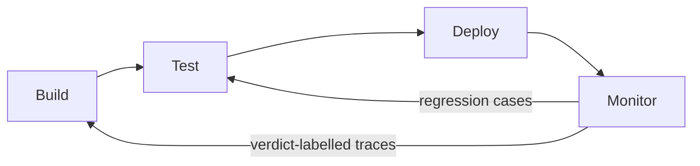

# Agent Development Lifecycle for Agent Products

> A four-phase loop — build, test, deploy, monitor — for teams whose unit of work is the agent itself, with verdict-labelled traces from production feeding the next evaluation cycle.

## A Lifecycle for the Agent, Not the Feature

Two SDLC framings already live on the project. [The 7 Phases of AI Development](../workflows/7-phases-ai-development.md) is a feature-level workflow for using an agent to ship code. [SDLC-Phase Skill Taxonomy](../workflows/sdlc-skill-taxonomy.md) organises a skill library so an agent acting on a codebase activates the right skills. Both treat the agent as the implement; the unit of work is the codebase.

The Agent Development Lifecycle (ADLC), formalised by Harrison Chase on 2026-05-09 ([LangChain blog](https://www.langchain.com/blog/the-agent-development-lifecycle)), inverts that. The agent is the product. The lifecycle covers how teams build, test, deploy, and monitor that product, and how production signals close the loop back to the next build.

The ordering is deliberate: test before deploy, monitor after deploy, feed learnings into the next build. Each phase produces an artifact the next phase consumes — a scope doc, an eval verdict, a deploy artifact, a verdict-labelled trace corpus.

## The Four Phases

### Build

Define scope, choose the architecture, wire the harness. LangChain names LangGraph as its build layer, and now extends the phase beyond code: LangSmith Fleet, Claude Cowork, and n8n are cited as no-code and low-code surfaces that let non-engineers participate ([LangChain blog](https://www.langchain.com/blog/the-agent-development-lifecycle)). Produces: a runnable agent plus a scope doc the test phase can score against.

### Test

Score the agent against an eval suite **before** it touches production. [Eval-Driven Development](../workflows/eval-driven-development.md) covers the discipline: define success criteria first, then build toward them. Without that ordering, teams reverse-engineer success from a live system and embed the agent's current bugs into the definition of correct. Produces: a pass/fail verdict and a deploy artifact gated on it.

### Deploy

Ship the agent in a controlled way. Canary rollouts, traffic shadowing, and rollback paths apply directly — [Canary Rollout for Agent Policy](../workflows/canary-rollout-agent-policy.md) covers the mechanics. Produces: a running deployment plus the observability hooks the monitor phase consumes.

### Monitor

Trace every run, label every trace with a verdict, alert on drift. Useful agent dashboards track usage, feedback, latency, cost, tool calls, evaluator scores, and recurring failure patterns ([LangChain blog](https://www.langchain.com/blog/the-agent-development-lifecycle)).

The verdict step is the load-bearing one. [Traces Need Feedback to Power Learning](../observability/traces-need-feedback-to-power-learning.md) covers the four feedback sources — deterministic rule, LLM-as-judge, indirect user signal, direct user verdict — and the OTel `gen_ai.evaluation.result` channel for attaching them to the same trace. Without that coupling, the monitor phase generates trajectories nobody can act on. Produces: a verdict-labelled trace corpus and a stream of regression cases for the next test cycle.

## Closing the Loop

The four phases only matter if signal flows between them. Two project pages already operationalise the back-edges:

- [Bootstrap Incident-to-Eval](../agent-readiness/bootstrap-incident-to-eval.md) converts each production incident into a regression eval case with a severity tier and a CI gate. This is the Monitor → Test edge in concrete form.
- [Continuous Agent Improvement](../workflows/continuous-agent-improvement.md) covers the observation-to-update loop for agent configurations — the Monitor → Build edge.

The mechanism beneath both: **agents fail on distributions, not on cases**. A bug-fix-and-redeploy loop optimises for one failing trace; a four-phase lifecycle with verdict-labelled traces optimises for the failure-rate trend across a population of traces. The phases are the minimum cut points where verdict-carrying signal can flow back.

## When ADLC Adds Value

The lifecycle pays off when regression cost exceeds four-phase ceremony cost. That threshold rises with:

- Multi-tenant or multi-user agent products where one regression affects many sessions
- Long-horizon agents whose failure modes only surface across populations of runs
- Teams with at least one prior regression that cost real time

## When It Does Not

The framing also has clear failure conditions where the ceremony costs more than it returns:

- **Single-agent solo team, pre-PMF**: the collapsed cycle — rebuild, redeploy, glance at logs — dominates until a regression has actually hurt. The four phases describe a destination state, not a starting state.
- **Stateless one-shot agents**: deterministic-enough tool surfaces benefit more from classical web-service SRE than from an agent-specific lifecycle.
- **Pure batch or cron-driven agents with no user-facing surface**: three of the four feedback sources are unavailable, so the monitor phase shrinks to deterministic-rule scoring and the lifecycle loses much of its signal advantage.
- **Multi-tenant agents with strict privacy or retention constraints**: trace storage feeding back into evals can violate compliance unless feedback is collected without persisting tenant inputs — significant infrastructure cost before the loop closes.

In every case, ship the rebuild loop first; let the four phases differentiate as the failure modes surface.

## Tool Mapping Is Not the Pattern

LangChain names its own stack alongside the lifecycle: LangGraph for build, LangSmith for test and monitor, LangSmith Deployment for deploy ([LangChain blog](https://www.langchain.com/blog/the-agent-development-lifecycle), [LangSmith and LangGraph in 2026, Medium](https://medium.com/@sehaj23chawla/langsmith-and-langgraph-in-2026-how-langchains-agent-stack-quietly-became-the-default-f1609af5d658)). Other vendors converge on parallel framings — Domino's "Agentic AI Development Lifecycle" ([NAND Research](https://nand-research.com/domino-data-lab-winter-release-2026-the-agentic-ai-development-lifecycle/)) and EPAM's "Agentic Development Lifecycle" ([EPAM](https://www.epam.com/insights/ai/blogs/agentic-development-lifecycle-explained)) describe the same loop shape.

The pattern is the four phases and the back-edges that connect them. The vendor stack is one instantiation. Any agent-product team using Claude API, OpenAI SDK, Bedrock, or in-house tooling can wire the same lifecycle out of OTel traces, an eval runner, and a deploy pipeline.

## Key Takeaways

- ADLC is a meta-lifecycle for the agent product itself — distinct from a feature-level SDLC or a skill-library SDLC; same loop shape, different unit of work.
- The four phases — build, test, deploy, monitor — produce explicit hand-off artifacts: scope doc, eval verdict, deploy artifact, verdict-labelled traces.
- The Monitor → Test back-edge is operationalised by an incident-to-eval pipeline; the Monitor → Build back-edge by a continuous-improvement loop.
- The mechanism is distributional: verdict-labelled traces let teams optimise failure-rate trends, not one-off failing cases.
- The lifecycle is not free — small teams pre-PMF, stateless one-shot agents, batch jobs with no user surface, and privacy-constrained agents should ship the collapsed rebuild loop first.

## Related

- [The 7 Phases of AI Development](../workflows/7-phases-ai-development.md) — feature-level SDLC for using an agent to ship code; contrast point.
- [SDLC-Phase Skill Taxonomy](../workflows/sdlc-skill-taxonomy.md) — lifecycle for an agent acting on a codebase; contrast point.
- [Eval-Driven Development](../workflows/eval-driven-development.md) — the test phase, in depth.
- [Traces Need Feedback to Power Learning](../observability/traces-need-feedback-to-power-learning.md) — how the monitor phase produces verdict-labelled traces.
- [Bootstrap Incident-to-Eval](../agent-readiness/bootstrap-incident-to-eval.md) — the Monitor → Test back-edge.
- [Bootstrap Eval Suite](../agent-readiness/bootstrap-eval-suite.md) — the test-phase scaffolding.
- [Continuous Agent Improvement](../workflows/continuous-agent-improvement.md) — the Monitor → Build back-edge.
- [Canary Rollout for Agent Policy](../workflows/canary-rollout-agent-policy.md) — the deploy phase, in depth.
