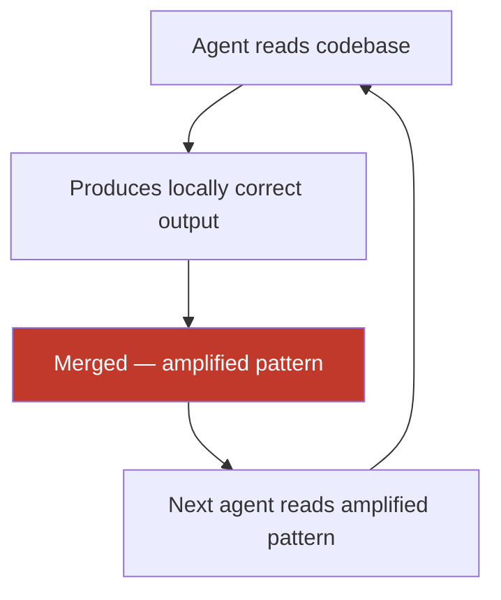

# Emergent Architecture in AI-Driven Codebases

> AI coding agents produce codebases with measurable architectural biases — not through mistakes, but through how agents work. Recognizing the fingerprint lets teams audit what agents built and intervene before the biases compound.

## The Core Problem

Human architects make deliberate decisions. Agents make locally optimal decisions. A codebase built by agents develops architectural character through accumulated bias rather than design intent — no single PR looks wrong; the aggregate does.

This is a structural property of how agents work: context-window blindness to architectural rationale, training-frequency priors on tool selection, and output-completeness bias.

## The Four Measurable Biases

### 1. Pattern Replication at Scale

Agents read existing code and reproduce patterns faithfully — including deprecated APIs, legacy workarounds, and known anti-patterns. They do not distinguish between golden-path implementations and code marked for removal.

| Metric | Finding | Source |
|--------|---------|--------|
| Copy/paste code share | Rose from 8.3% → 12.3% | [GitClear, 211M lines](https://www.gitclear.com/ai_assistant_code_quality_2025_research) |
| Refactoring share | Dropped from 25% → under 10% | [GitClear](https://www.gitclear.com/ai_assistant_code_quality_2025_research) |
| Static analysis warnings | ~30% increase post-AI adoption | [CMU study, 807 repos](https://blog.robbowley.net/2025/12/04/ai-is-still-making-code-worse-a-new-cmu-study-confirms/) |
| Cognitive complexity | 40%+ increase | [CMU study](https://blog.robbowley.net/2025/12/04/ai-is-still-making-code-worse-a-new-cmu-study-confirms/) |

A legacy `fetchWithRetry` utility with three existing usages becomes 23 usages after two sprints of agent work. Each usage is correct in isolation. The utility now costs 23-file migrations to remove.

### 2. Abstraction Bloat

Agents optimize for comprehensive-looking output: a notification sender returns a rate limiter, analytics hook, and abstract factory never requested. LoC increases 76% in agent-assisted repositories; cognitive complexity rises 39% ([Agile Pain Relief](https://agilepainrelief.com/blog/ai-generated-code-quality-problems/)). The bias is directional: agents add abstractions rather than collapse them, and refactoring drops because each task is treated as greenfield.

### 3. Symptomatic Fixes Over Root-Cause Diagnosis

Agents address observable failures rather than underlying causes ([Mason, 2026](https://mikemason.ca/writing/ai-coding-agents-jan-2026/)): memory limits raised instead of leaks found; retry loops added instead of error sources fixed; deprecated APIs wrapped in compatibility layers instead of migrated. These fixes pass tests; the structural issue persists under accumulating compatibility layers.

### 4. Training-Frequency Stack Convergence

When asked to choose tools, agents recommend by training data frequency, not fitness. Greenfield projects tend to converge on a narrow stack regardless of requirements. The mechanism: more training examples → higher confidence → stronger default recommendation.

## Why Biases Compound in Multi-Agent Systems

Coordinated agents assigned to separate files each optimize their slice without awareness of adjacent slices — per-file correctness with cross-file coherence gaps in shared types, naming, and error handling.

[Lavaee (OpenAI)](https://alexlavaee.me/blog/openai-agent-first-codebase-learnings/): pattern replication amplifies with each successive agent run.

## Auditing an Agent-Driven Codebase

When inheriting an agent-built codebase, check these signals:

**Duplication and refactoring ratio** — run a duplication scanner; compare refactoring to feature commits. Agent codebases frequently fall under 10% refactoring share (healthy: above 15%).

**ADR compliance** — agents do not read ADRs unless in the active context window.

**Cross-cutting concerns** — review error handling, logging, and authentication across modules separately; coherence gaps concentrate here.

**Technology stack** — verify tool choices reflect requirements; agents default to most-represented training corpus tools.

**Abstraction depth** — single-implementation abstract base classes and factory patterns wrapping simple operations are reliable bloat indicators.

## When This Backfires

- **Small codebases** — enforcement overhead (CI rules, ADR maintenance) rarely pays back in projects under six months or ten engineers.
- **Partial enforcement** — rules ignored by half the repos create false confidence; inconsistent application is worse than none.
- **Refactoring during scale-up** — simultaneous cleanup and agent expansion re-introduces biases faster than they're removed; stabilize scope first.
- **Threshold-only duplication alerts** — copy/paste rate is not a proxy for architectural health; high duplication in generated test scaffolding is benign, and noise erodes trust in the signal.

## Mitigations

| Intervention | Mechanism | Source |
|---|---|---|
| Machine-readable architectural rules (AGENTS.md, CLAUDE.md) | Makes architectural context available in the agent's active window | [JetBrains AIR; Lavaee](https://alexlavaee.me/blog/openai-agent-first-codebase-learnings/) |
| Deterministic enforcement (linters, CI checks) | Rejects anti-patterns mechanically — prose instructions fail when contradicted by codebase examples | [Fowler/Bockeler — rigor relocation](https://martinfowler.com/articles/exploring-gen-ai/harness-engineering.html); see also [Rigor Relocation](../human/rigor-relocation.md) |
| Explicit simplicity directives | Counteracts abstraction-bloat bias at prompt level | [Fowler/Garg — design-first collaboration](https://martinfowler.com/articles/reduce-friction-ai/design-first-collaboration.html) |
| Garbage-collection agents | Background agents scan for constraint violations and architectural inconsistencies | [Fowler/Bockeler](https://martinfowler.com/articles/exploring-gen-ai/harness-engineering.html) |
| Mandatory review gates | Prevents compounding drift on shared repositories | [Fowler/Bockeler](https://martinfowler.com/articles/exploring-gen-ai/harness-engineering.html) |

Remediate existing anti-patterns before scaling agent usage — OpenAI's harness team spent 20% of sprint time on cleanup before arriving at a systematic approach ([Lavaee](https://alexlavaee.me/blog/openai-agent-first-codebase-learnings/)).

## Example

An engineering team inherits a codebase built over six months using an autonomous coding agent. The handoff includes no ADRs and no architectural documentation.

**Audit findings using the fingerprint above:**

- Duplication rate: 14.2% (elevated; baseline for this language is ~8%)
- Refactoring commits: 4% of total commits
- Cross-cutting concerns: 6 different error-handling patterns across 12 modules; logging format inconsistent across service boundaries
- Technology stack: all external calls use `axios` with hand-rolled retry logic — team's standard is `got` with a centralized retry policy
- Abstraction depth: 11 abstract base classes, 9 with a single concrete implementation

The team uses this scan to prioritize: the retry-logic inconsistency affects 14 integration points and is addressed first with a CI lint rule rejecting direct HTTP calls outside the approved wrapper.

## Key Takeaways

- Agent-driven codebases accumulate architectural character through emergent bias, not design — recognizing the four biases (pattern replication, abstraction bloat, symptomatic fixes, stack convergence) enables targeted audits
- Per-file correctness does not imply cross-file coherence; multi-agent systems create coherence gaps at module boundaries
- Machine-readable architectural rules and deterministic enforcement are more reliable than prose instructions for steering agent architectural decisions
- Audit before you refactor: measure duplication, refactoring share, ADR compliance, and abstraction depth to prioritize where bias has compounded most

## Related

- [Shadow Tech Debt](../anti-patterns/shadow-tech-debt.md) — how each individually correct PR accumulates into structural drift
- [Pattern Replication Risk](../anti-patterns/pattern-replication-risk.md) — detailed treatment of pattern amplification: mechanism, evidence, mitigation
- [Abstraction Bloat](../anti-patterns/abstraction-bloat.md) — over-engineering from output-completeness bias; measurable impact and mitigations
- [Boring Technology Bias](../anti-patterns/boring-technology-bias.md) — training-frequency priors on tool selection
- [Codebase Readiness for Agents](../workflows/codebase-readiness.md) — preparing a codebase before scaling agent usage
- [Harness Engineering](harness-engineering.md) — structural constraints on agent behavior
- [Deterministic Guardrails](../verification/deterministic-guardrails.md) — linters and CI as the primary enforcement layer
- [Implicit Knowledge Problem](../anti-patterns/implicit-knowledge-problem.md)
- [Agent-Driven Greenfield Product Development](../workflows/agent-driven-greenfield.md) — why architectural rationale is invisible to agents by default
