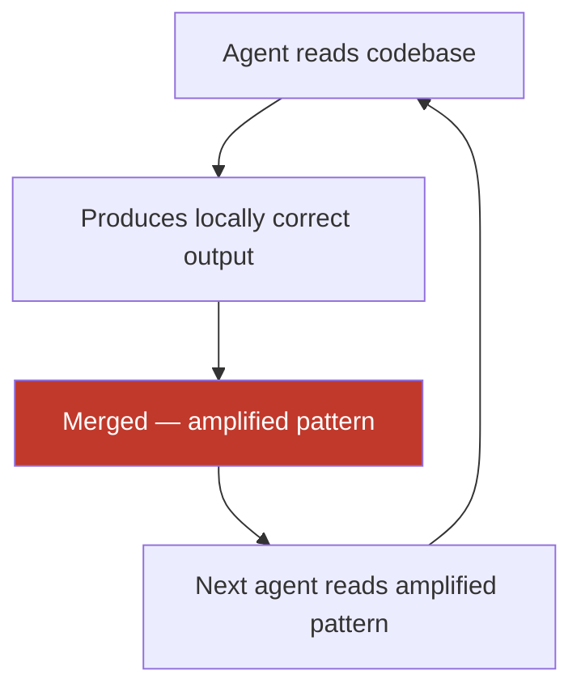

# Emergent Architecture in AI-Driven Codebases

> AI coding agents produce codebases with measurable architectural biases; recognizing the fingerprint lets teams audit what agents built before the biases compound.

## The core problem

Human architects decide deliberately; agents decide locally. A codebase built by agents accumulates character through bias, not design intent. No single PR looks wrong, but the aggregate does. The agent cannot see rationale beyond its context window, picks tools by training frequency, and favors complete-looking output.

## The four measurable biases

### 1. Pattern replication at scale

Agents reproduce the patterns they read, including deprecated APIs, legacy workarounds, and known anti-patterns. They cannot tell golden-path code from code marked for removal.

| Metric | Finding | Source |
|--------|---------|--------|
| Copy/paste code share | Rose from 8.3% → 12.3% | [GitClear, 211M lines](https://www.gitclear.com/ai_assistant_code_quality_2025_research) |
| Refactoring share | Dropped from 25% → under 10% | [GitClear](https://www.gitclear.com/ai_assistant_code_quality_2025_research) |
| Static analysis warnings | ~30% increase post-AI adoption | [CMU study, 807 repos](https://blog.robbowley.net/2025/12/04/ai-is-still-making-code-worse-a-new-cmu-study-confirms/) |
| Cognitive complexity | 40%+ increase | [CMU study](https://blog.robbowley.net/2025/12/04/ai-is-still-making-code-worse-a-new-cmu-study-confirms/) |

A `fetchWithRetry` utility with three usages becomes 23 after two agent sprints. Each usage is correct alone. Removing it now costs a 23-file migration.

A 2026 MSR study qualifies that number: duplication effects are "small and inconsistent", with the real risk in structural complexity, not copy/paste growth ([Agarwal et al., MSR 2026](https://arxiv.org/abs/2601.13597)). Treat copy/paste rate as a weak signal; cognitive complexity and static-analysis warnings are the stable indicators.

### 2. Abstraction bloat

A notification sender comes back with a rate limiter, an analytics hook, and an abstract factory no one asked for. Lines of code rise 76% in agent-assisted repositories, and cognitive complexity rises 39% ([Agile Pain Relief](https://agilepainrelief.com/blog/ai-generated-code-quality-problems/)). Agents add abstractions rather than remove them, and refactoring drops as each task is treated as greenfield.

### 3. Symptomatic fixes over root-cause diagnosis

Agents fix the failure you can see, not the cause underneath ([Mason, 2026](https://mikemason.ca/writing/ai-coding-agents-jan-2026/)). They raise memory limits instead of finding the leak, add retry loops instead of fixing the error source, and wrap deprecated APIs instead of migrating them. The fixes pass tests; the structural problem persists.

### 4. Training-frequency stack convergence

Asked to choose tools, agents recommend by training frequency, not fitness. Greenfield projects then converge on a narrow stack whatever the requirements, the [boring-technology bias](../anti-patterns/boring-technology-bias.md).

## Why biases compound in multi-agent systems

Coordinated agents each own a file and optimize their slice, blind to the rest. Each file is correct alone, but coherence breaks across files in shared types, naming, and error handling.

```mermaid
graph TD
    A[Agent reads codebase] --> B[Produces locally correct output]
    B --> C[Merged — amplified pattern]
    C --> D[Next agent reads amplified pattern]
    D --> A
    style C fill:#c0392b,color:#fff
```

[Lavaee (OpenAI)](https://alexlavaee.me/blog/openai-agent-first-codebase-learnings/): pattern replication amplifies with each successive agent run.

## Auditing an agent-driven codebase

Inheriting an agent-built codebase, check these signals:

- Duplication and refactoring ratio — compare refactoring to feature commits; agent codebases often fall under 10%, where healthy is above 15%.
- ADR compliance — agents ignore ADRs outside the active context window.
- Cross-cutting concerns — review error handling, logging, and auth across modules; gaps concentrate here.
- Technology stack — check that tool choices fit the requirements, not training frequency.
- Abstraction depth — single-implementation abstract base classes and factories wrapping simple operations are reliable [abstraction-bloat](../anti-patterns/abstraction-bloat.md) indicators.

## When this backfires

- Small codebases — overhead such as CI rules and ADR upkeep rarely pays back under 6 months or 10 engineers.
- Partial enforcement — rules that half the repos ignore create false confidence. Inconsistent application is worse than none.
- Refactoring during scale-up — cleaning up while you expand agent use re-introduces biases faster than you remove them. Stabilize scope first.
- Threshold-only duplication alerts — copy/paste rate is not a proxy for architectural health. High duplication in generated test scaffolding is benign, and the noise erodes trust.

## Mitigations

| Intervention | Mechanism | Source |
|---|---|---|
| Machine-readable architectural rules (AGENTS.md, CLAUDE.md) | Makes architectural context available in the agent's active window | [JetBrains AIR; Lavaee](https://alexlavaee.me/blog/openai-agent-first-codebase-learnings/) |
| Deterministic enforcement (linters, CI checks) | Rejects anti-patterns mechanically — prose instructions fail when contradicted by codebase examples | [Fowler/Bockeler — rigor relocation](https://martinfowler.com/articles/exploring-gen-ai/harness-engineering.html); see also [Rigor Relocation](../human/rigor-relocation.md) |
| Explicit simplicity directives | Counteracts abstraction-bloat bias at prompt level | [Fowler/Garg — design-first collaboration](https://martinfowler.com/articles/reduce-friction-ai/design-first-collaboration.html) |
| Garbage-collection agents | Background agents scan for constraint violations and architectural inconsistencies | [Fowler/Bockeler](https://martinfowler.com/articles/exploring-gen-ai/harness-engineering.html) |
| Mandatory review gates | Prevents compounding drift on shared repositories | [Fowler/Bockeler](https://martinfowler.com/articles/exploring-gen-ai/harness-engineering.html) |

Fix existing anti-patterns before scaling agent use. OpenAI's harness team spent 20% of sprint time on cleanup before reaching a systematic approach ([Lavaee](https://alexlavaee.me/blog/openai-agent-first-codebase-learnings/)).

## Example

An engineering team inherits a codebase built over six months with an autonomous coding agent. The handoff includes no ADRs and no architectural documentation.

Audit findings using the fingerprint above:

- Duplication rate: 14.2%, elevated against a baseline of about 8% for this language
- Refactoring commits: 4% of total commits
- Cross-cutting concerns: 6 error-handling patterns across 12 modules, with logging format inconsistent across service boundaries
- Technology stack: all external calls use `axios` with hand-rolled retry logic, where the team's standard is `got` with a centralized retry policy
- Abstraction depth: 11 abstract base classes, 9 with a single concrete implementation

The team uses this scan to set priorities. The retry-logic inconsistency affects 14 integration points, so they fix it first with a CI lint rule that rejects direct HTTP calls outside the approved wrapper.

## Key Takeaways

- Agent-driven codebases accumulate architectural character through emergent bias, not design — recognizing the four biases (pattern replication, abstraction bloat, symptomatic fixes, stack convergence) enables targeted audits
- Per-file correctness does not imply cross-file coherence; multi-agent systems create coherence gaps at module boundaries
- Machine-readable architectural rules and deterministic enforcement are more reliable than prose instructions for steering agent architectural decisions
- Audit before you refactor: measure duplication, refactoring share, ADR compliance, and abstraction depth to prioritize where bias has compounded most

## Related

- [Shadow Tech Debt](../anti-patterns/shadow-tech-debt.md) — how each individually correct PR accumulates into structural drift
- [Pattern Replication Risk](../anti-patterns/pattern-replication-risk.md) — detailed treatment of pattern amplification: mechanism, evidence, mitigation
- [Abstraction Bloat](../anti-patterns/abstraction-bloat.md) — over-engineering from output-completeness bias; measurable impact and mitigations
- [Boring Technology Bias](../anti-patterns/boring-technology-bias.md) — training-frequency priors on tool selection
- [Codebase Readiness for Agents](codebase-readiness.md) — preparing a codebase before scaling agent usage
- [Deterministic Guardrails](../verification/deterministic-guardrails.md) — linters and CI as the primary enforcement layer
- [Agent-Driven Greenfield Product Development](../workflows/agent-driven-greenfield.md) — why architectural rationale is invisible to agents by default
- [AGENTS.md: A README for AI Coding Agents](../standards/agents-md.md) — the machine-readable instruction file standard for encoding architectural rules
