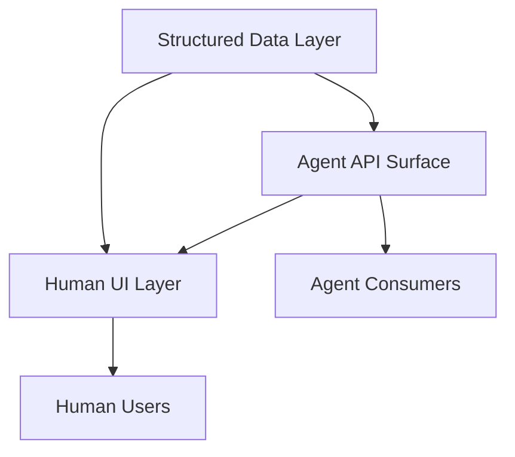

# Agent-First Software Design

> Architect systems where AI agents are the primary consumers — machine-readable APIs, structured outputs, and programmatic interfaces replace visual UIs as the default interaction surface.

## The Agent-First Inversion

Traditional software design optimizes for human comprehension: dashboards, forms, visual hierarchies. Agent-first design inverts this priority. The primary consumer is a program that reads structured data, calls APIs, and acts on machine-readable state. Human interfaces become a layer on top, not the foundation.

This does not remove humans from the loop. It designs the data and control plane for machines first, then renders human-friendly views from the same substrate.

Anthropic frames this as the [agent-computer interface (ACI)](../tool-engineering/agent-computer-interface.md) — investing the same design effort into machine-facing interfaces as teams traditionally invest in human-computer interfaces (HCI).

## Design Principles

### Structured Over Visual

Replace dashboards with queryable APIs. Where a human reads a status page, an agent reads a JSON endpoint. The structured format is the primary artifact.

| Human-First | Agent-First |
|-------------|-------------|
| Status dashboard | `/status` JSON endpoint |
| Form-based configuration | Declarative config files |
| Visual diff viewer | Structured diff API |
| Notification emails | Webhook events with typed payloads |

### Self-Describing Interfaces

Agent-consumable APIs require richer metadata than human-facing ones. Every endpoint, parameter, and response field needs a description that an LLM can interpret without external documentation [unverified]. OpenAPI 3.0+ specifications with complete `description` fields on all components serve as both documentation and agent instruction.

### Poka-Yoke Tool Design

Anthropic's SWE-bench work demonstrated that [tool interfaces should make mistakes structurally impossible](https://www.anthropic.com/research/building-effective-agents). When their agent used relative filepaths, it made errors after changing directories. Switching to mandatory absolute filepaths eliminated the error class entirely. Design parameters and inputs so the wrong usage fails at the interface level, not at runtime.

### Deterministic Over Probabilistic

Agents perform best against APIs with predictable behavior. [Idempotent operations](idempotent-agent-operations.md), consistent error formats, and stable response schemas reduce the reasoning an agent must do per call. Every ambiguity in an API response is a potential failure point when an agent must decide what to do next.

## Early Examples

**llms.txt** — A [standardized file](https://llmstxt.org) that provides LLM-friendly site metadata, enabling agents to navigate a project without crawling every page. It treats the machine reader as the primary audience for site structure.

**Model Context Protocol (MCP)** — An [open standard](https://modelcontextprotocol.io) for connecting agents to external tools and data sources. MCP servers expose capabilities in a structured, discoverable format that agents can consume programmatically.

**[Agent Cards](../standards/agent-cards.md)** — Machine-readable capability declarations that let agents discover what other agents or services can do, enabling automated composition without human intermediaries [unverified].

**[OpenAPI as tool spec](../standards/openapi-agent-tool-spec.md)** — API specifications originally designed for human developers double as agent tool definitions when enriched with descriptive metadata, example values, and clear parameter constraints [unverified].

## The Layering Pattern

Agent-first does not mean agent-only. The pattern layers interfaces:



The structured data layer is the single source of truth. Both agent and human interfaces derive from it, preventing divergence between the API and UI layers.

## Trade-Offs

**Reduced human observability.** When the primary interface is machine-readable, visibility into system state requires explicitly maintaining the human UI layer.

**Higher upfront metadata cost.** Self-describing APIs require descriptions, examples, and constraints for every field — more work than a minimal API with separate docs. The payoff: agents consume the API without custom integration.

**Premature optimization risk.** Most valuable for platforms that multiple agents consume, not internal tools with a single human user.

## Example

This OpenAPI 3.1 fragment shows the same endpoint designed first for humans, then improved for agents. The agent-first version adds `description` fields on every parameter and response property so an LLM can interpret the interface without reading external documentation.

```yaml
# Before: human-first — minimal metadata
paths:
  /deployments:
    post:
      summary: Create deployment
      requestBody:
        content:
          application/json:
            schema:
              type: object
              properties:
                env:
                  type: string
                ref:
                  type: string
```

```yaml
# After: agent-first — self-describing, poka-yoke parameters
paths:
  /deployments:
    post:
      summary: Trigger a production deployment for a given git ref
      description: >
        Idempotent — submitting the same ref twice returns the existing
        deployment record rather than creating a duplicate.
      requestBody:
        required: true
        content:
          application/json:
            schema:
              type: object
              required: [env, ref]
              properties:
                env:
                  type: string
                  enum: [staging, production]
                  description: >
                    Target environment. Must be "production" for live traffic.
                    Use "staging" for pre-release validation.
                ref:
                  type: string
                  pattern: '^[0-9a-f]{40}$'
                  description: >
                    Full 40-character SHA-1 git commit hash. Short hashes and
                    branch names are rejected to prevent ambiguous deployments.
                  example: "a3f2c1d4e5b6789012345678901234567890abcd"
      responses:
        "200":
          description: Deployment already exists for this ref; returns existing record.
        "201":
          description: New deployment created and queued.
```

The `enum` constraint on `env` and the SHA-1 `pattern` on `ref` make wrong usage fail at the interface level — the [poka-yoke principle](../tool-engineering/poka-yoke-agent-tools.md) applied to an API. An agent calling this endpoint cannot accidentally pass a branch name or an ambiguous short hash.

## Key Takeaways

- Design data and control planes for machine consumption first; render human views from the same substrate.
- Invest in agent-computer interfaces (ACI) with the same rigor as human-computer interfaces.
- llms.txt, MCP, and enriched OpenAPI are early agent-first implementations.
- Agent-first does not mean agent-only — human observability requires explicit investment.

## Related

- [Codebase Readiness for Agents](../workflows/codebase-readiness.md)
- [Harness Engineering](harness-engineering.md)
- [Empowerment Over Automation](empowerment-over-automation.md)
- [llms.txt: Spec, Adoption, and Honest Limitations](../geo/llms-txt.md)
- [Discoverable vs Non-Discoverable Context](../context-engineering/discoverable-vs-nondiscoverable-context.md)
- [The Specification as Prompt](../instructions/specification-as-prompt.md)
- [Token-Efficient Tool Design](../tool-engineering/token-efficient-tool-design.md)
- [MCP: The Plumbing Behind Agent Tool Access](../standards/mcp-protocol.md)
- [Agent Turn Model](agent-turn-model.md) — the inference-tool-call loop that underlies agent execution
- [Cognitive Reasoning vs Execution](cognitive-reasoning-execution-separation.md) — separating the agent layer that decides from the layer that acts, with typed tool interfaces enforcing the boundary
- [Execution-First Delegation](execution-first-delegation.md) — specifying goals, constraints, and success conditions so agents handle the how
- [Context Engineering](../context-engineering/context-engineering.md) — the discipline of designing what enters an agent's context window to maximise output quality
- [AX/UX/DX Triad](ax-ux-dx-triad.md) — treats agent experience, user experience, and developer experience as separate design surfaces in agent systems
- [Agent Pushback Protocol](agent-pushback-protocol.md) — how agents communicate resistance through the agent-computer interface when instructions conflict with constraints
