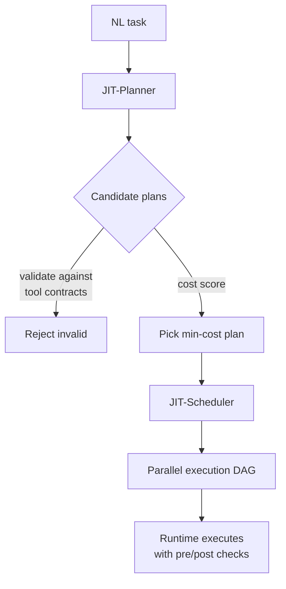

# Agent JIT Compilation

> JIT compilation compiles a natural-language task into one executable, contract-validated program — replacing the per-step screenshot-inference-act loop with a single planning round plus parallel execution.

Agent JIT compilation translates a task description into a code program that the runtime executes directly, with embedded LLM calls and tool invocations as first-class statements ([Winston et al., ICML 2026 — arXiv:2605.21470](https://arxiv.org/abs/2605.21470)). It pays off only when four conditions hold simultaneously; outside them, a standard sequential ReAct loop dominates.

## When the Conditions Hold

| Condition | Why it matters |
|----------|----------------|
| Task spans many steps (≥ ~5 tool calls) | Compilation, validation, and scheduling add fixed overhead — short tasks pay the cost without recovering enough per-step inference savings |
| Underlying model is a capable code generator | The planner-coder interface drops information when the coder is weak; in one systematic study, 52% of cases needed coordinated multi-file edits the planner failed to express ([arXiv:2510.10460](https://arxiv.org/pdf/2510.10460)) |
| Tools expose precondition and postcondition contracts | Plan-time validation is the source of the accuracy gain — without contracts there is nothing to validate against ([arXiv:2605.21470](https://arxiv.org/abs/2605.21470)) |
| Target UI or API is stable enough that pre-validated preconditions stay true at execution time | A page that re-renders or A/B-tests selectors between plan time and execute time silently violates the contract the validator just approved |

Inside this envelope, JIT-Planner reports 10.4× speedup and +28% accuracy over Browser-Use, and JIT-Scheduler reports 2.4× speedup and +9% accuracy over OpenAI's computer-use agent across five web applications ([arXiv:2605.21470](https://arxiv.org/abs/2605.21470)).

## The Three Components

- **JIT-Planner** — generates multiple candidate code plans, validates each statically against tool specs, and picks the lowest-cost candidate. Validation catches wrong-tool errors before any I/O ([arXiv:2605.21470](https://arxiv.org/abs/2605.21470)).
- **JIT-Scheduler** — converts the chosen plan into a parallel dependency graph and uses Monte Carlo simulation over learned per-tool latency distributions to pick a schedule that minimises wall-clock time ([arXiv:2605.21470](https://arxiv.org/abs/2605.21470)).
- **Invariant-enforcing tool protocol** — every tool declares precondition and postcondition state requirements; the planner validates candidate code against them and the runtime checks them before and after each call ([arXiv:2605.21470](https://arxiv.org/abs/2605.21470)).

The code-as-action substrate is not new: CodeAct showed emitting executable code beats JSON tool calls by up to 20 points of success and ~30% fewer steps, because code supports loops, conditionals, variables, and multi-tool composition in one turn ([Wang et al., 2024 — arXiv:2402.01030](https://arxiv.org/html/2402.01030v4)). JIT compilation extends CodeAct with the cost-optimising scheduler and the contract-checking validator.

## Diagram

## Why It Works

The mechanism is **cost relocation**, not better reasoning. A conventional browser agent pays `inference + screenshot + parsing` on every step — in production, each screenshot adds roughly 0.8 seconds to LLM latency and a single form interaction can take 15–30 seconds against 2–3 seconds for a scripted equivalent ([Browser-Use: Speed Matters](https://browser-use.com/posts/speed-matters)). JIT compilation invokes the LLM **once per task** to emit a program covering many actions, eliminating the per-step round trip. The accuracy gain is a side-effect of validation: invalid candidate plans are filtered before any I/O happens, so the executed plan has cleared a correctness gate the baseline loop never sees ([arXiv:2605.21470](https://arxiv.org/abs/2605.21470)). The scheduler then runs independent tool calls concurrently, bounding wall-clock cost by the critical path.

## When This Backfires

- **Dynamic UIs** — shifting selectors, A/B-tested layouts, or auth flows that change between sessions invalidate pre-validated preconditions. A ReAct loop that observes after every action recovers; a plan baked with `click('#submit')` breaks the moment the selector moves.
- **Short tasks (1–3 steps)** — compilation, validation, and scheduling are fixed overhead that exceeds the latency saved on a handful of iterations; below ~5 steps the sequential loop usually wins.
- **Weak code generators** — on smaller models the planner-coder gap dominates and a JSON tool-call loop is more robust ([arXiv:2510.10460](https://arxiv.org/pdf/2510.10460)).
- **Untyped tool surfaces** — the validator assumes precondition/postcondition contracts; bolting JIT onto an untyped tool surface means re-instrumenting every tool before any benefit appears.
- **Sandboxing constraints** — executing model-generated code raises a security surface some deployments cannot accept without an isolated runtime, and planners are brittle on unexpected tool outputs without explicit re-planning loops ([arXiv:2509.08646](https://arxiv.org/pdf/2509.08646)).
- **Baselines have moved** — Browser-Use 1.0 already collapsed much of the per-step latency the paper attacks via selective screenshots, DOM-first navigation, and prompt caching ([Browser-Use: Speed Matters](https://browser-use.com/posts/speed-matters)); the absolute speedup ratio depends on which baseline version is in scope.

## Example

A multi-step shopping task on a stable e-commerce site fits the envelope: "find the cheapest in-stock blue medium t-shirt and add to cart" decomposes into independent sub-actions — search, filter by colour, filter by size, check stock, compare prices. A sequential loop issues one LLM call per click. JIT-Planner emits a single program; the filter operations are validated against a `filter(field, value)` tool contract; JIT-Scheduler runs the colour and size filters concurrently because neither depends on the other, then sequences price comparison and add-to-cart on the critical path ([arXiv:2605.21470](https://arxiv.org/abs/2605.21470)). The same approach applied to a one-step "log me in" task underperforms — the planning round dominates the budget, and a brittle pre-baked selector breaks on the next UI refresh.

## Key Takeaways

- JIT compilation collapses many per-step LLM calls into one per-task planning round, then runs the resulting code with parallel scheduling and contract checks.
- The reported speedups (10.4× over Browser-Use, 2.4× over OpenAI CUA) depend on capable code generators, contract-annotated tools, multi-step tasks, and stable UIs.
- Accuracy gains come from plan-time validation filtering invalid candidates, not from better reasoning inside the executor.
- Code-as-action is the substrate ([CodeAct](https://arxiv.org/html/2402.01030v4)); the scheduler and invariant protocol are what turn it into a cost-optimising agent.
- Outside the envelope — dynamic UIs, short tasks, weak models, untyped tools — a sequential ReAct loop with prompt caching is still the default.

## Related

- [Asynchronous Agent I/O and Speculative Tool Calling](asynchronous-agent-io-and-speculative-tools.md) — another way to break out of the synchronous turn loop when tool latency dominates
- [Deterministic Orchestration for Structured Modernization](deterministic-orchestration-structured-modernization.md) — encoding stable workflow shape in code rather than letting the LLM rediscover it each turn
- [Cognitive Reasoning vs Execution: A Two-Layer Agent Architecture](cognitive-reasoning-execution-separation.md) — the planner/executor split that JIT compilation makes concrete
- [Critic Agent Pattern](critic-agent-plan-review.md) — review a plan before executing; JIT compilation does this statically against tool contracts rather than with a second model
- [Plan Compliance in Agents](plan-compliance-in-agents.md) — what happens when an agent has a plan but does not follow it; JIT compilation removes the gap by making the plan the executable
