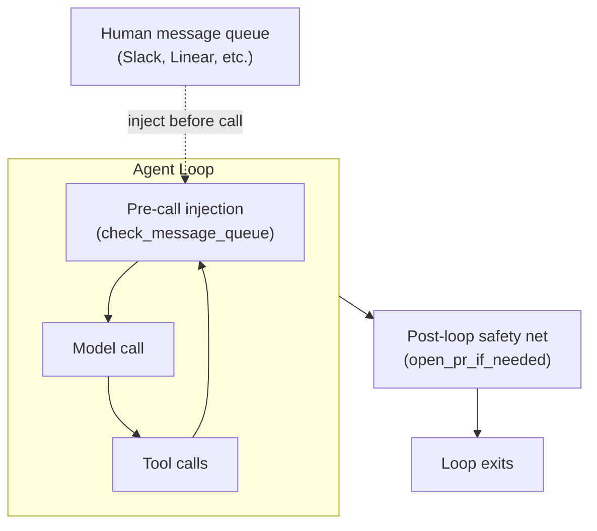

# Agent Loop Middleware

> Treat the agent loop as a unit to wrap from the outside. Middleware nodes guarantee that critical steps happen regardless of agent behavior, and inject queued input before the next model call.

## The Problem

Agents are probabilistic. A critical step — committing changes, opening a PR, logging state — may be skipped depending on context, token pressure, or model attention. Prompt instructions reduce the failure rate; they do not eliminate it.

Middleware removes the dependence on agent compliance. The agent either does the critical step or the middleware does — the outcome is the same. This is distinct from per-tool-call enforcement ([hooks-vs-prompts](../verification/hooks-vs-prompts.md)) and CI guardrails ([deterministic-guardrails](../verification/deterministic-guardrails.md)), which operate within the loop or after it. Middleware acts at loop boundaries.

## Two Middleware Patterns



### Post-Loop Safety Nets

A post-loop safety net runs after the agent loop terminates. If the agent performed the step, the safety net is a no-op; otherwise it performs the step deterministically.

The canonical example comes from [Open SWE](https://github.com/langchain-ai/open-swe) — LangChain's open-source coding agent modeled on internal agents built independently by Stripe, Ramp, and Coinbase. Stripe's ["Minions" engineering post](https://stripe.dev/blog/minions-stripes-one-shot-end-to-end-coding-agents-part-2) describes the same blueprint architecture, sequencing deterministic nodes around agentic loops:

```python
# open_pr_if_needed — runs after the agent loop exits
def open_pr_if_needed(state: AgentState) -> AgentState:
    if not state.pr_opened:
        # Agent didn't open a PR — do it deterministically
        create_pr(state.branch, state.title, state.body)
    return state
```

The [Open SWE README](https://github.com/langchain-ai/open-swe) describes this as "a lightweight version of Stripe's deterministic nodes — ensuring critical steps happen regardless of LLM behavior."

Common safety-net targets:

| Critical step | Why the agent may skip it |
|--------------|--------------------------|
| Open a PR | Agent thinks task is done; PR is implicit |
| Commit changes | Agent ran out of steps before cleanup |
| Write to a log / update a ticket | Side effect, not rewarded by task completion |
| Persist session state | Only matters for the next session |

### Pre-Call Message Injection

A pre-call injection node runs before each model invocation and inserts queued messages — human feedback, follow-up instructions, external events — into the conversation without restarting the loop.

The Open SWE equivalent:

```python
# check_message_queue_before_model — runs before each model call
def check_message_queue_before_model(state: AgentState) -> AgentState:
    messages = poll_message_queue()  # Slack, Linear, etc.
    if messages:
        state.conversation.extend(as_user_messages(messages))
    return state
```

## Relationship to Claude Code Hooks

Claude Code's [hook system](../tools/claude/hooks-lifecycle.md) provides the equivalent of both patterns:

| Middleware pattern | Claude Code equivalent |
|-------------------|----------------------|
| Post-loop safety net | `Stop` hook (fires when agent finishes responding; can force continuation); `SessionEnd` hook (fires on session termination) |
| Pre-call injection | `UserPromptSubmit` hook or context prepended before the next invocation |

The `Stop` hook fires when the agent would otherwise stop, enabling a check and optional continuation.

```json
{
  "hooks": {
    "Stop": [
      {
        "hooks": [
          {
            "type": "command",
            "command": "bash .claude/hooks/post-loop-safety-net.sh"
          }
        ]
      }
    ]
  }
}
```

## Complementary, Not Redundant

| Layer | Mechanism | Scope |
|-------|-----------|-------|
| Prompt | Instruction in system prompt | Requests compliance — probabilistic |
| Per-call hook | `PreToolUse` / `PostToolUse` | Enforces per-tool-call rules |
| CI guardrail | Linter, test suite, schema check | Validates output properties |
| **Loop middleware** | Safety-net + injection nodes | Guarantees loop-level outcomes |

## When to Use This Pattern

Apply post-loop safety nets when:

- A step is non-negotiable but the agent treats it as optional (PR creation, state persistence)
- The agent loop may terminate early due to error handling or resource limits
- The correct outcome is verifiable and automatable independently of the agent

Apply pre-call message injection when:

- Humans send feedback or follow-up instructions asynchronously (Slack, Linear, GitHub comments)
- Multiple queued messages should be batched into a single model call
- The loop should continue without restarting after human input

## Example

A LangGraph-style agent with both middleware patterns wired around the loop:

```python
from langgraph.graph import StateGraph, END

def agent_node(state):
    """Core agent: model call + tool execution."""
    response = call_model(state.messages)
    state.messages.append(response)
    if response.tool_calls:
        results = execute_tools(response.tool_calls)
        state.messages.extend(results)
    return state

def pre_call_inject(state):
    """Pre-call middleware: drain the message queue."""
    queued = poll_queue(state.queue_url)
    if queued:
        state.messages.extend(as_user_messages(queued))
    return state

def post_loop_commit(state):
    """Post-loop middleware: commit if the agent forgot."""
    if state.files_changed and not state.committed:
        run(["git", "add", "-A"])
        run(["git", "commit", "-m", state.task_summary])
        state.committed = True
    return state

graph = StateGraph(AgentState)
graph.add_node("inject", pre_call_inject)
graph.add_node("agent", agent_node)
graph.add_node("commit", post_loop_commit)

graph.set_entry_point("inject")
graph.add_edge("inject", "agent")
graph.add_conditional_edges("agent", should_continue,
    {"continue": "inject", "done": "commit"})
graph.add_edge("commit", END)
```

The `inject` node drains external messages before every model call. The `commit` node guarantees changes are committed regardless of whether the agent remembered to do so.

## When This Backfires

Post-loop safety nets rely on idempotency — if a net fires when the agent already completed the step, the result must be identical, not doubled. Three conditions produce failures:

- **Non-idempotent critical steps.** `open_pr_if_needed` is safe only if the `state.pr_opened` flag is reliably set. If the agent opens a PR but fails to persist the flag, the net opens a second PR. Design safety nets around verifiable state, not assumed state.
- **Safety net masks systematic compliance failures.** If the agent never opens PRs and the net fires every run, the pattern hides a prompt or tool-call problem that should be fixed at the source. Monitor net fire-rate; a rate above ~5% signals an upstream issue worth addressing.
- **Message queue injection in high-latency channels.** Pre-call injection polls an external queue synchronously before each model call. If the queue endpoint has variable latency, injection adds per-iteration overhead. Rate-limit the poll or use a local buffer when the queue source is unreliable.

## Related

- [Harness Engineering](harness-engineering.md) — environment-level design that constrains what agents can do
- [Hooks for Enforcement vs Prompts for Guidance](../verification/hooks-vs-prompts.md) — per-tool-call enforcement inside Claude Code
- [PostToolUse Hooks: Auto-Formatting on Every File Edit](../workflows/posttooluse-auto-formatting.md) — automatic formatting via PostToolUse hooks
- [Deterministic Guardrails](../verification/deterministic-guardrails.md) — CI and commit-level output checks
- [Pre-Completion Checklists](../verification/pre-completion-checklists.md) — verification gates before task completion
- [Steering Running Agents](steering-running-agents.md) — human intervention patterns during agent execution
- [Agent Turn Model](agent-turn-model.md) — the inference-tool-call loop that middleware intercepts at each iteration
- [Agent Memory Patterns](agent-memory-patterns.md) — scoped memory systems for persisting state across sessions, complementing loop-level state management
- [Loop Strategy Spectrum](loop-strategy-spectrum.md) — choosing between accumulated-context and fresh-context loop strategies
- [Rollback-First Design](rollback-first-design.md) — designing every agent action to be reversible, complementing safety-net guarantees
- [Classical SE Patterns as Agent Design Vocabulary](classical-se-patterns-agent-analogues.md) — GoF and SOLID patterns including middleware and observer analogues for agent systems
- [Idempotent Agent Operations](idempotent-agent-operations.md) — designing operations for safe retry, relevant when safety nets re-run critical steps
- [Lane-Based Execution Queueing](lane-based-execution-queueing.md) — named isolated queues with per-lane concurrency limits; the scheduling complement to loop-level middleware
