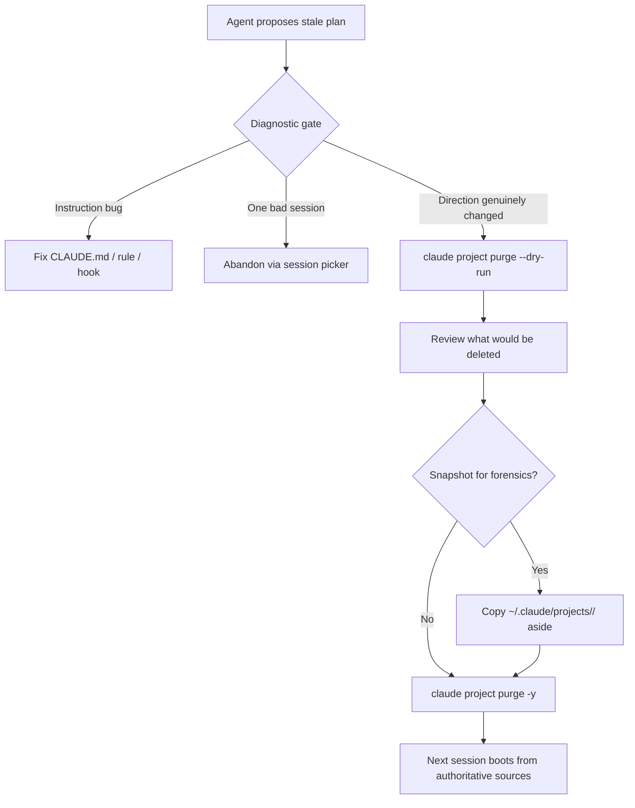

# Agent Project State Purge: Clean-Slate Session Reset

> A clean-slate primitive that tears down all per-project session state — transcripts, auto-memory, indexed sessions — returning the agent to a known-empty baseline. The pattern is conditional: it pays off when state contamination is the real diagnosis, not when it masks an instruction-file or hook bug.

A project state purge is a single operation that deletes every artefact a coding-agent harness accumulated for one project — transcripts, auto-memory, sessions index, and the harness's record of the project. Claude Code v2.1.126 (May 1, 2026) added `claude project purge [path]` with `--dry-run`, `-y/--yes`, `-i/--interactive`, and `--all` ([Claude Code changelog](https://code.claude.com/docs/en/changelog)). The pattern matters because long-running projects accumulate stale plans and half-finished todo lists that quietly bias future sessions; without a first-class primitive, operators either live with the contamination or hand-edit state files they do not fully understand.

## When the Purge Is the Right Move

The trigger is a specific symptom: **the agent keeps proposing the old plan after you changed direction**. Practitioners describe this as the agent carrying state from a previous run that should have been cleared — error output useful at turn 5 becomes actively misleading at turn 40 ([TianPan.co: Stale World Model Problem](https://tianpan.co/blog/2026-04-10-stale-world-model-long-running-agents)).

Diagnostic gate — run these checks before reaching for the purge:

1. **Stale direction in `CLAUDE.md` or a rule file?** Edit the file. Purging will not help; the next session re-reads the same stale instruction.
2. **Hook auto-injecting an old recap or progress file?** The hook is the bug — disable or fix it.
3. **One specific session contaminating?** Use the session picker (`/resume`) and abandon that one session rather than nuke the whole project record.
4. **Direction genuinely changed?** Post-mortem hand-off, scope inversion, or abandoned approach — this is what the primitive is for.

## What Survives, What Dies

Claude Code's `.claude/` directory cleanly separates **project source** (version-controlled files the team shares) from **project state** (ambient artefacts the harness writes as the operator works) ([Claude Code: Explore the .claude directory](https://code.claude.com/docs/en/claude-directory)). The purge crosses only the second boundary.

| Surface | Survives `claude project purge` |
|---------|---------------------------------|
| `CLAUDE.md` (project + global) | Yes — project source |
| `.claude/settings.json`, hooks, skills, agents, commands | Yes — project source |
| `.mcp.json` | Yes — project source |
| `~/.claude/projects/<project>/<session-id>.jsonl` (transcripts) | No — deleted |
| `~/.claude/projects/<project>/memory/` (auto-memory the agent wrote) | No — deleted |
| `~/.claude/projects/<project>/sessions-index.json` | No — deleted |
| Claude Code's per-project config entry | No — deleted |

The purge is precisely scoped: instruction surfaces and tool-source files are untouched, so the next session boots against the same rules and skills but reconstructs context from current code rather than persisted history.

## How It Works



Three modes matter in practice:

- **`--dry-run`** lists what would be deleted without touching disk. Run it first every time; if the inventory looks wrong, the diagnosis was wrong.
- **`-i/--interactive`** lets the operator select which sessions to drop and which to keep. This is the right form when only part of the project record is contaminated.
- **`-y`** (with or without `--all`) is the unattended form. Reserve it for batch cleanups in disposable environments.

The snapshot-then-purge variant (`cp -r ~/.claude/projects/<project> /tmp/backup-$(date +%s) && claude project purge -y`) preserves the JSONL audit trail for forensics — the per-session transcripts are the record of "why did the agent do that?", and a purge without snapshot deletes the diagnostic record at the exact moment something went wrong.

## Why It Works

A long-running project accumulates three kinds of state under `~/.claude/projects/<project>/`: JSONL transcripts, auto-memory the agent wrote to itself, and indexed session metadata ([Claude Code: Manage sessions](https://code.claude.com/docs/en/sessions)). Each is loaded back when sessions resume — explicitly via `--resume`/`--continue`, or implicitly when auto-memory is consulted. When that state diverges from current intent, the next session reconstructs the old objective from the persisted record and the agent reasons on a quietly wrong goal — the "stale world model" failure where agents look operational while deciding on outdated information ([TianPan.co](https://tianpan.co/blog/2026-04-10-stale-world-model-long-running-agents)).

A purge breaks the loop at exactly the surface that reintroduces stale context. Returning to a known-empty baseline forces the next session to reconstruct context from authoritative sources — current `CLAUDE.md`, current code, current prompt — rather than a record of how the project used to look. Removing stale tokens is itself context engineering: every token in the window competes for the model's attention ([Anthropic: April 23 postmortem](https://www.anthropic.com/engineering/april-23-postmortem)).

## When This Backfires

Reaching for the purge is the wrong move under four conditions:

- **Purging masks an instruction bug.** If the agent keeps proposing a stale plan because `CLAUDE.md` still contains the old direction or a `SessionStart` hook auto-injects an old recap, the purge wipes the symptom and the bug re-appears next session. If you find yourself purging weekly, the harness is fighting you — fix upstream (narrower rules, tighter hooks, smaller [recap schemas](session-recap.md)), not downstream.
- **Purging destroys cross-session learning.** Auto-memory under `~/.claude/projects/<project>/memory/` holds build commands, debugging insights, and architecture notes the agent wrote to itself — the same surface [agent memory patterns](agent-memory-patterns.md) treat as a durable asset. On the LOCOMO benchmark, persistent-memory architectures outperform stateless approaches on accuracy and latency ([Mem0 research](https://mem0.ai/research-3)); reflexive purges give back the gains the memory infrastructure was supposed to compound.
- **No backup-before-purge means no forensics.** Per-session JSONL files *are* the audit trail. Purging without snapshotting removes the record at the moment something went wrong. The `--dry-run` mode does not preserve state; only an explicit copy does.
- **Tool-agnostic harnesses lack an equivalent.** Claude Code is the only first-class implementation today. Copilot CLI has `/clear` and `/reset` (in-session) but no command to delete the per-session folder; users manually `rm -rf ~/.copilot/session-state/` and the feature remains an [open request](https://github.com/github/copilot-cli/issues/2869). Documenting "use the purge primitive" as cross-tool is misleading until equivalents ship.

## Example

A team has spent two weeks on a refactor that the architect cancelled this morning. The next agent session opens with "let's continue the dependency-injection migration on `UserService`" — the abandoned direction, not the new one.

**Before** — without a purge, hand-editing state:

```bash
# The operator tries to find and remove just the stale auto-memory
$ ls ~/.claude/projects/-home-team-app/
ce8f2a3b-...jsonl  7d2e1f4c-...jsonl  memory/  sessions-index.json
$ rm -rf ~/.claude/projects/-home-team-app/memory/
# Did that work? The next session still has 47 JSONL transcripts to pick from.
# The session picker resurfaces a transcript from yesterday — same stale plan.
```

**After** — using the primitive:

```bash
$ claude project purge ~/team/app --dry-run
Would delete:
  ~/.claude/projects/-home-team-app/  (47 sessions, 12.4 MB)
  config entry for /home/team/app

$ cp -r ~/.claude/projects/-home-team-app /tmp/backup-$(date +%s)
$ claude project purge ~/team/app -y
Deleted 47 sessions and project config entry.

$ claude --continue
# No prior session found in this directory.
# The next prompt reads from current CLAUDE.md and current code only.
```

The `CLAUDE.md`, hooks, skills, and `.mcp.json` for the project remain untouched. The team's new architectural direction is the only state the next session sees.

## Key Takeaways

- A project state purge is a primitive for the specific case where stale persisted state is biasing the next session — not a routine cleanup command
- Diagnose before purging: rule out instruction-file bugs, hook bugs, and one-session contaminators first
- Project source files (`CLAUDE.md`, hooks, skills, settings, `.mcp.json`) survive; project state (transcripts, auto-memory, sessions index, config entry) does not
- Snapshot before unattended purges if you need a forensic trail — the per-session JSONL files are the audit record
- Claude Code's `claude project purge` (v2.1.126, May 2026) is the only first-class implementation today; Copilot CLI users do the equivalent manually

## Related

- [Session Recap: Goal-Shaped Handoff at Context Boundaries](session-recap.md) — the goal-shaped handoff that purge is the opposite of; preserve when continuation is right, purge when reset is right
- [Agent Memory Patterns](agent-memory-patterns.md) — the cross-session memory layer a purge wipes; understand what is being destroyed
- [Session Initialization Ritual](session-initialization-ritual.md) — what every session does after a purge, when there is no prior state to read
- [Post-Compaction Re-read Protocol](../instructions/post-compaction-reread-protocol.md) — a softer intervention for instruction-fidelity drift, distinct from a state nuke
- [Trajectory Logging via Progress Files and Git History](../observability/trajectory-logging-progress-files.md) — the persistent audit surface a purge does not touch, useful as the source-of-truth that survives reset
