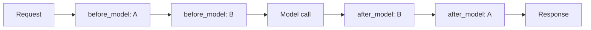

# Agent Runtime Middleware

> Runtime middleware composes cross-cutting concerns — retry, redaction, cost caps, observability — as ordered pre/post handlers around every model and tool call.

Agent runtime middleware is a chain of pre- and post-handlers that intercepts every model invocation and tool call inside the agent runtime. Pre-handlers run in declared order before the call; post-handlers run in reverse order after, letting wrappers unwind cleanly. Google Genkit and LangChain both ship the pattern with the same shape ([Genkit announcement](https://developers.googleblog.com/announcing-genkit-middleware-intercept-extend-and-harden-your-agentic-apps/); [LangChain agent middleware](https://blog.langchain.com/agent-middleware/)).

## Pipeline Shape

Every middleware exposes some subset of three hooks:

| Hook | Runs | Purpose |
|------|------|---------|
| `before_model` / pre-handler | In declared order before the model call | Rewrite request, inject context, deny on policy |
| `modify_model_request` / `wrap_*` | Around the call, declared order | Substitute model, transform parameters, add retry/fallback |
| `after_model` / post-handler | **Reverse** order after the call | Redact output, score, validate, gate side-effects |

LangChain documents the reverse-order rule explicitly: `after_model` hooks run in inverse registration order, so a stack of `[log, redact, classify]` post-processes as `classify → redact → log` — keeping redaction inside the boundary logging sees ([LangChain custom middleware](https://docs.langchain.com/oss/python/langchain/middleware/custom)).



## Placement Matrix

Middleware is one of four places a cross-cutting concern can live; picking the right one matters more than the cleanest implementation.

| Concern | Belongs in | Why |
|---------|-----------|-----|
| PII redaction across messages | Middleware | Needs conversation state and per-call wrap; redact before logging |
| Retry / fallback on transient model errors | Middleware | Genkit's `retry` and `fallback` middleware are the canonical examples ([Genkit blog](https://developers.googleblog.com/announcing-genkit-middleware-intercept-extend-and-harden-your-agentic-apps/)) |
| Cost cap per turn or per session | Middleware | Needs running totals across multiple model calls |
| Filesystem write deny / network egress block | Host-side hook | OS-enforced is stronger than runtime-enforced; see [Hooks vs Prompts](../instructions/hooks-vs-prompts.md) |
| Per-tool input validation | Tool wrapper | Schema lives with the tool definition, not the runtime |
| Style or persona guidance | System prompt | Probabilistic by nature; no enforcement value in wrapping |

The dividing line: middleware sees the conversation and wraps every call; hooks fire outside the runtime and can refuse to launch a process. Both belong in production; neither replaces the other.

## Why It Works

Every model call and tool invocation is a request/response pair, so cross-cutting concerns compose at that boundary — the aspect-oriented composition Express, ASP.NET, and gRPC interceptors have used for a decade. Genkit describes the mechanism as "composable hooks that intercept generation calls, including the tool execution loop, and inject custom behaviors" ([Google Developers Blog](https://developers.googleblog.com/announcing-genkit-middleware-intercept-extend-and-harden-your-agentic-apps/)). The Agent Lifecycle Toolkit formalises six intervention points and argues such interception is what prevents "misinterpreted tool arguments from corrupting production data" ([ALTK, CAIS '26](https://arxiv.org/abs/2603.15473)). Once every call passes through the same chain, adding a concern is additive, not invasive.

## Prebuilt Catalogues

Both frameworks ship a baseline set mapping to common production needs:

| Concern | Genkit | LangChain |
|---------|--------|-----------|
| Retry transient errors | `retry` (exponential backoff with jitter; only the model call, tool loop not replayed) | (custom or `wrap_model_call`) |
| Failover to alt model | `fallback` (switches on specified error codes) | `ModelFallbackMiddleware` |
| Human approval before action | (custom) | `HumanInTheLoopMiddleware` |
| PII detection / redaction | (custom) | `PIIMiddleware` |
| Cap total model calls | (custom) | `ModelCallLimitMiddleware` |
| Cap tool invocations | (custom) | `ToolCallLimitMiddleware` |
| Summarise long history | (custom) | `SummarizationMiddleware` |

Genkit ships in TypeScript, Go, and Dart with Python in flight; LangChain's API is Python-native ([Genkit announcement](https://developers.googleblog.com/announcing-genkit-middleware-intercept-extend-and-harden-your-agentic-apps/)).

## When This Backfires

- **Small agents with three or fewer cross-cutting concerns.** Three middlewares around a function are harder to read than three inline lines. The indirection pays off only once the cross-cutting set is large or stable enough across agents to motivate the abstraction.
- **Order-dependent middleware without ordering tests.** Redaction-then-logging vs logging-then-redaction is a security bug, not a style preference. Registration-order drift without a test asserting effective order is a footgun.
- **Silent-swallow middleware.** A handler that catches and discards exceptions makes failures vanish into the stack — a documented agent failure mode ([AI agent failure pattern recognition](https://www.mindstudio.ai/blog/ai-agent-failure-pattern-recognition)). Contain it with an error-handler middleware that re-raises by default.
- **Performance death-by-thousand-handlers.** Fifteen handlers run twice per turn at 2 ms each add 60 ms per iteration; at thirty iterations that is 1.8 s of pure middleware overhead.
- **Compliance theatre.** An "approval" middleware that auto-approves teaches the audit log that controls exist when none do — the Lies-in-the-Loop failure mode.
- **Off-protocol egress invisible to middleware.** Middleware only sees calls through the runtime. An agent that shells out to curl, opens a raw socket, or uses a DB driver directly bypasses the chain. Pair with host-side egress controls.

## Example

A redaction-then-log middleware stack — the post-handler reverse-order rule is what keeps the secret out of the log:

```python
# LangChain — registration order
agent = create_agent(
    model="claude-opus-4-7",
    tools=[...],
    middleware=[
        LoggingMiddleware(),    # after_model runs LAST
        PIIMiddleware(),        # after_model runs FIRST — redacts before log sees it
    ],
)
```

`before_model` runs `Logging → PII`; `after_model` runs `PII → Logging`. The log only ever sees redacted text. Reverse the registration order and the log captures the raw secret before redaction — same code, different security posture.

## Key Takeaways

- Middleware composes cross-cutting concerns as ordered pre/post handlers around every model and tool call inside the runtime; post-handlers run in reverse registration order so wrappers unwind cleanly.
- Use the placement matrix: middleware for conversation-aware in-runtime concerns; host-side hooks for OS-enforced controls; tool wrappers for per-tool schema; prompt rules for probabilistic guidance.
- Genkit and LangChain converged on the same shape in 2026 — the abstraction is borrowed from web-framework interceptors, not new.
- Silent-swallow, ordering bugs, and off-protocol egress are the three failure modes that turn middleware into a liability instead of a control.

## Related

- [Agent Loop Middleware](agent-loop-middleware.md) — sibling pattern that wraps the *loop* boundary with deterministic nodes; this page wraps the *per-call* boundary inside the loop.
- [Hooks for Enforcement vs Prompts for Guidance](../instructions/hooks-vs-prompts.md) — host-side enforcement when OS-level guarantees matter more than runtime composition.
- [Hooks Invoking MCP Tools](../tool-engineering/hooks-invoking-mcp-tools.md) — when hook handlers need to call into the same MCP surface middleware governs.
- [Model a Single Agent Turn as Many Inference and Tool-Call Iterations](agent-turn-model.md) — the iteration count that determines middleware overhead per task.
