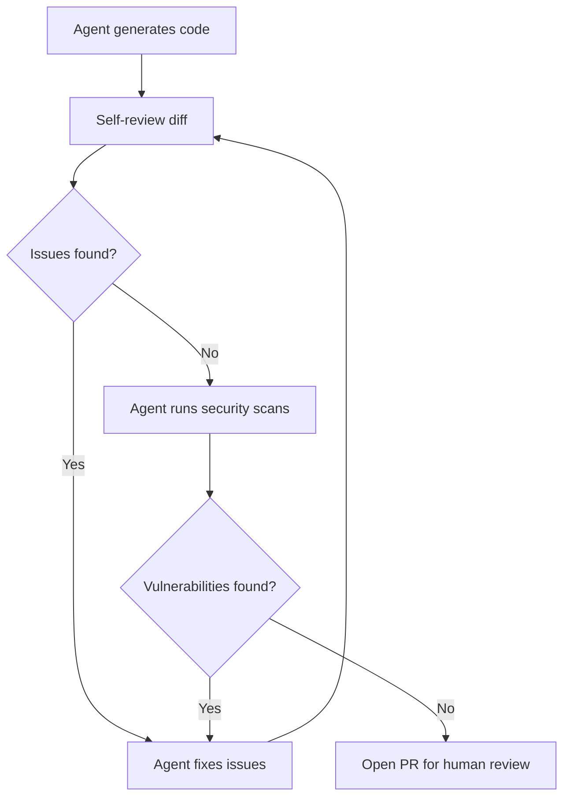

# Agent Self-Review Loop

> Agents review their own output — running code review, security scanning, and quality checks — before submitting work for human review.

!!! info "Also known as"
    Review-Then-Implement Loop, Agent Review Loops

## The Pattern

An agent that generates code runs a review pass on its own changes before opening a pull request — iterating on findings, fixing issues before a human ever sees the PR.

This differs from the [Committee Review Pattern](../code-review/committee-review-pattern.md), where separate reviewer agents evaluate an implementer's output. In a self-review loop, the same agent (or a tightly integrated review step within the agent's workflow) evaluates and iterates on its own work as a built-in phase before submission.

## How It Works



### GitHub Copilot Coding Agent

GitHub's [Copilot coding agent](../tools/copilot/coding-agent.md) implements this pattern natively. The agent [reviews its own changes using Copilot code review before it opens the pull request](https://github.blog/ai-and-ml/github-copilot/whats-new-with-github-copilot-coding-agent/). It receives feedback, iterates, and improves the patch — only requesting human review after completing its own review cycle.

The agent also runs security checks during its workflow:

- **Code scanning** — static analysis for vulnerability patterns
- **Secret scanning** — detects accidentally committed credentials
- **Dependency vulnerability checks** — flags dependencies with known CVEs

As GitHub documents: ["If a dependency has a known issue, or something looks like a committed API key, it gets flagged before the pull request opens."](https://github.blog/ai-and-ml/github-copilot/whats-new-with-github-copilot-coding-agent/) Code scanning, normally part of GitHub Advanced Security, is included at no additional cost.

Copilot code review has processed [over 60 million reviews](https://github.blog/ai-and-ml/github-copilot/60-million-copilot-code-reviews-and-counting/) since its April 2025 launch.

## What Human Reviewers Gain

Self-review eliminates the issues humans should not spend time on: style violations, unused imports, common vulnerability patterns, and accidental secret exposure — shifting attention to areas where judgment is irreplaceable.

GitHub identifies [three functions that remain exclusively human](https://github.blog/ai-and-ml/generative-ai/code-review-in-the-age-of-ai-why-developers-will-always-own-the-merge-button/):

1. **Architectural decisions** — "should we split this service?" requires contextual judgment
2. **Mentorship** — PR threads function as team classrooms where experience transfers
3. **Ethical evaluation** — determining whether features align with organizational values

Self-review [reduces back-and-forth by roughly a third](https://github.blog/ai-and-ml/generative-ai/code-review-in-the-age-of-ai-why-developers-will-always-own-the-merge-button/) by eliminating trivial corrections — while the merge button remains a human decision.

## Implementing the Pattern

For agents without built-in self-review:

1. **Add a review step before PR creation.** After the agent completes code generation, run a separate review prompt or subagent against the diff. Use `git diff` to scope the review to changes only.
2. **Include security tooling.** Run linters, static analysis (e.g., CodeQL, Semgrep, Bandit), and secret scanners as shell commands within the agent's workflow. Parse results and fix findings before proceeding.
3. **Cap iteration rounds.** Set a maximum of two to three self-review cycles. If the agent cannot resolve its own findings within that limit, open the PR with remaining issues documented for human review.
4. **Maintain independence where possible.** A fresh context for the review step reduces confirmation bias. If using a subagent for review, give it read-only tool access and a review-focused prompt distinct from the implementation prompt.

## Limitations

**Confirmation bias.** An agent reviewing its own output in the same context tends to validate the same assumptions it made during generation. This is structurally less independent than cross-agent or cross-model review — a single-context reviewer shares the same training biases and blind spots as the generator. The pattern is operationally simpler and faster than coordinating separate reviewers, at the cost of that independence. When an external LLM reviewer is added, a separate failure mode applies: LLMs systematically flag correct code as non-compliant, and adding explanation requirements worsens the false positive rate — see [LLM Code Review Overcorrection](../anti-patterns/llm-review-overcorrection.md).

**Scope ceiling.** Self-review catches mechanical issues — style, known vulnerability patterns, dependency problems. It does not catch architectural misjudgments, incorrect business logic, or design problems that require domain knowledge beyond the agent's context.

**Diminishing returns.** After two to three rounds of self-review iteration, additional rounds rarely surface new issues. The agent converges on its own interpretation of correctness.

## Key Takeaways

- Agents that review their own output before submitting PRs eliminate mechanical issues from human review queues
- GitHub's Copilot coding agent implements self-review natively — code review, security scanning, and dependency checks run before the PR opens
- Self-review reduces reviewer back-and-forth by roughly a third while preserving human authority over the merge decision
- Cap self-review iterations at two to three rounds to avoid diminishing returns
- Self-review complements but does not replace independent cross-agent review for high-risk changes

## Example

A Claude Code agent implementing a feature branch runs a self-review loop before opening a PR.

**Review step prompt (runs after code generation):**

```
Review the following diff for issues before I open a pull request.

Check for:
- Logic errors and off-by-one mistakes
- Unused imports or variables
- Hardcoded credentials or secrets
- Missing error handling
- Test coverage gaps

Output a JSON array: [{"file": "...", "line": N, "severity": "high|medium|low", "issue": "..."}]
If no issues found, return [].

<diff>
$(git diff main)
</diff>
```

**Agent workflow:**

```python
MAX_ROUNDS = 3

for round in range(MAX_ROUNDS):
    findings = run_review_prompt(git_diff())
    if not findings:
        break
    fix_findings(findings)

if findings:
    # Could not resolve all findings — open PR with issues documented
    open_pr(unresolved=findings)
else:
    open_pr(unresolved=[])
```

**Security scan step (runs in parallel with review):**

```bash
# Static analysis
semgrep --config=auto --json > semgrep-findings.json

# Secret scanning
trufflehog filesystem . --json > secrets-findings.json

# Dependency vulnerabilities
pip-audit --format=json > audit-findings.json
```

The agent parses each JSON output and fixes findings before the PR opens. If findings remain after the iteration cap, they are documented in the PR body for human review.

## Related

- [Review-Then-Implement Loop](../code-review/review-then-implement-loop.md)
- [Committee Review Pattern](../code-review/committee-review-pattern.md)
- [Agent-Assisted Code Review](../code-review/agent-assisted-code-review.md)
- [Pre-Completion Checklists](../verification/pre-completion-checklists.md)
- [Incremental Verification](../verification/incremental-verification.md)
- [Empowerment Over Automation](empowerment-over-automation.md)
- [Convergence Detection](convergence-detection.md)
- [Evaluator-Optimizer Pattern](evaluator-optimizer.md)
- [Agent Backpressure](agent-backpressure.md)
- [Agent Turn Model](agent-turn-model.md) — the inference-tool-call loop that self-review extends with an extra verification pass
- [Loop Strategy Spectrum](loop-strategy-spectrum.md) — accumulated vs fresh context tradeoffs across iteration loops
- [The Ralph Wiggum Loop](ralph-wiggum-loop.md) — fresh-context iteration pattern that applies to self-review rounds
- [Agent Harness](agent-harness.md) — the initializer + coding agent pattern that self-review integrates into as a built-in phase
- [Harness Engineering](harness-engineering.md) — integrating review steps into agent harness configuration
- [Reasoning Budget Allocation](reasoning-budget-allocation.md) — allocating iteration budget across reasoning and review phases
- [Exception Handling and Recovery Patterns](exception-handling-recovery-patterns.md) — handling errors that self-review cycles cannot resolve within the iteration cap
- [Behavioral Drivers of Agent Success](behavioral-drivers-agent-success.md) — quality gates and verification behaviors that determine whether self-review loops converge reliably
- [Self-Rewriting Meta-Prompt Loop](self-rewriting-meta-prompt-loop.md) — self-review extended to agents rewriting their own system prompts
