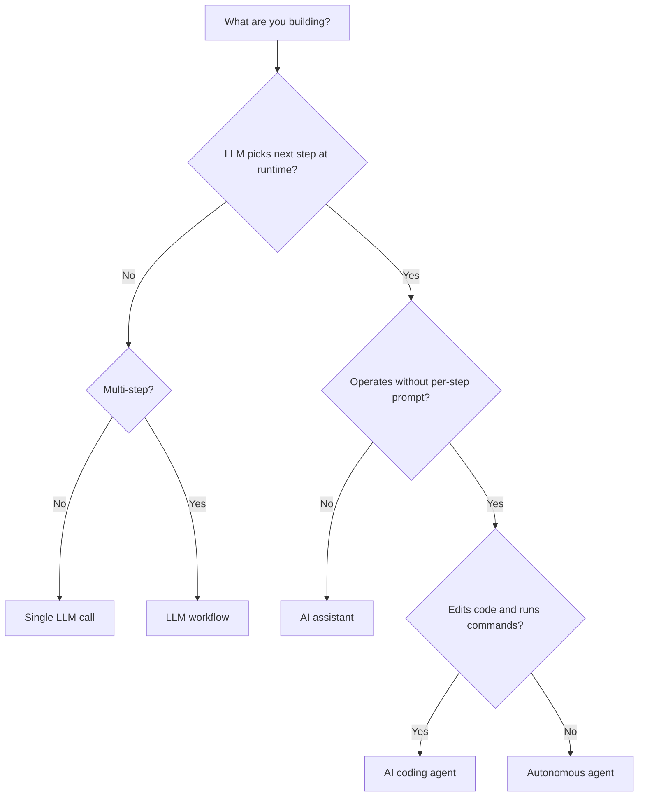

# Agent Terminology Disambiguation for AI Coding Systems

> Eight overlapping terms — LLM workflow through autonomous agent — name distinct systems with distinct failure modes, and the vendor you read shapes each definition.

"Agent" is one of the most overloaded words in AI engineering. Anthropic, OpenAI, Google, and LangChain each define it differently, and the ambiguity drives cargo-culting: teams building sequential prompts with state passing reach for multi-agent orchestration patterns because they called their system "multi-agent". A 2025 paper argued the term has been "diluted beyond utility" and proposed multidimensional characterization — across environmental interaction, autonomy, goal complexity, and temporal coherence — over single definitions ([arxiv 2508.05338](https://arxiv.org/abs/2508.05338)). This page names the working definitions practitioners meet today and the one conflation each invites.

## Conditions Under Which This Page Applies

The disambiguation here is **vendor-aware and time-bound**:

- **Anthropic's framing is canonical on this site** because the pattern catalogue is structured around control-flow ownership. Readers on OpenAI's Agents SDK or LangGraph state machines will meet alternative framings — none is "the" right one.
- **Categories are spectrum points, not boxes**. Anthropic's [Building Effective Agents](https://www.anthropic.com/engineering/building-effective-agents) treats workflow-vs-agent as a continuum.
- **Definitions shift quarterly**. Use this page to recognise which patterns to reach for today, not as permanent taxonomy. Simon Willison crowdsourced 211 "agent" definitions, showing convergence is still in progress ([agent-definitions tag](https://simonwillison.net/tags/agent-definitions/)).

## The Eight Terms

### LLM Workflow

A system where LLMs and tools are orchestrated through predefined code paths ([Anthropic — Building Effective Agents](https://www.anthropic.com/engineering/building-effective-agents)). The developer encodes control flow; the model fills in each step.

- **Example.** A prompt-chain that summarises a document, then extracts entities, then writes a report — three sequential LLM calls wired in code.
- **Most-likely conflation: autonomous agent.** A workflow with many LLM calls is still a workflow if a human wrote the routing logic.

### Deterministic Orchestration

Workflow code that executes the same sequence for the same input, with non-deterministic work confined to clearly-bounded activities. Temporal-class engines require this property so workflows can survive process crashes via replay ([Temporal — dynamic AI agents](https://temporal.io/blog/of-course-you-can-build-dynamic-ai-agents-with-temporal)).

- **Example.** A code-modernization pipeline that runs the same translate-validate-commit sequence per file, with the LLM only making translation choices ([Deterministic Orchestration for Structured Modernization](deterministic-orchestration-structured-modernization.md)).
- **Most-likely conflation: workflow engine.** Deterministic orchestration is a *property* of how workflow code is written; a workflow engine is the *runtime* that enforces it.

### Autonomous Agent

A system where the LLM dynamically directs its own processes and tool usage, maintaining control over how it accomplishes the task ([Anthropic — Building Effective Agents](https://www.anthropic.com/engineering/building-effective-agents)). Simon Willison's converging practitioner definition: "an LLM agent runs tools in a loop to achieve a goal" ([agent-definitions](https://simonwillison.net/tags/agent-definitions/)).

- **Example.** Claude Code planning a multi-file refactor, choosing which files to read, when to run tests, and when the task is complete — without a pre-coded routing graph.
- **Most-likely conflation: LLM workflow.** A multi-step LLM application is not an agent unless the LLM picks the next step at runtime.

### Long-Running System

A system that operates across multiple sessions, accumulating state and context over hours, days, or weeks. Long-running systems can be workflows *or* agents — the distinguishing axis is duration, not control flow ([Anthropic — Effective harnesses for long-running agents](https://www.anthropic.com/engineering/effective-harnesses-for-long-running-agents); [Addy Osmani — Long-running Agents](https://addyo.substack.com/p/long-running-agents)).

- **Example.** A coding agent harness with an initializer phase and incremental session-by-session work, surviving across compaction boundaries.
- **Most-likely conflation: autonomous agent.** "Long-running" describes temporal property; "autonomous" describes control-flow property. See [Long-Running Agents](long-running-agents.md).

### AI Assistant

A reactive system that waits for user prompts, executes specific tasks one at a time, and returns control to the user after each step. Assistants need little governance because consequential action requires per-step user approval ([latentview — Agentic AI vs AI Assistants](https://www.latentview.com/blog/agentic-ai-vs-ai-assistants/)).

- **Example.** GitHub Copilot inline completions, ChatGPT in a chat window — each turn requires explicit user invocation.
- **Most-likely conflation: autonomous agent.** Crossing from assistant to agent requires escalation thresholds, audit trails, and recovery protocols that assistants do not need.

### RAG Pipeline

A generation technique that combines parametric and non-parametric memory: a retriever pulls relevant documents from an index, and the generator conditions output on them ([Lewis et al. 2020](https://arxiv.org/abs/2005.11401)). Retrieval is fused into the generation step.

- **Example.** A documentation Q&A system that embeds a query, retrieves top-k passages from a vector index, and passes them as context to a single LLM call.
- **Most-likely conflation: autonomous agent.** RAG is a generation technique, not a loop. An agent that calls a search tool uses retrieval — it is not a "RAG pipeline" any more than it is a "tool-call pipeline".

### Workflow Engine

A runtime that executes workflow code with durability, retry, checkpointing, and resumption guarantees. Examples: Temporal, Camunda, Airflow. The engine enforces deterministic-orchestration property by replaying workflow code on failure ([Temporal](https://temporal.io/blog/of-course-you-can-build-dynamic-ai-agents-with-temporal)).

- **Example.** A Temporal workflow that orchestrates an agent's tool calls as activities, providing durability around each LLM call.
- **Most-likely conflation: agent runtime.** Workflow engines and agent runtimes can compose, but they answer different questions: durability vs next-step selection.

### AI Coding Agent

An agentic coding tool that reads a codebase, edits files, runs commands, and integrates with development tools ([Claude Code overview](https://code.claude.com/docs/en/overview)). The distinguishing features are codebase-wide comprehension, file write authority, and dev-tool integration.

- **Example.** Claude Code, Cursor's agent mode, and GitHub Copilot coding agent are AI coding agents; an LLM chat window with file-editing tooling is not.
- **Most-likely conflation: generic LLM agent.** Coding agents have different verification surfaces (compilers, tests, type checkers) and different failure modes (silent code corruption, hallucinated APIs). See [Coding Agent Scope Expansion](coding-agent-scope-expansion.md).

## Decision Tree

Workflows pull from [Anthropic's Effective Agents Framework](anthropic-effective-agents-framework.md); autonomous loops pull from [Goal-Driven Autonomous Loop](goal-driven-autonomous-loop.md) and [Loop Strategy Spectrum](loop-strategy-spectrum.md); coding-agent specifics live in [Harness Engineering](harness-engineering.md).

## Why It Works

Category recognition reduces over-engineering. The [Agentless paper](https://arxiv.org/abs/2407.01489) demonstrated a two-phase non-autonomous workflow achieved 27.33% on SWE-bench Lite at $0.70 per issue, outperforming contemporary autonomous-agent baselines. The empirical lesson: teams that recognise they are building a workflow stop reaching for autonomous-loop patterns. Anthropic's [Building Effective Agents](https://www.anthropic.com/engineering/building-effective-agents) is explicit: "find the simplest solution possible, and only increasing complexity when needed", adding agentic patterns "only when it demonstrably improves outcomes". Shared vocabulary makes that judgment legible inside a team.

## When This Backfires

- **Vendor-aligned readers** — OpenAI defined "agent" two different ways in the same week: "systems that independently accomplish tasks on behalf of users" (blog) and "LLMs equipped with instructions and tools" (Agents SDK docs). A reader fluent in OpenAI vocabulary may find Anthropic-derived definitions foreign ([Simon Willison thread](https://x.com/simonw/status/1899590715992428871)).
- **Pre-paradigm field** — definitions shifted measurably between mid-2024 and end-2025. Anthropic could redefine "agent" in the next post and invalidate the central distinction.
- **Over-categorisation pressure** — readers force-fit hybrid systems into single boxes, then over-engineer to fit the box rather than the problem. The [arxiv 2508.05338](https://arxiv.org/abs/2508.05338) critique applies: multidimensional characterization beats single-label assignment.
- **Decision-tree tyranny** — readers stop at the tree's leaf and skip the linked pattern pages, treating the leaf as a final answer. The tree routes; it does not decide.

## Key Takeaways

- The central axis for workflow vs agent is **control-flow ownership** — predefined code paths versus LLM-directed next-step decisions ([Anthropic — Building Effective Agents](https://www.anthropic.com/engineering/building-effective-agents)).
- **Long-running** describes duration, **autonomous** describes control flow, **assistant** describes reactivity — independent dimensions.
- RAG is a generation technique, not an agent. Workflow engines and agent runtimes solve different problems and can compose.
- AI coding agents are a specialisation with distinct verification surfaces; generic LLM agent patterns do not always transfer.
- Categories are spectrum points; the goal is recognising which patterns apply, not winning a definitional argument.

## Related

- [Anthropic's Effective Agents Framework](anthropic-effective-agents-framework.md) — canonical source for workflow-vs-agent distinction and the five workflow patterns
- [Agentless vs Autonomous](agentless-vs-autonomous.md) — empirical case for non-autonomous workflows outperforming autonomous agents
- [Deterministic Orchestration for Structured Modernization](deterministic-orchestration-structured-modernization.md) — concrete instance of stable workflow shape beating LLM routing
- [Long-Running Agents](long-running-agents.md) — temporal dimension treated independently of autonomy
- [Coding Agent Scope Expansion](coding-agent-scope-expansion.md) — what changes when an AI coding agent extends beyond the codebase
