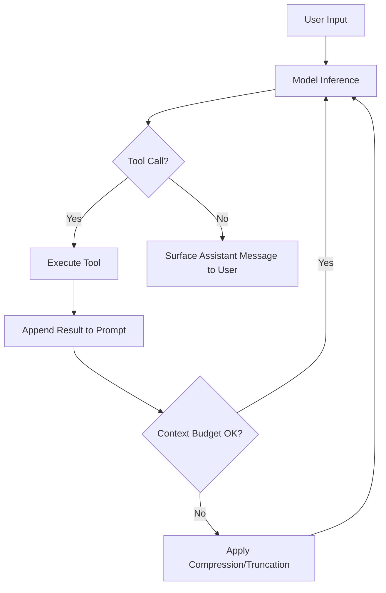

# Model a Single Agent Turn as Many Inference and Tool-Call Iterations

> A single user-facing "turn" is an iterative sequence of model inference and tool execution steps that repeats until the model emits an assistant message with no pending tool calls — not a single round-trip inference call.

## The Misconception

When building agent UX, you may assume a 1:1 mapping between user input and model response. This assumption shapes how you design timeouts, error handling, context management, and progress indicators — and it is wrong.

A single turn can involve dozens or hundreds of inference-tool-call cycles before producing a final assistant message. The Codex CLI treats each full sequence — from user input through all intermediate tool calls to the final message — as one "turn," surfacing only the result. [Source: [Unrolling the Codex Agent Loop](https://openai.com/index/unrolling-the-codex-agent-loop/)]

## How the Loop Terminates

The turn loop terminates when the model emits an assistant message without a pending tool call. Until that point:

- The model produces a response
- If the response contains a tool call, the [harness](agent-harness.md) executes the tool
- The tool result is appended to the prompt
- The model is re-queried with the updated prompt
- Repeat

This is not bounded to a fixed number of steps. The loop runs until the termination condition is met. [Source: [Unrolling the Codex Agent Loop](https://openai.com/index/unrolling-the-codex-agent-loop/)]

## Context Window Growth Within a Turn

Each tool call result is appended to the prompt for the next inference call, so the prompt grows within a single turn. For tasks involving many file reads, test runs, and iterative fixes, the context window can fill mid-turn.

Track token usage across all intermediate steps, not just the final response. This requires:

- Monitoring token count after each tool call result is appended
- Applying compression or truncation before the budget is exceeded
- Designing compact tool responses [Source: [Unrolling the Codex Agent Loop](https://openai.com/index/unrolling-the-codex-agent-loop/)]

## Practical Design Implications

**Timeouts**: a turn may run for minutes, not seconds. Request-count-based timeout logic may cancel valid in-progress turns.

**Progress indicators**: stream intermediate output via SSE or partial results rather than waiting silently through tool call cycles. [Source: [Unrolling the Codex Agent Loop](https://openai.com/index/unrolling-the-codex-agent-loop/)]

**Error recovery**: if a tool call fails mid-turn, the error is appended to the prompt as an observation and the model decides whether to retry or surface a failure. ([Bui, 2026 §2.2.6](https://arxiv.org/abs/2603.05344))

**Context continuity**: intermediate tool call outputs must persist for subsequent inference calls within the same turn. Stripping tool call history within a turn breaks the model's access to its own working state. ([Bui, 2026 §2.2.6](https://arxiv.org/abs/2603.05344))

## Extended ReAct Phases

The standard ReAct loop can be augmented with additional phases at each iteration ([Bui, 2026 §2.2.6](https://arxiv.org/abs/2603.05344)):

- **Phase 0 — Staged context management**: inject memory, fire system reminders, run compaction before inference.
- **Phase 1 — Thinking**: optional extended reasoning producing an internal chain-of-thought trace.
- **Phase 2 — Action**: standard LLM call with tool schemas, producing tool calls.
- **Phase 3 — Decision and dispatch**: validate tool calls against safety rules, enforce approval policies, detect doom loops.

The loop terminates on a final text response, an iteration cap, or budget exhaustion ([Bui, 2026 §2.2.6](https://arxiv.org/abs/2603.05344)).

## Example

A minimal agent harness illustrating the inference→tool→append→re-query cycle:

```python
def run_turn(user_message, tools):
    messages = [{"role": "user", "content": user_message}]

    while True:
        response = model.inference(messages, tools=tools)
        messages.append({"role": "assistant", "content": response})

        if not response.tool_calls:
            # No pending tool call — turn is complete
            return response.text

        for call in response.tool_calls:
            result = execute_tool(call.name, call.arguments)
            # Append result so the next inference sees it
            messages.append({"role": "tool", "content": result, "tool_call_id": call.id})
        # Re-query the model with the updated prompt
```

The loop exits only when the model produces a response with no tool calls. Each iteration appends tool results to `messages`, growing the context window.

## Diagram



## When This Backfires

Unbounded turn loops become liabilities in production under these conditions:

1. **Runaway cost from stuck tool calls**: when a tool returns an error state that the model treats as recoverable, the loop can retry indefinitely — a single stuck turn has been observed consuming millions of tokens before hitting a wall ([The Agent Loop Problem, Modexa, 2026](https://medium.com/@Modexa/the-agent-loop-problem-when-smart-wont-stop-ccbf8489180f)). Always enforce a hard iteration cap.

2. **Context window exhaustion mid-turn**: each tool result appends to the growing prompt. A turn involving many file reads or large API responses will silently approach the context limit. Without proactive compression, the next inference call is truncated or rejected — design for token budget exhaustion as a normal case, not an edge case.

3. **Latency opacity**: a turn that takes 30 seconds of silent tool execution is indistinguishable from a hung process to the end user. Streaming intermediate tool results is the only signal available; omitting it produces a wall of silence that triggers retries or abandonment.

4. **Doom loops in multi-agent systems**: when multiple agents share a loop, conflicting termination conditions cause tasks to bounce without resolution, burning turns without progress. Phase 3 of the Extended ReAct loop explicitly targets doom-loop detection as a separate concern ([Bui, 2026 §2.2.6](https://arxiv.org/abs/2603.05344)); see [Loop Detection](../observability/loop-detection.md) for the intra-session intervention patterns.

## Key Takeaways

- A single agent turn loops until the model emits a final message without a tool call
- Context grows within a turn; track token budget across all intermediate steps
- The loop can be extended with pre-inference context management, explicit thinking, and post-action safety validation
- Timeouts, progress indicators, and error recovery must account for multi-step turns

## Related

- [Agent Harness](agent-harness.md) — the runtime that executes tool calls and appends results within each turn iteration
- [Harness Engineering](harness-engineering.md) — design decisions for the surrounding loop that drive inference and tool dispatch
- [Loop Strategy Spectrum](loop-strategy-spectrum.md) — alternatives and variations on the iterative inference-tool loop
- [Agent Loop Middleware](agent-loop-middleware.md) — interception points that wrap inference and tool execution steps
- [Exception Handling and Recovery Patterns](exception-handling-recovery-patterns.md) — strategies for mid-turn tool failures and error recovery
- [The Think Tool](think-tool.md) — explicit thinking phase during Phase 1 of the Extended ReAct loop
- [Context Compression Strategies](../context-engineering/context-compression-strategies.md) — how to keep the intra-turn prompt within budget
- [Manual Compaction as Dumb Zone Mitigation](../context-engineering/manual-compaction-dumb-zone-mitigation.md) — proactively compacting context before the turn's budget is exhausted
