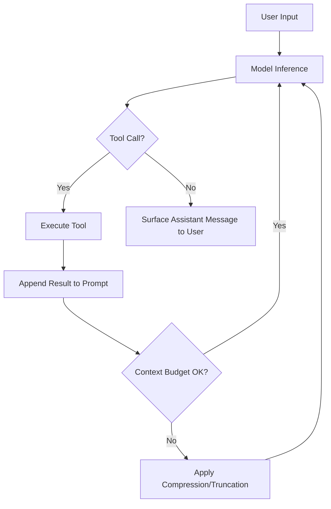

# Model a Single Agent Turn as Many Inference and Tool-Call Iterations

> An agent turn is an iterative sequence of model inference and tool-call steps, repeating until the model emits a response with no pending tool calls.

## The misconception

When building agent UX, you may assume each user input maps to one model response. That assumption is wrong. It shapes how you design timeouts, error handling, context management, and progress indicators.

A single turn can involve dozens or hundreds of inference-tool-call cycles before it produces a final assistant message. The Codex CLI treats each full sequence — from user input through all intermediate tool calls to the final message — as one "turn," surfacing only the result. [Source: [Unrolling the Codex Agent Loop](https://openai.com/index/unrolling-the-codex-agent-loop/)]

## How the loop ends

The turn loop ends when the model emits an assistant message with no pending tool call. Until that point:

- The model produces a response
- If the response contains a tool call, the [harness](agent-harness.md) executes the tool
- The tool result is appended to the prompt
- The model is re-queried with the updated prompt
- Repeat

The loop is not bound to a fixed number of steps. It runs until it meets the termination condition. [Source: [Unrolling the Codex Agent Loop](https://openai.com/index/unrolling-the-codex-agent-loop/)]

## Context window growth within a turn

The harness appends each tool result to the prompt for the next inference call, so the prompt grows within a single turn. For tasks with many file reads, test runs, and iterative fixes, the context window can fill mid-turn.

Track token usage across all intermediate steps, not just the final response. This requires:

- Monitoring token count after each tool call result is appended
- Applying compression or truncation before the budget is exceeded
- Designing compact tool responses [Source: [Unrolling the Codex Agent Loop](https://openai.com/index/unrolling-the-codex-agent-loop/)]

## Practical design implications

Timeouts: a turn may run for minutes, not seconds. Timeout logic based on request count may cancel valid in-progress turns.

Progress indicators: stream intermediate output through SSE or partial results, rather than waiting silently through tool call cycles. [Source: [Unrolling the Codex Agent Loop](https://openai.com/index/unrolling-the-codex-agent-loop/)]

Error recovery: if a tool call fails mid-turn, the harness appends the error to the prompt as an observation. The model then decides whether to retry or surface a failure. ([Bui, 2026 §2.2.6](https://arxiv.org/abs/2603.05344))

Context continuity: intermediate tool call outputs must persist for later inference calls within the same turn. Stripping tool call history within a turn cuts the model off from its own working state. ([Bui, 2026 §2.2.6](https://arxiv.org/abs/2603.05344))

## Extended ReAct phases

You can add more phases to the standard ReAct loop at each iteration ([Bui, 2026 §2.2.6](https://arxiv.org/abs/2603.05344)):

- Phase 0 — staged context management: inject memory, fire system reminders, run compaction before inference.
- Phase 1 — thinking: optional extended reasoning that produces an internal chain-of-thought trace.
- Phase 2 — action: standard LLM call with tool schemas, producing tool calls.
- Phase 3 — decision and dispatch: validate tool calls against safety rules, enforce approval policies, detect doom loops.

The loop ends on a final text response, an iteration cap, or budget exhaustion ([Bui, 2026 §2.2.6](https://arxiv.org/abs/2603.05344)).

## Example

A minimal agent harness illustrating the inference→tool→append→re-query cycle:

```python
def run_turn(user_message, tools):
    messages = [{"role": "user", "content": user_message}]

    while True:
        response = model.inference(messages, tools=tools)
        messages.append({"role": "assistant", "content": response})

        if not response.tool_calls:
            # No pending tool call — turn is complete
            return response.text

        for call in response.tool_calls:
            result = execute_tool(call.name, call.arguments)
            # Append result so the next inference sees it
            messages.append({"role": "tool", "content": result, "tool_call_id": call.id})
        # Re-query the model with the updated prompt
```

The loop exits only when the model produces a response with no tool calls. Each iteration appends tool results to `messages`, growing the context window.

## Diagram


```mermaid
graph TD
    A[User Input] --> B[Model Inference]
    B --> C{Tool Call?}
    C -->|Yes| D[Execute Tool]
    D --> E[Append Result to Prompt]
    E --> F{Context Budget OK?}
    F -->|Yes| B
    F -->|No| G[Apply Compression/Truncation]
    G --> B
    C -->|No| H[Surface Assistant Message to User]
```

## When this backfires

Unbounded turn loops become liabilities in production under these conditions:

1. Runaway cost from stuck tool calls: when a tool returns an error state that the model treats as recoverable, the loop can retry without end. One stuck turn has consumed millions of tokens before hitting a wall ([The Agent Loop Problem, Modexa, 2026](https://medium.com/@Modexa/the-agent-loop-problem-when-smart-wont-stop-ccbf8489180f)). Always enforce a hard iteration cap.

2. Context window exhaustion mid-turn: each tool result appends to the growing prompt. A turn with many file reads or large API responses will silently approach the context limit. Without proactive [context compression](../context-engineering/context-compression-strategies.md), the next inference call is truncated or rejected. Design for token budget exhaustion as a normal case, not an edge case.

3. Latency opacity: a turn that runs 30 seconds of silent tool execution looks like a hung process to the user. Streaming intermediate tool results is the only signal you have. Omit it and you produce a wall of silence that triggers retries or abandonment.

4. Doom loops in multi-agent systems: when multiple agents share a loop, conflicting termination conditions cause tasks to bounce without resolution, burning turns without progress. Phase 3 of the extended ReAct loop targets doom-loop detection as a separate concern ([Bui, 2026 §2.2.6](https://arxiv.org/abs/2603.05344)). See [Loop Detection](../observability/loop-detection.md) for the intra-session intervention patterns.

## Key Takeaways

- A single agent turn loops until the model emits a final message without a tool call
- Context grows within a turn; track token budget across all intermediate steps
- The loop can be extended with pre-inference context management, explicit thinking, and post-action safety validation
- Timeouts, progress indicators, and error recovery must account for multi-step turns

## Related

- [Agent Harness](agent-harness.md) — the runtime that executes tool calls and appends results within each turn iteration
- [Harness Engineering](harness-engineering.md) — design decisions for the surrounding loop that drive inference and tool dispatch
- [Loop Strategy Spectrum](../loop-engineering/loop-strategy-spectrum.md) — alternatives and variations on the iterative inference-tool loop
- [Agent Loop Middleware](../loop-engineering/agent-loop-middleware.md) — interception points that wrap inference and tool execution steps
- [Exception Handling and Recovery Patterns](exception-handling-recovery-patterns.md) — strategies for mid-turn tool failures and error recovery
- [The Think Tool](think-tool.md) — explicit thinking phase during Phase 1 of the Extended ReAct loop
- [Context Compression Strategies](../context-engineering/context-compression-strategies.md) — how to keep the intra-turn prompt within budget
- [Manual Compaction as Dumb Zone Mitigation](../context-engineering/manual-compaction-dumb-zone-mitigation.md) — proactively compacting context before the turn's budget is exhausted
