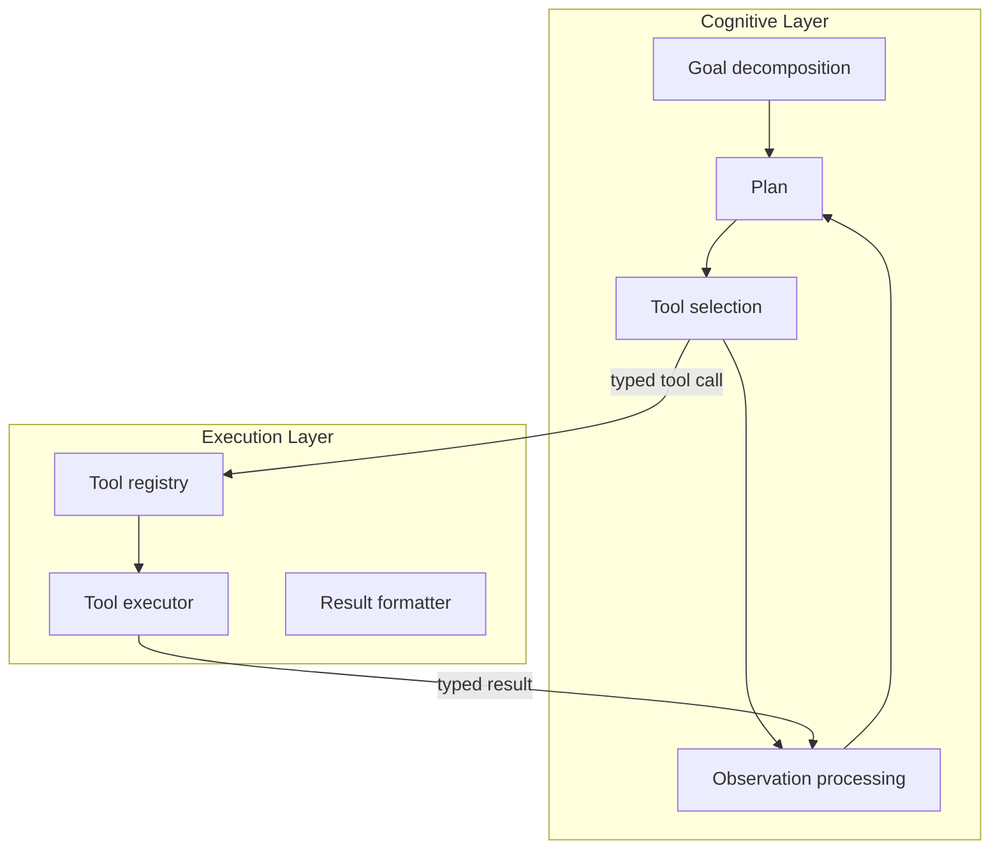

# Agentic AI Architecture: From Prompt-Response to Goal-Directed Systems

> The transition from stateless prompt-response models to goal-directed agentic systems requires a reference architecture separating cognitive reasoning from execution, a topology taxonomy for multi-agent coordination, and an enterprise hardening checklist.

## The Architectural Shift

Stateless prompt-response systems — where a user sends a message and the model returns a response — are the simplest LLM deployment pattern. Goal-directed systems extend this into autonomous multi-turn execution: the agent receives an objective, decomposes it into subtasks, executes tools, observes results, and iterates until the goal is met or a stopping condition triggers.

[arXiv:2602.10479](https://arxiv.org/abs/2602.10479) synthesizes this architectural evolution from foundational theory (BDI, reactive, and deliberative agent models) through contemporary LLM deployment patterns. The key insight: the transition is not incremental — it requires structural separation of concerns that prompt-response systems do not need.

## Reference Architecture

The core structural principle: **separate cognitive reasoning from execution using typed tool interfaces**.

**Cognitive layer** — the LLM. Responsible for goal interpretation, planning, tool selection, and result synthesis. The cognitive layer never directly modifies external state; it only emits typed tool calls.

**Typed tool interfaces** — the boundary. Tool calls are schema-validated; results are schema-validated. The cognitive layer cannot issue an untyped or malformed command. This boundary is the primary mechanism for predictable behavior.

**Execution layer** — deterministic infrastructure. Receives typed calls, executes them, returns typed results. The execution layer contains no reasoning; it contains only execution logic, error handling, and result formatting.

This separation enables independent testing of each layer and explicit auditability at the boundary.

## Multi-Agent Topology Taxonomy

Three coordination topologies, each with distinct failure patterns (see [Multi-Agent Topology Taxonomy](../multi-agent/multi-agent-topology-taxonomy.md) for a full breakdown):

**Centralised orchestration** — one orchestrator agent manages all worker agents. Workers execute assigned tasks and return results; the orchestrator synthesizes and decides next steps.

- *Advantage*: single point of coordination makes reasoning traceable
- *Failure mode*: orchestrator becomes a bottleneck; orchestrator failure halts the entire system

**Decentralised peer-to-peer** — agents communicate directly with each other without a designated coordinator. Each agent makes local decisions based on shared state or message passing.

- *Advantage*: no single point of failure; scales horizontally
- *Failure mode*: emergent coordination failures, race conditions, and inconsistent shared state are harder to debug

**Hybrid** — a lightweight coordinator handles task routing and high-level synthesis; workers communicate directly for sub-task coordination without routing through the coordinator.

- *Advantage*: reduces coordinator bottleneck while maintaining traceability at the routing level
- *Failure mode*: boundary between coordinator and peer-to-peer communication must be explicitly defined; implicit crossing creates inconsistent behavior

## Enterprise Hardening Checklist

Production agent deployments require three categories of hardening beyond functional correctness:

**Governance**

- Audit trails: every agent action is logged with timestamp, agent identity, tool name, arguments, and result [unverified]
- Access control: agents operate with least-privilege permissions; no agent has broader access than its assigned task requires [unverified]
- Policy enforcement: organizational constraints (data residency, PII handling, approved models) are enforced at the harness level, not by agent prompt alone [unverified]

**Observability**

- [Trajectory logging](../observability/trajectory-logging-progress-files.md): full turn-by-turn execution logs for post-hoc analysis and debugging [unverified]
- Cost tracking: per-session and per-agent token consumption reported in real time [unverified]
- Anomaly detection: alerts on deviation from expected trajectory length, tool call patterns, or cost bounds [unverified]

**Reproducibility**

- Deterministic seeding: where randomness affects agent behavior, seeds are captured in logs for replay [unverified]
- Idempotent operations: agent actions produce the same end state if executed more than once; no compounding side effects on retry [unverified]
- Snapshot-based rollback: system state is snapshotted before consequential actions; rollback is defined before execution begins [unverified] — see [Rollback-First Design](rollback-first-design.md)

## Industry Convergence Pattern

The paper observes that the ecosystem is converging on shared infrastructure patterns parallel to web services maturation: standardized agent loops, tool registries, and auditable control mechanisms. Multiple frameworks now implement the cognitive/execution separation, typed tool interfaces, and governance checklists described above. [unverified] If you build on these patterns now, you avoid architectural retrofits later.

## Example

A code review agent built on this architecture:

**Cognitive layer** — the LLM receives: `"Review PR #42 for security issues"`. It decomposes the goal: fetch PR diff, identify changed files, scan each file for known patterns, summarise findings. For each step it emits a typed tool call, e.g. `{ "tool": "github_get_pr_diff", "pr": 42 }`.

**Execution layer** — `github_get_pr_diff` fetches the diff and returns a typed result `{ "files": [...], "additions": 310, "deletions": 45 }`. The LLM never calls GitHub directly; it only receives the formatted result and decides the next tool call.

**Enterprise hardening applied**:

- Every tool call is logged: timestamp, agent ID, tool name, arguments, result.
- The agent runs with a scoped GitHub token (read-only on the target repo).
- A cost guard halts execution if the session exceeds 50k tokens before the agent self-terminates.

This maps each component directly onto the reference architecture above: the LLM stays in the cognitive layer, the GitHub client lives in the execution layer, and the typed tool interface enforces the boundary.

## Related

- [Orchestrator-Worker Pattern](../multi-agent/orchestrator-worker.md)
- [Agent Composition Patterns: Chains, Fan-Out, Pipelines, Supervisors](agent-composition-patterns.md)
- [Cognitive Reasoning vs Execution: A Two-Layer Agent](cognitive-reasoning-execution-separation.md)
- [Separation of Knowledge and Execution](separation-of-knowledge-and-execution.md)
- [Blast Radius Containment: Least Privilege for AI Agents](../security/blast-radius-containment.md)
- [PII Tokenization in Agent Context](../security/pii-tokenization-in-agent-context.md)
- [Idempotent Agent Operations: Safe to Retry](idempotent-agent-operations.md)
- [Typed Schemas at Agent Boundaries](../tool-engineering/typed-schemas-at-agent-boundaries.md)
- [Circuit Breakers for Agent Loops](../observability/circuit-breakers.md)
- [Agents vs Commands](agents-vs-commands.md)
- [Heuristic Effort Scaling](heuristic-effort-scaling.md)
- [Open Agent School Pattern Mapping](open-agent-school-pattern-mapping.md)
- [Specialized Agent Roles](specialized-agent-roles.md)
- [Agent Turn Model](agent-turn-model.md)
- [Agent Harness: Initializer and Coding Agent](agent-harness.md)
- [Cost-Aware Agent Design: Route by Complexity, Not Habit](cost-aware-agent-design.md)
- [Convergence Detection in Iterative Refinement](convergence-detection.md)
