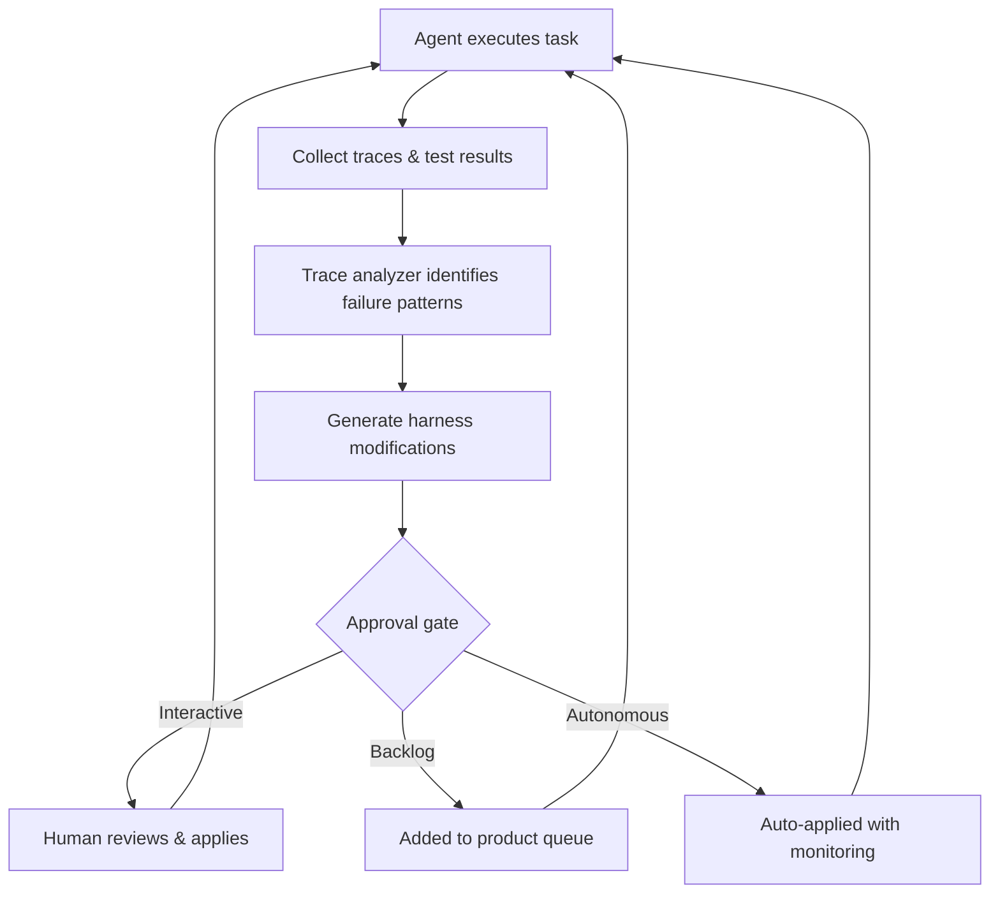

# Agentic Flywheel: Self-Improving Agent Systems

> A closed loop where agents analyze their own operational data -- traces, test results, pipeline metrics -- and generate harness improvements that make all future agent work better, not just the current task.

## Why a Flywheel

Most agent improvement is manual: a developer observes a failure, updates a prompt, and retries. The [continuous agent improvement](../workflows/continuous-agent-improvement.md) workflow formalizes this but keeps a human in the critical path.

The flywheel closes the loop. Agents analyze their own performance and propose harness changes -- prompts, tools, middleware, verification checks -- compounding improvement without a human at every step.

## Four Stages

| Stage | Activity | Existing pattern |
|-------|----------|-----------------|
| **Embed signals** | Add self-verification, tests, and quality checks so agents can gauge their own output | [Pre-completion checklists](../verification/pre-completion-checklists.md), [shift-left testing](../verification/tdd-agent-development.md) |
| **Analyze traces** | Mine execution traces for failure patterns, focusing on cases that failed in previous runs (boosting) | [Agent transcript analysis](../verification/agent-transcript-analysis.md) |
| **Generate modifications** | Produce targeted harness changes: new middleware, updated prompts, adjusted tool configurations | [Introspective skill generation](../workflows/introspective-skill-generation.md) |
| **Escalate approval** | Route modifications through an approval tier matched to confidence and risk | [Progressive autonomy with model evolution](../human/progressive-autonomy-model-evolution.md) |

The stages form a **closed loop improving the system's own infrastructure**, not individual task outputs.

## Boosting: Learning from Failures

Boosting concentrates analysis on prior failure cases:

1. Run a batch of agent tasks and collect traces
2. Filter to failures -- tasks that failed tests, produced rejected PRs, or triggered [loop detection](../observability/loop-detection.md)
3. Spawn parallel analysis agents, each examining a cluster of related failures
4. Synthesize findings into harness modifications

LangChain demonstrated this on Terminal Bench 2.0: harness-only improvements (self-verification loops, context injection, loop detection, reasoning budgets) improved scores from 52.8% to 66.5% -- a 13.7-point gain with no model change ([Improving Deep Agents with Harness Engineering](https://blog.langchain.com/improving-deep-agents-with-harness-engineering/)).

## Escalating Autonomy for Modifications

Not every harness change should be auto-applied. Kief Morris describes three levels ([Humans and Agents in Software Engineering Loops](https://martinfowler.com/articles/exploring-gen-ai/humans-and-agents.html)):

| Level | Mechanism | When to use |
|-------|-----------|-------------|
| **Interactive** | Human reviews each recommendation and selectively applies | Novel failure modes, security-sensitive middleware changes |
| **Backlog** | Agent adds suggestions to the product queue for later triage | Improvements needing broader discussion or affecting multiple projects |
| **Autonomous** | High-confidence recommendations auto-apply with monitoring | Well-tested, narrow-scope changes with rollback capability (e.g., adjusting a retry count, adding a lint rule) -- see [Rollback-First Design](rollback-first-design.md) |

Start at interactive. Move to autonomous only for categories with a proven track record. Fully autonomous tier 3 adoption remains rare in practice — most documented implementations keep a human in the loop for all but the narrowest change categories.

## Harness Modifications That Work

Effective flywheel improvements target the harness, not the model.

- **Reasoning sandwich** -- allocate maximum reasoning compute for planning and verification, moderate for implementation (xhigh-high-xhigh). Running maximum throughout caused timeouts; the sandwich pattern scored 63.6% vs. 53.9% for uniform maximum ([Improving Deep Agents with Harness Engineering](https://blog.langchain.com/improving-deep-agents-with-harness-engineering/)). See [reasoning budget allocation](reasoning-budget-allocation.md).
- **Pre-completion checklist middleware** -- intercepts the agent before exit and forces verification against the task spec, preventing premature completion — the [Ralph Wiggum loop](ralph-wiggum-loop.md) as middleware.
- **Loop detection middleware** -- tracks per-file edit counts and injects a reconsideration prompt after N edits, breaking doom loops ([loop detection](../observability/loop-detection.md)).

## Failure Modes

| Risk | Mitigation |
|------|------------|
| **Objective drift** | Context compression shifts the analyzer off original goals. Stress-test summarization to surface deviations ([objective drift](../anti-patterns/objective-drift.md)). |
| **Compounding bad changes** | An autonomous modification passes initial tests but degrades edge cases. A/B evaluate on a held-out task set before promoting. |
| **Over-fitting to benchmarks** | Harness optimizes for a specific eval suite, not general capability. Rotate eval tasks and include unseen scenarios. |

## Example

A team running nightly agent batches across 50 repositories implements the flywheel:

1. **Embed signals**: Each agent task includes a pre-completion checklist that runs tests and validates output against the issue spec
2. **Analyze traces**: A morning trace-analysis job filters to failed tasks, clusters them by error type (timeout, test failure, loop), and generates a report
3. **Generate modifications**: For the most common [failure cluster](behavioral-drivers-agent-success.md), the analyzer proposes a harness change -- e.g., adding a file-count guardrail after observing agents creating excessive temporary files
4. **Escalate**: The team reviews the first three proposals interactively. After two weeks of safe applications, they promote "add missing test import" fixes to autonomous

## Related

- [Continuous Agent Improvement](../workflows/continuous-agent-improvement.md)
- [Evaluator-Optimizer](evaluator-optimizer.md)
- [Agent Harness](agent-harness.md)
- [Context Compression Strategies: Offloading and Summarisation](../context-engineering/context-compression-strategies.md) — tiered compression that can cause objective drift when summaries lose task specifics
- [Introspective Skill Generation](../workflows/introspective-skill-generation.md)
- [Pre-Completion Checklists](../verification/pre-completion-checklists.md)
- [Progressive Autonomy with Model Evolution](../human/progressive-autonomy-model-evolution.md)
- [Ralph Wiggum Loop](ralph-wiggum-loop.md)
- [Loop Strategy Spectrum](loop-strategy-spectrum.md)
- [Loop Detection](../observability/loop-detection.md)
- [Circuit Breakers for Agent Loops](../observability/circuit-breakers.md)
- [Agent Loop Middleware](agent-loop-middleware.md)
- [Harness Engineering](harness-engineering.md)
- [Agent Composition Patterns](agent-composition-patterns.md)
- [Convergence Detection](convergence-detection.md)
- [Memory Synthesis from Execution Logs](memory-synthesis-execution-logs.md)
