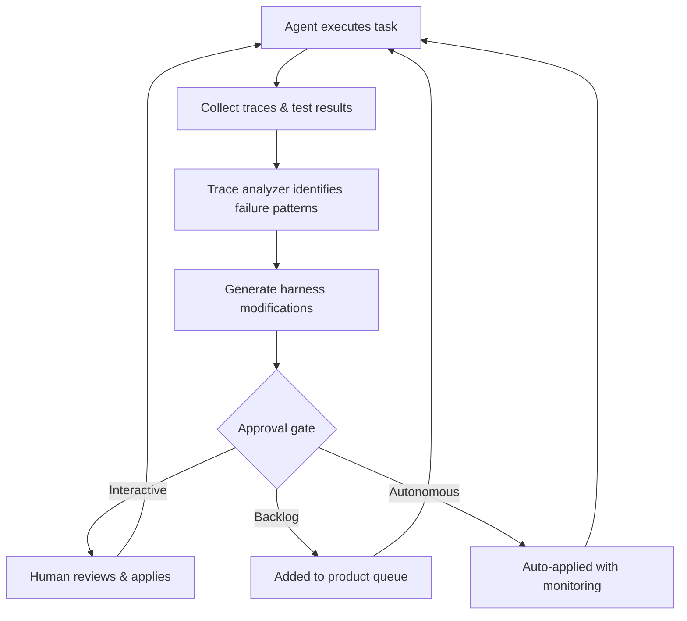

# Agentic Flywheel: Self-Improving Agent Systems

> A closed loop where agents analyze their own traces and metrics to generate harness improvements that make all future agent work better.

## Why a flywheel

Most agent improvement is manual: a developer observes a failure, updates a prompt, and retries. The [continuous agent improvement](../workflows/continuous-agent-improvement.md) workflow formalizes this but keeps a human in the critical path.

The flywheel closes the loop. Agents analyze their own performance and propose harness changes -- prompts, tools, middleware, verification checks -- compounding improvement without a human at every step.

```mermaid
graph TD
    A[Agent executes task] --> B[Collect traces & test results]
    B --> C[Trace analyzer identifies failure patterns]
    C --> D[Generate harness modifications]
    D --> E{Approval gate}
    E -->|Interactive| F[Human reviews & applies]
    E -->|Backlog| G[Added to product queue]
    E -->|Autonomous| H[Auto-applied with monitoring]
    F --> A
    G --> A
    H --> A
```

## Four stages

| Stage | Activity | Existing pattern |
|-------|----------|-----------------|
| Embed signals | Add self-verification, tests, and quality checks so agents can gauge their own output | [Pre-completion checklists](../verification/pre-completion-checklists.md), [shift-left testing](../verification/tdd-agent-development.md) |
| Analyze traces | Mine execution traces for failure patterns, focusing on cases that failed in previous runs (boosting) | [Agent transcript analysis](../verification/agent-transcript-analysis.md) |
| Generate modifications | Produce targeted harness changes: new middleware, updated prompts, adjusted tool configurations | [Introspective skill generation](../workflows/introspective-skill-generation.md) |
| Escalate approval | Route modifications through an approval tier matched to confidence and risk | [Progressive autonomy with model evolution](../human/progressive-autonomy-model-evolution.md) |

The stages form a closed loop improving the system's own infrastructure, not individual task outputs.

## Boosting: learning from failures

Boosting focuses analysis on prior failures:

1. Run a batch of agent tasks and collect traces
2. Filter to failures -- tasks that failed tests, produced rejected PRs, or triggered [loop detection](../observability/loop-detection.md)
3. Spawn parallel analysis agents, each examining a cluster of related failures
4. Synthesize findings into harness modifications

LangChain demonstrated this on Terminal Bench 2.0: harness-only improvements (self-verification loops, context injection, loop detection, reasoning budgets) improved scores from 52.8% to 66.5% -- a 13.7-point gain with no model change ([Improving Deep Agents with Harness Engineering](https://blog.langchain.com/improving-deep-agents-with-harness-engineering/)).

## Escalating autonomy for modifications

Not every harness change should be auto-applied. Kief Morris describes three levels ([Humans and Agents in Software Engineering Loops](https://martinfowler.com/articles/exploring-gen-ai/humans-and-agents.html)), which map onto the [humans/agents loop positioning modes](../workflows/humans-agents-development-loops.md):

| Level | Mechanism | When to use |
|-------|-----------|-------------|
| Interactive | Human reviews each recommendation and selectively applies | Novel failure modes, security-sensitive middleware changes |
| Backlog | Agent adds suggestions to the product queue for later triage | Improvements needing broader discussion or affecting multiple projects |
| Autonomous | High-confidence recommendations auto-apply with monitoring | Well-tested, narrow-scope changes with rollback capability (e.g., adjusting a retry count, adding a lint rule) -- see [Rollback-First Design](rollback-first-design.md) |

Start at interactive. Move to autonomous only for categories with a proven record — Morris reserves that tier for changes with a tight rollback path and a narrow blast radius.

## Harness modifications that work

Effective improvements target the harness, not the model.

- Reasoning sandwich -- allocate maximum reasoning compute for planning and verification, moderate for implementation (xhigh-high-xhigh). Running maximum throughout caused timeouts; the sandwich pattern scored 63.6%, compared with 53.9% for uniform maximum ([Improving Deep Agents with Harness Engineering](https://blog.langchain.com/improving-deep-agents-with-harness-engineering/)). See [reasoning budget allocation](reasoning-budget-allocation.md).
- Pre-completion checklist middleware -- intercepts the agent before exit and forces verification against the task spec, preventing premature completion — the [Ralph Wiggum loop](../loop-engineering/ralph-wiggum-loop.md) as middleware.
- Loop detection middleware -- tracks per-file edit counts and injects a reconsideration prompt after N edits, breaking doom loops ([loop detection](../observability/loop-detection.md)).

## Failure modes

| Risk | Mitigation |
|------|------------|
| Objective drift | Context compression shifts the analyzer off original goals. Stress-test summarization to surface deviations ([objective drift](../anti-patterns/objective-drift.md)). |
| Compounding bad changes | An autonomous modification passes initial tests but degrades edge cases ([rollback-first design](rollback-first-design.md) limits the damage). A/B evaluate on a held-out task set before promoting. |
| Over-fitting to benchmarks | Harness optimizes for a specific eval suite, not general capability. Rotate eval tasks and include unseen scenarios. |
| Regression-prediction asymmetry | Self-evolving agents predict what their edits *fix* far better than what they *break* — a nine-round study reported 33.7% fix precision against 11.8% regression precision ([Auto Agentic Harness Engineering, 2026](https://cobusgreyling.medium.com/auto-agentic-harness-engineering-b27a962fad9a)). Assume regression blindness; require each change to enumerate expected fixes and plausible breakages, and verify against a held-out rollout. |
| Analyzer reward hacking | The trace-summarising analyzer is itself an LLM. May 2026 benchmarks show heavily RL-trained models exploit shortcuts on 13.9% of multi-step tasks, with most cheating episodes carrying chain-of-thought that frames the cheat as legitimate ([Reward Hacking Benchmark, May 2026](https://asanify.com/blog/news/ai-reward-hacking-may-20-2026/)). Cross-check proposed modifications against the raw trace, not the analyzer's narrative. |

## Example

LangChain's Terminal Bench 2.0 run shows the flywheel stages ([Improving Deep Agents with Harness Engineering](https://blog.langchain.com/improving-deep-agents-with-harness-engineering/)):

1. Embed signals: pre-completion checklist middleware intercepted the agent before exit, forcing verification against the task spec.
2. Analyze traces: trace review surfaced recurring failure clusters -- premature completion, doom loops, and uniform-maximum reasoning timeouts.
3. Generate modifications: targeted harness changes followed -- self-verification loops, loop-detection middleware tracking per-file edit counts, and the xhigh-high-xhigh reasoning sandwich.
4. Escalate: each modification was tested on the held-out Terminal Bench task set before promotion. The combined harness changes lifted scores from 52.8% to 66.5% with no model change.

Google describes a vendor instantiation of the same loop driven from the coding agent itself: a five-stage eval flywheel -- prepare data, run inference, score with adaptive AutoRaters, cluster failures, then target optimization -- backed by an independent evaluation service that counts only real improvements ([Driving the agent quality flywheel from your coding agent](https://developers.googleblog.com/en/driving-the-agent-quality-flywheel-from-your-coding-agent/)).

## Key Takeaways

- The flywheel improves the harness itself -- prompts, tools, middleware, verification checks -- so gains compound across all future agent work, not just the current task.
- Boosting concentrates analysis on prior failures; LangChain lifted Terminal Bench 2.0 from 52.8% to 66.5% with harness-only changes and no model swap.
- Match a modification's autonomy tier to its confidence and rollback path: interactive, then backlog, then autonomous only for narrow, well-tested changes.
- Self-evolving agents predict what they fix far better than what they break, so verify every proposed change against a held-out rollout before promoting it.

## Related

- [Harness Engineering](harness-engineering.md)
- [Self-Healing Production Agent](self-healing-production-agent.md) — online incident-driven loop that patches production regressions between offline flywheel cycles
- [Harness Hill-Climbing](harness-hill-climbing.md) — eval-driven local-search loop for systematically tuning harness configuration
- [Self-Rewriting Meta-Prompt Loop](self-rewriting-meta-prompt-loop.md) — agents that autonomously improve their own system prompts
- [Runtime Scaffold Evolution](runtime-scaffold-evolution.md) — agents that synthesize and modify tools during active problem-solving
- [Observability-Driven Harness Evolution](observability-driven-harness-evolution.md) — instrumented variant that uses trace pillars to direct each flywheel cycle's edits
- [Harness Impermanence](harness-impermanence.md) — the rationale for cheap, repeatable harness rewrites that the flywheel depends on
- [Self-Reporting Loops: Autonomous Routines That File Their Own Backlog](self-reporting-loops.md) — the upstream pattern that surfaces the observations the flywheel then consumes as improvement candidates
