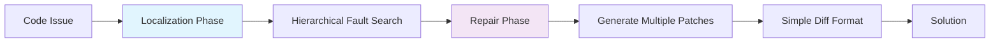

# Agentless vs Autonomous: When Simple Beats Complex

> Complex autonomous software agents are often unnecessary and counterproductive. Simple, constrained workflows frequently deliver better results at lower cost with reduced complexity debt.

The assumption that "more AI autonomy = better results" has been challenged by empirical evidence. The [Agentless paper](https://arxiv.org/abs/2407.01489) demonstrated that a simple two-phase process (localization + repair) achieved **27.33% accuracy on SWE-bench Lite at $0.70 average cost**, outperforming existing open-source autonomous agents despite using significantly less complexity.

## The Agentless Approach



**Localization Phase**: Hierarchical process to identify fault locations
**Repair Phase**: Generate multiple candidate patches in diff format

This constrained approach avoided the complexity overhead of autonomous planning, tool selection, and execution coordination that characterizes agent-based systems.

## When Autonomy Becomes Counterproductive

### The 80% Problem Shift

As AI coding capability improved from 70% to 80%+, [failure modes shifted](https://addyo.substack.com/p/the-80-problem-in-agentic-coding) from syntax bugs to deeper logical mistakes and comprehension debt. More autonomous agents compound these errors through:

- **State accumulation**: Complex agents build incorrect assumptions over many turns
- **Context drift**: Autonomous planning can diverge from actual requirements
- **Tool selection errors**: Agents choose inappropriate tools without human oversight
- **Coordination overhead**: Multi-agent systems spend tokens on communication rather than problem-solving

### Cost-Effectiveness Analysis

| Approach | SWE-bench Lite Accuracy | Average Cost | Complexity |
|----------|------------------------|--------------|------------|
| Agentless (Two-phase) | 27.33% | $0.70 | Low |
| SWE-Agent | 12.00% | Higher | High |
| AutoCodeRover | 16.00% | Higher | High |

Simple approaches demonstrate superior cost-performance ratios when complexity overhead is factored in.

## Design Principles for Simple-First Systems

### Start Constrained, Add Autonomy Selectively

[Anthropic's engineering guidance](https://www.anthropic.com/engineering/building-effective-agents) emphasizes "find the simplest solution first" and only add agent complexity "when it demonstrably improves outcomes."

**Progression path**:
1. **Manual workflow**: Human-driven, fully controlled
2. **Assisted workflow**: AI helps with specific steps
3. **Guided autonomy**: AI executes within strict boundaries
4. **Full autonomy**: AI plans and executes independently

Most tasks stop at level 2-3 because the marginal benefits of full autonomy don't justify the complexity costs.

### Harness Engineering Over Agent Engineering

Instead of building more autonomous agents, constrain AI systems through architectural patterns:

- **Typed interfaces**: Enforce correct tool usage
- **Bounded execution**: Limit scope and resource consumption
- **Mechanical validation**: Automated checks catch errors before propagation
- **Rollback-first design**: Every action should be easily reversible

This [harness engineering approach](https://martinfowler.com/articles/exploring-gen-ai/harness-engineering.html) maintains reliability while preserving AI capabilities within safe boundaries.

## Example: Code Review Workflow Comparison

**Autonomous Agent Approach**
```yaml
# High complexity, unpredictable paths
agent:
  - discover_files
  - analyze_architecture
  - identify_patterns
  - check_dependencies
  - run_tests
  - generate_report
  - suggest_improvements
  - coordinate_fixes
```

**Agentless Approach**
```yaml
# Constrained, predictable workflow
phases:
  locate: [lint_check, type_check, test_results]
  repair: [generate_fixes, validate_patches, apply_best]
```

The agentless version produces more consistent results because it avoids coordination complexity while leveraging AI strengths (pattern recognition and code generation) within bounded contexts.

## Key Takeaways

- **Complexity debt compounds**: Autonomous agents accumulate complexity costs that often exceed their benefits
- **Constrained AI outperforms**: Simple, bounded workflows frequently deliver better results than complex autonomous systems
- **Start simple, add selectively**: Only introduce autonomy when simpler approaches demonstrably fail
- **Cost-effectiveness matters**: Factor in development, maintenance, and debugging costs when choosing between approaches
- **Evidence over intuition**: Empirical results consistently favor constrained approaches for most coding tasks

The goal is not to avoid AI, but to apply it within architectures that maximize its strengths while minimizing complexity overhead.

## Unverified Claims

- SWE-bench Lite-S quality improvements and specific accuracy metrics beyond what is stated in the Agentless paper abstract [unverified]

## Related

- [Harness Engineering](harness-engineering.md) — The discipline of constraining agent environments so agents reliably produce correct results within safe boundaries
- [Delegation Decision](delegation-decision.md) — Framework for deciding when agent delegation overhead is justified versus simpler approaches
- [Cost-Aware Agent Design](cost-aware-agent-design.md) — Matching model capability to task complexity rather than defaulting to the most autonomous option
- [Cognitive Reasoning vs Execution Separation](cognitive-reasoning-execution-separation.md) — The two-layer architecture that the agentless approach implicitly follows
