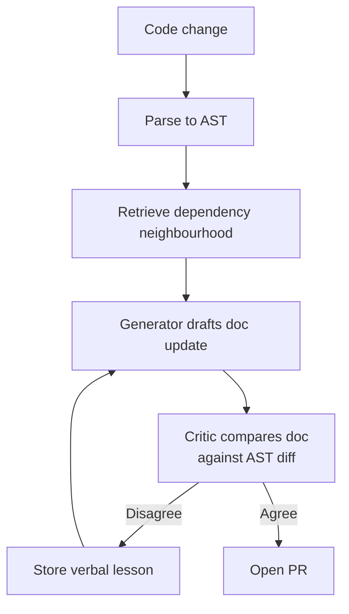

# AST-Grounded Critic Loop for Documentation Maintenance

> Constrain doc generation with the code's Abstract Syntax Tree, retrieve only the dependency neighbourhood, and run the proposed update through a separate critic until the structural diff converges — Reflexion stores each rejection as a verbal lesson for the next attempt.

## The Composition

The technique stacks three components that each exist as standalone patterns. The novelty is the wiring, not any single piece:

1. **AST grounding** — parse the source file, extract the symbols, signatures, and dependency edges that the doc must describe. The generator's hypothesis space is restricted to nodes that exist in the tree
2. **Dependency-aware retrieval** — RAG fetches only the AST neighbourhood (callers, callees, type definitions referenced in the function under documentation), not the whole file or the whole repo
3. **Critic-guided Reflexion** — a separate model compares the proposed doc against the AST diff between current and previous code state, returns a structured rejection if they disagree, and the rejection is stored as a verbal lesson injected into the next attempt's context



This is the architecture proposed in DocSync ([Badrinarayan & Parthasarathy, arXiv:2605.02163](https://arxiv.org/abs/2605.02163)), which reports 3.44/5.0 on an automated judge against 1.91 for a CodeT5-base baseline using a LoRA-adapted small language model. Treat the number as a single-paper claim; no independent replication exists yet.

## Why Each Layer Carries Weight

**AST grounding** addresses hallucinated identifiers — the dominant failure mode of LLM-generated documentation ([DocAgent, ACL 2025 — arXiv:2504.08725](https://arxiv.org/abs/2504.08725)). A symbol absent from the AST cannot legitimately appear in a doc that claims to describe the file — the same property that motivates [AST-Guided Agent Memory](ast-guided-agent-memory.md).

**Dependency-aware retrieval** keeps the context window populated with the code that constrains the doc. Whole-module loading pollutes context; loading nothing forces invention. The AST gives an exact answer: load the transitively-referenced nodes.

**Critic-guided Reflexion** is the separation lever. A single model reflecting on its own output rationalises rather than critiques — the [self-correction blind spot](https://arxiv.org/abs/2507.02778) measures a 64.5% average blind-spot rate across 14 tested LLMs. A separate critic operating on the AST diff (a different artifact than the generator's text) breaks the shared blind spot. The Reflexion layer ([Shinn et al. 2023 — arXiv:2303.11366](https://arxiv.org/abs/2303.11366)) carries the rejected attempt's lesson into the next iteration as a verbal note.

## When to Apply

Apply when:

- The codebase has robust AST tooling for the target language; polyglot stacks need a parser per language
- Documentation drift is frequent and high-cost — API references, function docstrings, README API tables, OpenAPI summaries
- The critic and generator can be different models, or the same model in distinct prompts with non-overlapping context

Avoid when:

- The doc is narrative or conceptual (architectural overviews, tutorials) — there is no AST diff to compare against
- The codebase relies on metaprogramming, code generation, or DSLs the parser sees only partially — structural ground truth is incomplete
- The documentation surface is small or rarely-changes — manual edits beat the infrastructure cost
- The model lacks pre-training exposure to the codebase's proprietary patterns — RAG helps but does not eliminate hallucination the critic cannot judge

## Where It Slots Into a Pipeline

This is a technique, not a workflow. The orchestration layer — schedule triggers, push triggers, safe outputs, PR labelling — belongs to [Continuous Documentation](../workflows/continuous-documentation.md). The technique replaces that workflow's generation step with a critic-guided loop instead of a single-shot LLM call.

The critic role mirrors [Critic Agent Pattern](critic-agent-plan-review.md), specialised for doc-vs-AST-diff comparison. The Reflexion-style memory carries forward like [Self-Rewriting Meta-Prompt Loop](self-rewriting-meta-prompt-loop.md), applied per-file rather than per-prompt.

## Failure Modes Specific to This Composition

**Drift-loop churn** — if the critic's rejection criteria are stylistic, the generator oscillates between equivalent phrasings without converging. Cap iteration depth and escalate non-convergence to a human reviewer.

**AST coverage gaps masquerading as agreement** — functions generated by macros, decorators, or runtime metaclasses appear partial or absent in the AST. The critic sees no diff to disagree with and the loop terminates with a doc that does not describe the actual runtime behaviour. Track which symbols in the doc map to AST nodes; flag unresolved ones.

**Shared blind spot when critic and generator share both model and prompt** — separation requires either a different model or a critic prompt that operates on a different artifact (the AST diff, not the doc text). A "review your work" instruction with the same context as generation reproduces the blind-spot rate ([self-correction blind spot, arXiv:2507.02778](https://arxiv.org/abs/2507.02778)).

**Reported gains came from a LoRA-adapted small model** — the same loop around a generic frontier model without domain adaptation may not reproduce DocSync's headline numbers. Treat the architecture as separable from the parameter-count savings.

## Example

The minimum viable form for a Python codebase:

```python
import ast

def doc_critic_loop(source_file, code_diff, max_iterations=3):
    tree = ast.parse(source_file.read())
    target = locate_changed_function(tree, code_diff)
    neighbourhood = collect_dependencies(tree, target)  # callers, callees, types

    lesson = ""
    for _ in range(max_iterations):
        proposed_doc = generator.draft(
            target=target,
            context=neighbourhood,
            prior_lesson=lesson,
        )
        verdict = critic.evaluate(
            doc=proposed_doc,
            ast_diff=diff_target_against_prior(target),
        )
        if verdict.agrees:
            return proposed_doc
        lesson = verdict.structured_rejection  # verbal note, Reflexion-style

    return None  # escalate to human reviewer
```

The `critic.evaluate` call is the lever — it consumes the AST diff, not the source code, so its judgement is structural rather than textual. The loop terminates on agreement or on iteration cap; never on the generator's self-assessment.

## Key Takeaways

- AST grounding restricts the generator's hypothesis space to symbols that actually exist; RAG limits context to the dependency neighbourhood; the critic operating on AST diffs breaks the same-model blind spot — three separable levers, each with prior evidence
- The Reflexion layer ([Shinn et al. 2023](https://arxiv.org/abs/2303.11366)) carries the rejected attempt's lesson forward; it is the persistence mechanism, not the reasoning mechanism
- DocSync's headline judge score is from a single just-published paper ([arXiv:2605.02163](https://arxiv.org/abs/2605.02163)); no independent replication, no production reports
- The technique is a generation-step replacement inside [Continuous Documentation](../workflows/continuous-documentation.md), not a workflow on its own
- Failure modes — AST coverage gaps, drift-loop churn, shared blind spot when critic and generator share a model and prompt — are addressable but not eliminated by the architecture

## Related

- [Continuous Documentation](../workflows/continuous-documentation.md)
- [Critic Agent Pattern](critic-agent-plan-review.md)
- [AST-Guided Agent Memory](ast-guided-agent-memory.md)
- [Evaluator-Optimizer Pattern](evaluator-optimizer.md)
- [Self-Rewriting Meta-Prompt Loop](self-rewriting-meta-prompt-loop.md)
- [Inference-Time Tool-Call Reviewer](inference-time-tool-call-reviewer.md)
