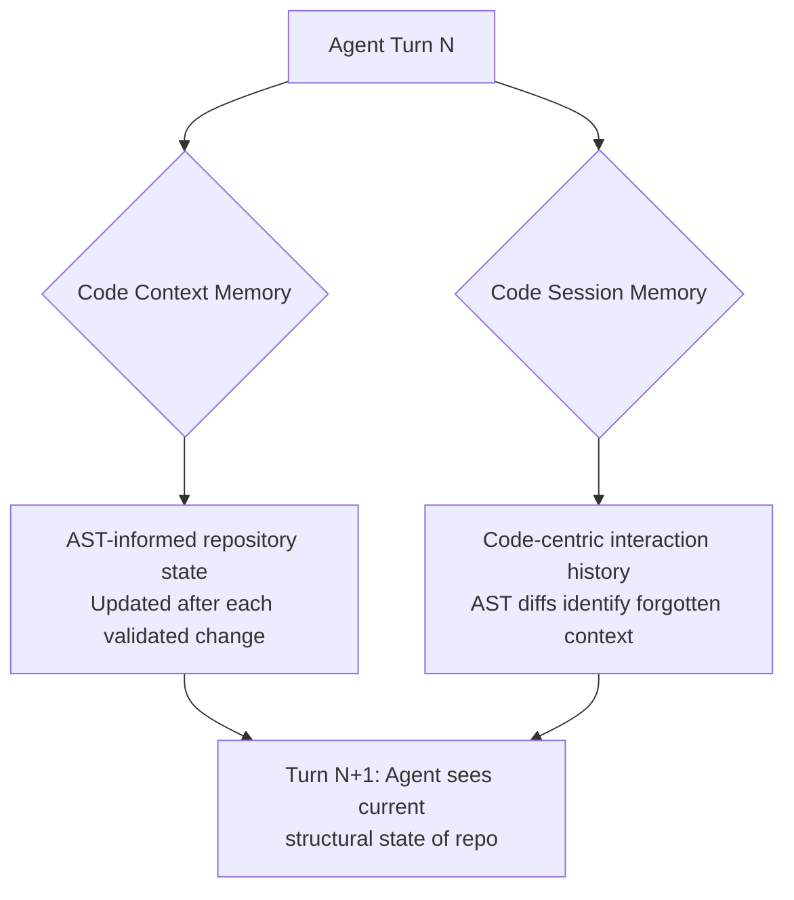

# AST-Guided Agent Memory for Repository-Level Code Generation

> Use AST (Abstract Syntax Tree) representations as the memory substrate for coding agents instead of natural language summaries — structural representations capture code relationships that text summaries miss, preventing agents from reintroducing previously fixed errors.

## The Error Recurrence Problem

As multi-turn coding sessions grow, agents lose track of validated fixes and reintroduce resolved errors. Natural language summaries lose structural relationships — "fixed the pagination logic" doesn't encode *which* AST nodes changed or *how* they relate to dependent code paths.

CodeMEM ([arXiv:2601.02868](https://arxiv.org/abs/2601.02868)) addresses this with two AST-informed memory components that track code state structurally.

## Dual Memory Architecture



**Code Context Memory** maintains live repository state via AST-informed operations. After each validated change, the memory reflects current structural relationships, preventing conflicting modifications. ([arXiv:2601.02868](https://arxiv.org/abs/2601.02868))

**Code Session Memory** builds a code-centric interaction history using AST diff analysis to identify forgotten context. When proposed changes regress toward a previously abandoned approach, AST diffs surface the discrepancy. ([arXiv:2601.02868](https://arxiv.org/abs/2601.02868))

## Why AST Over Text

Natural language memory has three failure modes:

| Failure Mode | Text Summary | AST Representation |
|---|---|---|
| **Structural loss** | "Fixed the auth middleware" — no encoding of which functions changed | Preserves exact node-level changes and dependency graph position |
| **Ambiguity** | "Updated the validation logic" could mean input, schema, or auth validation | AST nodes are unambiguous — specific functions, parameters, control flow |
| **Diff blindness** | Cannot mechanically compare current state against memory | AST diff identifies when current code matches a previously abandoned version |

Structural representation enables mechanical regression detection — text summaries require the LLM to infer whether two descriptions refer to the same change.

## Results

CodeMEM reports 12.2% current-turn and 11.5% session-level improvement in instruction following, with 2-3 fewer rounds per task. Token efficiency remains competitive with baselines. ([arXiv:2601.02868](https://arxiv.org/abs/2601.02868)) [unverified]

Round reduction is the key practical finding: each avoided round saves wait time and token budget.

## Practical Implications

**For agent builders:** If your agent maintains session memory, check whether it encodes code structure or just text descriptions. Tree-sitter and language server protocols provide the required AST parsing.

**For agent users:** Error recurrence — the agent fixing something, then breaking it two turns later — signals lost structural context. Shorter sessions, "do not change X" constraints, or diffing against validated state can mitigate this.

**Token efficiency:** AST representations compress code changes more efficiently than prose, keeping context windows manageable. [unverified]

## Relation to Other Memory Patterns

AST-guided memory operates on a different axis from scope and granularity patterns:

- **[Agent Memory Patterns](agent-memory-patterns.md)** defines *where* memories persist. AST-guided memory defines *how* — code structure, not text.
- **[Subtask-Level Memory](subtask-level-memory.md)** controls *retrieval granularity*. AST-guided memory controls *encoding fidelity* — preserving structural relationships in stored content.
- **[Episodic Memory Retrieval](episodic-memory-retrieval.md)** retrieves past episodes by trigger-context-outcome indexing. AST-guided memory could use structural similarity (edit distance) as the retrieval signal.

These dimensions compose: an agent could combine subtask-level retrieval, episodic scope, and AST-based encoding.

## Unverified Claims

- 12.2% current-turn and 11.5% session-level improvement [unverified — paper benchmarks, not independently reproduced]
- AST representations compress more efficiently than natural language [unverified — paper reports competitive token efficiency without compression ratio comparisons]

## Example

A coding agent fixes a pagination bug by changing `fetchPage(offset)` to `fetchPage(offset, limit)` in `api/list.py`. Two turns later, it refactors the same file and reverts to `fetchPage(offset)`.

**Text memory** stored: `"Fixed pagination to include limit parameter."` The agent cannot mechanically detect that the refactored version matches the pre-fix state.

**AST memory** stored the structural diff:

```
CallExpression: fetchPage
  args: [offset] → [offset, limit]
  file: api/list.py:42
```

When the agent proposes the refactored version, the AST diff against stored memory shows the `limit` argument was dropped — the same structural pattern as the original bug. Session memory flags the regression before the change is applied.

## Key Takeaways

- Natural language memory loses structural code relationships, enabling error recurrence in multi-turn sessions.
- AST diff analysis mechanically detects regression toward previously abandoned solutions — text summaries cannot.
- Dual memory (live repo state + structural session history) addresses two failure modes: conflicting changes and forgotten context.
- Round reduction (2-3 fewer turns per task) is the highest-impact practical benefit.

## Related

- [Agent Memory Patterns](agent-memory-patterns.md) — scope-based memory taxonomy
- [Subtask-Level Memory](subtask-level-memory.md) — retrieval granularity aligned to reasoning stages
- [Episodic Memory Retrieval](episodic-memory-retrieval.md) — trigger-context-outcome retrieval
- [Memory Synthesis from Execution Logs](memory-synthesis-execution-logs.md) — extracting lessons from agent traces
- [Beads: Task Graphs as External Agent Memory](beads-task-graph-agent-memory.md) — git-backed dependency graphs for session state
- [Context Compression Strategies](../context-engineering/context-compression-strategies.md) — structural compression for context management
