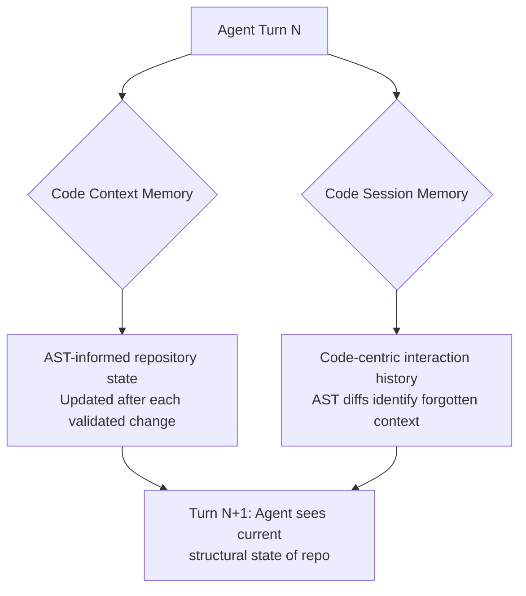

# AST-Guided Agent Memory for Repository-Level Code Generation

> Use AST (Abstract Syntax Tree) representations as the memory substrate for coding agents instead of natural language summaries — structural representations capture code relationships that text summaries miss, preventing agents from reintroducing previously fixed errors.

## The Error Recurrence Problem

Multi-turn coding sessions accumulate context. As session history grows, agents lose track of validated fixes and reintroduce previously resolved errors. Natural language summaries of code changes lose structural relationships — a summary like "fixed the pagination logic" doesn't encode *which* AST nodes changed or *how* they relate to dependent code paths.

The CodeMEM system ([arXiv:2601.02868](https://arxiv.org/abs/2601.02868)) addresses this with two AST-informed memory components that track code state and session history at the structural level rather than the textual level.

## Dual Memory Architecture

**Code Context Memory** maintains the live repository state through AST-informed LLM operations. After each validated code change, the memory updates to reflect the current structural relationships — not a text description of what changed, but the actual code structure as represented by its AST. This prevents the agent from proposing changes that conflict with already-validated modifications. ([arXiv:2601.02868](https://arxiv.org/abs/2601.02868))

**Code Session Memory** builds a code-centric (not text-centric) record of the interaction history. Rather than storing conversation turns as natural language, it uses AST diff analysis to identify what the agent has forgotten or lost track of. When the agent's proposed changes regress toward a previously abandoned approach, AST diffs surface the discrepancy. ([arXiv:2601.02868](https://arxiv.org/abs/2601.02868))

## Why AST Over Text

Natural language memory representations have three failure modes in code generation:

| Failure Mode | Text Summary | AST Representation |
|---|---|---|
| **Structural loss** | "Fixed the auth middleware" — no encoding of which functions, parameters, or call paths changed | Preserves the exact node-level changes and their position in the dependency graph |
| **Ambiguity** | "Updated the validation logic" could refer to input validation, schema validation, or auth checks | AST nodes are unambiguous — specific functions, parameters, and control flow paths |
| **Diff blindness** | Cannot mechanically compare current state against memory to detect regression | AST diff directly identifies when current code structurally matches a previously abandoned version |

Structural representation enables mechanical detection of error recurrence — text summaries require the LLM to reason about whether two descriptions refer to the same change. ([arXiv:2601.02868](https://arxiv.org/abs/2601.02868))

## Results

CodeMEM reports a 12.2% improvement in current-turn instruction following and 11.5% improvement at session level, with 2-3 fewer interaction rounds needed to complete tasks. Inference latency and token efficiency remain competitive with baseline approaches. ([arXiv:2601.02868](https://arxiv.org/abs/2601.02868)) [unverified]

The round reduction is the most practically significant finding: each avoided round saves developer wait time and token budget. The mechanism is preventing re-exploration of solution paths the agent already tried and abandoned.

## Practical Implications

**For agent builders:** If your agent maintains session memory for multi-turn coding, check whether it encodes code structure or just text descriptions. Tree-sitter and language server protocols provide the AST parsing needed for structural memory.

**For agent users:** Error recurrence — the agent fixing something, then breaking it again two turns later — signals that session memory is losing structural context. Shorter sessions, explicit "do not change X" constraints, or diffing against prior validated state can mitigate this.

**Token efficiency:** AST representations compress code changes more efficiently than prose explanations, keeping context windows manageable during long sessions. [unverified]

## Relation to Other Memory Patterns

AST-guided memory operates on a different axis from scope-based and granularity-based memory patterns:

- **[Agent Memory Patterns](agent-memory-patterns.md)** defines *where* memories persist (episodic, working, project scope). AST-guided memory defines *how* memories are represented — the substrate is code structure, not text.
- **[Subtask-Level Memory](subtask-level-memory.md)** controls *retrieval granularity* — matching memories to reasoning stages. AST-guided memory controls *encoding fidelity* — preserving structural relationships in what gets stored.
- **[Episodic Memory Retrieval](episodic-memory-retrieval.md)** retrieves past episodes by trigger-context-outcome indexing. AST-guided memory could use structural similarity (AST edit distance) as the retrieval signal instead of semantic similarity.

These dimensions compose: an agent could use subtask-level retrieval granularity, episodic scope, and AST-based encoding simultaneously.

## Unverified Claims

- 12.2% improvement in current-turn instruction following and 11.5% at session level [unverified — based on the paper's reported benchmarks, not independently reproduced]
- AST representations compress code changes more efficiently than natural language descriptions [unverified — the paper reports competitive token efficiency but does not provide direct compression ratio comparisons]

## Key Takeaways

- Natural language memory summaries lose structural code relationships, enabling error recurrence in multi-turn sessions.
- AST diff analysis mechanically detects when an agent regresses toward previously abandoned solutions — text summaries cannot.
- The dual memory design (live repo state + structural session history) addresses two distinct failure modes: conflicting changes and forgotten context.
- Round reduction (2-3 fewer turns per task) is the highest-impact practical benefit for developers.

## Related

- [Agent Memory Patterns: Learning Across Conversations](agent-memory-patterns.md) — scope-based memory taxonomy (episodic, working, project, user)
- [Subtask-Level Memory for Software Engineering Agents](subtask-level-memory.md) — retrieval granularity aligned to reasoning stages
- [Episodic Memory Retrieval](episodic-memory-retrieval.md) — trigger-context-outcome retrieval mechanics
- [Memory Synthesis from Execution Logs](memory-synthesis-execution-logs.md) — extracting lessons from agent traces
- [Context Compression Strategies](../context-engineering/context-compression-strategies.md) — structural compression for context management
