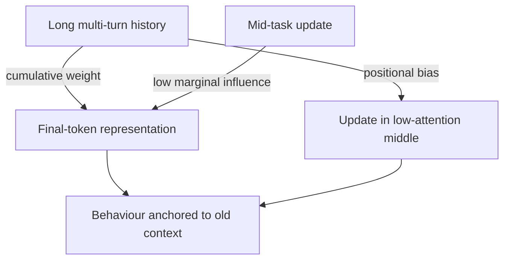

# Attention Latch: When Agents Stay Anchored to Stale Instructions

> Cumulative historical context in decoder-only Transformers can over-squash mid-task updates, leaving multi-turn agents anchored to obsolete constraints despite explicit contradictory instructions.

## The Failure Mode

An agent receives an instruction that contradicts an earlier one mid-session — and keeps acting on the earlier one. Shehata and Li (2026) name this the **Attention Latch**: cumulative probabilistic weight of historical context overrides mid-task updates, anchoring the agent to obsolete constraints despite explicit contradictory instructions ([Shehata & Li, 2026](https://arxiv.org/abs/2604.24512)).

The latch is the behavioural face of **Information Over-squashing** in decoder-only autoregressive Transformers ([Barbero et al., 2024](https://arxiv.org/abs/2406.04267)) — distinct input sequences collapse to near-identical final-token representations as history grows, so a late instruction cannot move the representation far enough to change behaviour.

## Why Over-Squashing Causes the Latch

Decoder-only attention is causal: information from earlier tokens contributes additively to the final-token representation through every subsequent layer. The unidirectional flow converging at the final token loses sensitivity to specific tokens, exacerbated by low-precision floating-point formats ([Barbero et al., 2024](https://arxiv.org/abs/2406.04267)). The longer the history, the smaller the marginal influence any single new instruction exerts.

This compounds with the [U-shaped attention curve](../context-engineering/lost-in-the-middle.md): a contradictory instruction inserted mid-session lands in the low-attention middle zone, where positional bias and over-squashing combine to suppress it ([Liu et al., 2023](https://arxiv.org/abs/2307.03172)).

## How to Recognise It

Distinct from instruction-following failure on a fresh prompt. Diagnostic signals:

- The agent acknowledged the new instruction earlier in the turn but then acted on the old one.
- Resetting the conversation and reissuing the same instruction produces compliance.
- Compliance returns when the contradicting prefix is removed.

If all three hold, the cause is structural over-squashing rather than ambiguous wording.

## Where It Triggers

Shehata and Li (2026) located the **Attention Stability Boundary** empirically across 9K trajectories on MultiWOZ 2.2. On the hardest tier — a semantic-hijacked 3-hop multi-fact synthesis task — vanilla ReAct on GPT-5.4 collapsed to 0.1% success ([Shehata & Li, 2026](https://arxiv.org/abs/2604.24512)). The boundary is reached when:

- Histories are long enough for cumulative weight to dominate.
- Mid-task updates contradict, rather than extend, prior constraints.
- Retrieval results inject content that semantically resembles the contradicted instruction.

Independent work confirms the broader pattern: 100K+ token sequences exhibit goal drift across model families, predominantly through inaction ([Arike et al., 2025](https://arxiv.org/abs/2505.02709)); models deprioritise initial instructions as history grows even when they remain in context ([Bui, 2026 §3.2](https://arxiv.org/abs/2603.05344)).

## Mitigations on a Spectrum

Match the mitigation cost to how often the latch fires in your workload. Lightweight options first.

### 1. Recency anchoring (lightweight)

Push current objectives into the high-attention tail at every step. [Goal recitation](../context-engineering/goal-recitation.md) rewrites the objective and to-do list after each tool call; [event-driven system reminders](../instructions/event-driven-system-reminders.md) inject the contradicting instruction as a fresh user-role message at the relevant decision point. These do not eliminate over-squashing — they place the new instruction where attention is strongest.

### 2. History reset (medium)

Bound cumulative history before it dominates. The [Ralph Wiggum Loop](ralph-wiggum-loop.md) restarts each iteration from a fresh context, re-reading the specification from disk; [post-compaction re-read protocols](../instructions/post-compaction-reread-protocol.md) restore foundational instructions after summarisation. These attack the latch at its root.

### 3. Architect/Executive separation (heavy)

Run high-level planning in one context (the Architect) and turn-by-turn execution in a separate, scoped context (the Executive) per turn — Shehata and Li's SSRP framework ([Shehata & Li, 2026](https://arxiv.org/abs/2604.24512)). Structural variants already covered on this site:

- [Cognitive Reasoning vs Execution Separation](cognitive-reasoning-execution-separation.md) — typed-tool-interface seam between layers.
- [Discrete Phase Separation](discrete-phase-separation.md) — conversation-boundary version, with each phase in its own conversation.

Choose this tier when lighter mitigations have been measured and found insufficient — the split adds an extra LLM call per turn, schema-versioning churn, and orchestration overhead, and most workloads do not cross the boundary ([Microsoft Azure Architecture Center](https://learn.microsoft.com/en-us/azure/architecture/ai-ml/guide/ai-agent-design-patterns)).

## The Grounding Paradox

Heavy mitigations can overshoot. Shehata and Li (2026) report a Procedural Integrity audit at 98.8% adherence revealing a **Grounding Paradox**: high-stability models fail by refusing to generate output under retrieval-reasoning contamination — the agent holds its ground so firmly it stops responding to legitimate updates ([Shehata & Li, 2026](https://arxiv.org/abs/2604.24512)). Verify the failure has been removed, not relocated.

## Where the Latch Does Not Fire

- **Short single-objective tasks.** Cumulative history stays small relative to the latest turn.
- **Append-only updates.** Extensions of prior context do not require overcoming over-squashing.
- **Aggressive harness-level resets.** Frequent compaction or [Ralph Wiggum](ralph-wiggum-loop.md)-style restarts keep histories below the boundary.
- **Single-turn flows.** The boundary is a multi-turn phenomenon.

## Key Takeaways

- The Attention Latch is the behavioural face of decoder-only over-squashing — a structural property, not a prompt bug.
- It triggers when long histories collide with contradicting mid-task updates, especially in the [U-shaped middle zone](../context-engineering/lost-in-the-middle.md).
- Mitigate on a spectrum: recency anchoring first, history reset next, architectural split only when measured drift justifies the overhead.
- Heavy mitigations introduce the Grounding Paradox — verify the failure is removed, not relocated.

## Related

- [Lost in the Middle: The U-Shaped Attention Curve](../context-engineering/lost-in-the-middle.md) — the positional-bias half of the same problem
- [Goal Recitation: Countering Drift in Long Sessions](../context-engineering/goal-recitation.md) — recency-anchoring mitigation
- [Event-Driven System Reminders](../instructions/event-driven-system-reminders.md) — harness-injected reminders at decision points
- [Post-Compaction Re-read Protocol](../instructions/post-compaction-reread-protocol.md) — restoring foundational instructions after summarisation
- [Objective Drift: When Agents Lose the Thread](../anti-patterns/objective-drift.md) — the post-compaction sibling failure mode
- [The Ralph Wiggum Loop](ralph-wiggum-loop.md) — bounded-history restarts that keep cumulative weight low
- [Cognitive Reasoning vs Execution Separation](cognitive-reasoning-execution-separation.md) — typed-interface variant of the architectural split
- [Discrete Phase Separation](discrete-phase-separation.md) — conversation-boundary variant of the architectural split
