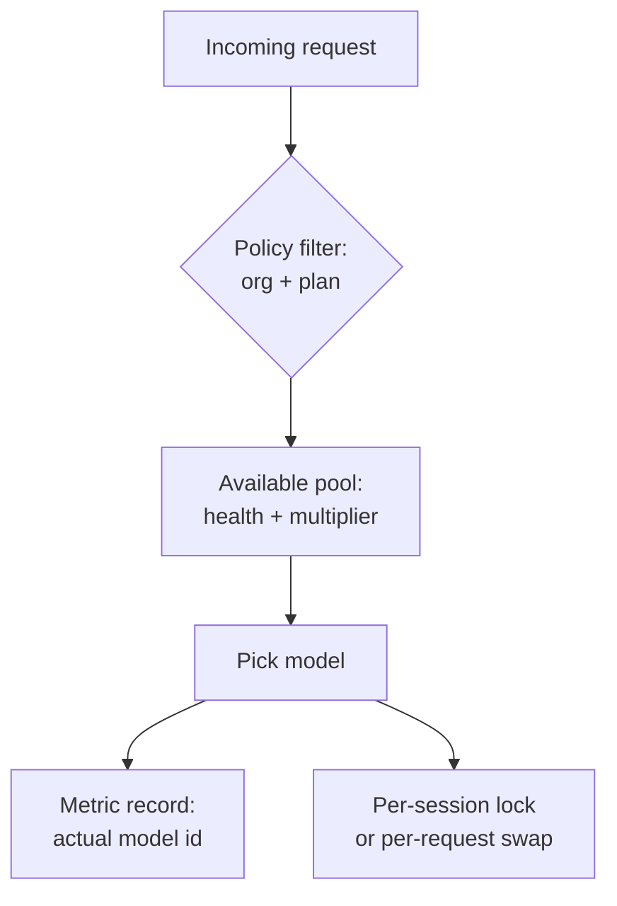

# Auto Model Selection

> Auto model selection moves the per-task model decision from the user to the harness — picking from a vendor-managed pool based on system health, policy, and plan, with the trade that capability fit is secondary to availability.

Auto model selection is a harness-side routing policy that picks the backing model for each request from a vendor-managed pool, using availability and policy signals rather than a user-pinned choice. GitHub Copilot ships it across Chat, CLI, JetBrains, VS Code, and (since 2026-05-14) the cloud coding agent: "Copilot intelligently selects the best available model based on system health and model performance" ([GitHub Changelog 2026-05-14](https://github.blog/changelog/2026-05-14-copilot-cloud-agent-supports-auto-model-selection/)). When the user is not present to choose — a cloud agent picking up an issue, a CLI call in a script — the decision either lives in the harness or it does not happen at all.

This is the harness policy layer, distinct from the infrastructure layer a gateway provides ([Gateway Model Routing](gateway-model-routing.md)) and the budget layer of per-tier routing ([Cost-Aware Agent Design](cost-aware-agent-design.md)).

## When This Pays Off

Three conditions hold together:

- **Execution-class work inside a capability band.** File edits, single-turn extractions, format passes, predictable refactors — the band the [Cognitive Reasoning vs Execution Separation](cognitive-reasoning-execution-separation.md) split names.
- **First-choice models hit rate-limit ceilings.** The benefit is resilience: the broker reroutes from a saturated model to a peer. Without rate pressure, the routing solves nothing.
- **Per-request capability variance is acceptable.** Two prompts with similar text can legitimately hit different backends — fine for a developer, poison for eval-gated CI.

When all three hold, the payoff is a 10% multiplier discount and exemption from weekly rate limits on the affected request ([GitHub Changelog 2026-04-17](https://github.blog/changelog/2026-04-17-github-copilot-cli-now-supports-copilot-auto-model-selection/)).

## The Four Design Points



1. **Routing dimensions.** Copilot's published criteria are availability, model performance, plan, and admin policy — not declared task class or expected context size ([GitHub Changelog 2026-05-14](https://github.blog/changelog/2026-05-14-copilot-cloud-agent-supports-auto-model-selection/)). The Visual Studio Magazine analysis names the trade-off: the broker "currently prioritizes server health and regional availability over the specific technical requirements of a developer's prompt" ([VS Magazine 2026-02-06](https://visualstudiomagazine.com/articles/2026/02/06/why-copilots-auto-mode-for-ai-models-ignores-your-actual-task.aspx)).
2. **Session vs request scope.** In Copilot CLI, "the selected model remains consistent throughout a chat session" — the decision fires once, at session start ([GitHub Changelog 2026-04-17](https://github.blog/changelog/2026-04-17-github-copilot-cli-now-supports-copilot-auto-model-selection/)). Per-session locking preserves in-context state; per-request routing maximises pool utilisation. The contract has to name which ships.
3. **Observability surface.** Until 2026-03-20, Copilot dashboards collapsed all Auto traffic under a generic "Auto" label, so admins could not see "exactly which models are being used across your organization, even when auto mode is the default" ([GitHub Changelog 2026-03-20](https://github.blog/changelog/2026-03-20-copilot-usage-metrics-now-resolve-auto-model-selection-to-actual-models/)). A harness that hides the resolved `model_id` from per-request telemetry is unauditable.
4. **Policy and plan as routing inputs.** Auto "honors all administrator model settings" and the pool is "subject to your policies and subscription type" ([GitHub Changelog 2026-05-14](https://github.blog/changelog/2026-05-14-copilot-cloud-agent-supports-auto-model-selection/)). Policy is a routing input, not a post-hoc audit — an org-level model restriction directly shrinks the broker's choice set.

## Why It Works

Auto routing works when capability is a band rather than a point. Most coding-agent traffic is execution-class work that several pool members handle equivalently; the bottleneck on the user side is rate-limit availability, not capability gap. Rerouting from a saturated model to a peer inside the same band delivers identical task quality at lower latency and lower multiplier cost.

The mechanism is **resource pooling across a fungible model fleet**: treating capability as a band converts one user's quota exhaustion into another peer's headroom. The same premise underlies the self-wired split in [Bootstrap Reasoning–Execution Routing](../agent-readiness/bootstrap-reasoning-execution-routing.md) — the difference is that Auto centralises the decision with the vendor rather than the team. The mechanism breaks down for any task outside the assumed band.

## When This Backfires

- **Long multi-turn sessions on hard tasks.** A silent mid-conversation swap discards in-context learning. One VS Code reporter observed "context loss/continuity issues" and "repeated mistakes on things I'd corrected multiple times," resolved by pinning Sonnet 4.5 ([microsoft/vscode#285064](https://github.com/microsoft/vscode/issues/285064)). Per-session locking in CLI mitigates this surface, not every client.
- **Eval-gated CI automation.** Differential evals depend on response stability; routing variance masks the regression signal. Pin the model on any CI gate that re-runs an agent against a known input.
- **Compliance attestation.** Even after the metrics fix exposes the resolved model name, the routing decision logic ("why GPT-5.4 over Sonnet 4.6 at 14:03 UTC?") is not exposed. Pin and log explicitly when per-request model attestation is required.
- **Workloads where rework cost exceeds the multiplier discount.** When the broker picks a cheaper-band model for a task that needed the frontier tier, the re-prompts and failed reviews dominate the 10% saving. The discount captures inference cost, not rework cost.
- **Teams without per-request `model_id` telemetry.** Auto's value is only legible when you can compare cost and quality across the pool — see [BYOK Model Token Visibility](../observability/byok-model-token-visibility.md) for the equivalent gap on self-hosted routes.

A separate operational hazard ([community discussion](https://github.com/orgs/community/discussions/187429)): some clients offer no setting to pin a non-Auto default or restrict the Auto pool locally. The escapes are per-request manual selection or org-admin policy.

## Example

The Copilot cloud agent picks up an issue assignment without a user present to choose a model. With Auto selected as the default in the model picker:

```text
Issue #4421 assigned to copilot/cloud-agent

→ Broker reads: org policy = {GPT-5.4, Sonnet 4.6 enabled}
→ Broker reads: plan = Business+
→ Broker reads: pool health = GPT-5.4 saturated, Sonnet 4.6 healthy
→ Broker selects: Sonnet 4.6 (in-band, available, allowed by policy)
→ Multiplier billed: 1x * 0.9 = 0.9 premium requests per call
→ Metric records: model_id = "claude-sonnet-4-6" (not "Auto")
```

The pool today is named: "Auto routes to models like GPT-5.4, GPT-5.3-Codex, Sonnet 4.6, and Haiku 4.5 based on your plan and policies" ([GitHub Changelog 2026-04-17](https://github.blog/changelog/2026-04-17-github-copilot-cli-now-supports-copilot-auto-model-selection/)). Only models with 0x–1x multipliers are currently in scope, and "the models auto will route to will change over time" — so the per-call cost ceiling is bounded but the identity of the model that ran is not stable across weeks.

To pin instead — when any of the failure conditions above apply — the cloud agent supports switching the picker to a specific model per issue or per-PR. The escape hatch is per-request, not a permanent client-side default ([Disable Auto Model Selection discussion](https://github.com/orgs/community/discussions/187429)).

## Key Takeaways

- Auto model selection moves the per-task model decision from the user to the harness, picking from a vendor-managed pool by availability and policy — not by declared task class or context size.
- The mechanism is resource pooling across a fungible model fleet: capability is treated as a band, and the broker exchanges one user's saturated quota for another peer's headroom inside that band.
- Per-session vs per-request scope is a separate design point — Copilot CLI locks per session; without that lock, in-context learning can be lost to a silent mid-conversation swap.
- Observability depends on the resolved `model_id` reaching per-request telemetry; a generic "Auto" label in dashboards is unauditable and was Copilot's state until 2026-03-20.
- Pin the model — do not trust Auto — for long multi-turn hard tasks, eval-gated CI, compliance attestation, and workloads where rework cost exceeds the typical 10% multiplier discount.

## Related

- [Gateway Model Routing](gateway-model-routing.md) — infrastructure layer that exposes many models behind one endpoint; Auto routing is the policy layer that picks among them.
- [Cost-Aware Agent Design](cost-aware-agent-design.md) — within-harness tier selection by task complexity; Auto is the vendor-side counterpart.
- [Bootstrap Reasoning–Execution Routing](../agent-readiness/bootstrap-reasoning-execution-routing.md) — self-wired equivalent that declares the routing decision in harness config the team controls.
- [Cross-Vendor Competitive Routing](cross-vendor-competitive-routing.md) — fan-out across vendors at the agent level, complementary to within-vendor pool routing.
- [BYOK Model Token Visibility](../observability/byok-model-token-visibility.md) — the parallel observability contract for self-hosted routes; both fail the same way when `model_id` is missing.
