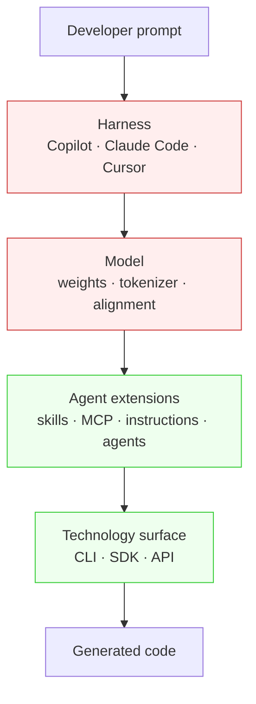

# The AX Stack

> A four-layer model — model, harness, agent extensions, technology surface — for naming which surface owns a failure or an optimisation. Useful when the fixed/controllable dichotomy is treated as approximate; misleading when treated as architectural independence.

## When This Helps (and When It Misleads)

The stack is a diagnostic and communication tool. Treat the fixed/open boundaries as approximate, not absolute:

- **Use it** when a team needs shared vocabulary to locate a failure ("the agent picked the wrong SDK — that is an extensions-layer problem, not a model swap") or to prioritise where to invest first.
- **Do not use it** when you need a portability guarantee, when one tool surface and one agent are involved, or when the team will treat "the harness is fixed" as licence to stop investigating hook scripts, system-prompt overrides, and managed settings — vendors *do* expose levers inside the harness, just not full replacement.

The site already carries a different cut of the same problem — the [Five-Failure-Layers Diagnostic](five-failure-layers-diagnostic.md) — which deliberately enumerates five working layers without claiming independence between them. Pick the lens that fits the question: the AX stack frames fixed-vs-controllable; the failure-layers diagnostic frames attribution before model swap.

## The Four Layers

Microsoft's 2026-05-21 post articulates the path from a developer's prompt to generated code as four layers, each with a different owner and a different intervention surface ([Mastykarz, Microsoft Developer Blog](https://developer.microsoft.com/blog/the-ax-stack-whats-fixed-where-you-can-win)):

| Layer | Owner | Typical intervention | Canonical failure mode |
|-------|-------|---------------------|------------------------|
| Model | Vendor | None directly — you can only swap models | Outdated SDK pattern; hallucinated API; default to competing technology when yours has thinner training data ([Mastykarz](https://developer.microsoft.com/blog/the-ax-stack-whats-fixed-where-you-can-win)) |
| Harness | Vendor (mostly) | Hooks, settings, system-prompt knobs the vendor exposes — but not full replacement | Inconsistent extension behaviour across Copilot, Claude Code, Cursor ([Mastykarz](https://developer.microsoft.com/blog/the-ax-stack-whats-fixed-where-you-can-win)) |
| Agent extensions | You | Skills, MCP servers, `AGENTS.md`/`CLAUDE.md`, custom agents | Discovery, selection, or quality failure ([Mastykarz](https://developer.microsoft.com/blog/the-ax-stack-whats-fixed-where-you-can-win)) |
| Technology surface | You | The shape of the CLI, SDK, or API the agent ultimately calls | Surface assumes human-readable feedback the agent cannot parse |

The "fixed" layers (model, harness) are red because the developer cannot rewrite them. The "controllable" layers (extensions, technology surface) are green because they ship in your repository and your service.

### Three Extension Failure Modes

Within the controllable surface, Mastykarz names three distinct failure modes — each takes a different intervention ([Mastykarz](https://developer.microsoft.com/blog/the-ax-stack-whats-fixed-where-you-can-win)):

- **Discovery failure** — the extension exists but the agent never sees it. Context-window budget or harness prioritisation hides it. Fix at the [progressive-disclosure layer](progressive-disclosure-agents.md).
- **Selection failure** — the agent sees the extension but does not connect it to the developer's intent. "Most common and most fixable" — usually a naming or description problem.
- **Quality failure** — the extension is invoked but returns content that hurts outcomes. The extension produces *drag* instead of *lift*.

## Why It Works

The stack works as a *diagnostic vocabulary*, not as a description of architectural independence. Its mechanism is the same as the [Five-Failure-Layers Diagnostic](five-failure-layers-diagnostic.md): forcing the question "which layer changed?" before "which model should we swap to?" closes the cheaper interventions first. Anthropic states model swap is the most expensive option and the layered attribution discipline closes the cheaper interventions first ([Anthropic](https://www.anthropic.com/engineering/effective-harnesses-for-long-running-agents)).

The empirical case for non-model layers carrying the optimisation budget is independent: LangChain raised Terminal Bench 2.0 from 52.8% to 66.5% through pure harness changes — no model swap ([LangChain](https://blog.langchain.com/improving-deep-agents-with-harness-engineering/)). Mastykarz's own argument runs the same direction at the extensions layer: improving public docs is "a long-term bet with no guaranteed payoff," changing the harness is impossible, but changing extensions gives "instant results" ([Mastykarz](https://developer.microsoft.com/blog/the-ax-stack-whats-fixed-where-you-can-win)).

Pair the diagnostic with measurement. Mastykarz proposes a *lift vs drag* test: run the same scenario with and without the extension; the extension produces lift if outcomes improve, drag otherwise. Without measurement, the stack vocabulary becomes a justification for unfalsifiable claims about which layer "really" caused a failure.

## Where Layers Leak

The stack model imports its layering intuition from networking, where layer boundaries are deliberately engineered to be narrow and stable. AI coding agents have no such interface contracts — the layers leak in named, predictable ways. A reader who treats the layers as independent will be surprised by every one of these:

- **Model ↔ extensions**: Models trained on more data for one technology will default to it even when your extension steers toward another. The extension fights training-data bias rather than a clean slot ([Mastykarz](https://developer.microsoft.com/blog/the-ax-stack-whats-fixed-where-you-can-win)).
- **Harness ↔ extensions**: "Different harnesses interpret extensions differently, making outcomes inconsistent across platforms" ([Mastykarz](https://developer.microsoft.com/blog/the-ax-stack-whats-fixed-where-you-can-win)). An MCP server that performs well in Claude Code may produce drag in Copilot.
- **Harness ↔ model**: The harness controls system-prompt content and tool-call protocols; changing the model under the same harness can invalidate prompt-format assumptions baked into the harness's tool descriptions.
- **Extensions ↔ technology surface**: An extension that returns human-readable prose to the model produces context bloat without inference value — the [AX/UX/DX Triad](ax-ux-dx-triad.md) names this conflation and the [Anthropic CCA paper](https://arxiv.org/abs/2512.10398) measures its cost (42.0% → 48.6% on SWE-Bench-Pro from AX-aware context shaping).

The stack model is useful precisely *because* you can name the leak points. Joel Spolsky's Law of Leaky Abstractions — all non-trivial abstractions leak — is the prior to assume here ([Spolsky](https://www.joelonsoftware.com/2002/11/11/the-law-of-leaky-abstractions/)). A stack vocabulary that hides leak points reproduces the OSI false-independence intuition.

## When This Backfires

The four-layer model adds taxonomy overhead and assumes a stable enough environment that the same layer names will mean the same thing tomorrow. It misleads when:

- **Cross-harness portability is the real question**: The stack implies extensions behave the same across harnesses; in practice they do not ([Mastykarz](https://developer.microsoft.com/blog/the-ax-stack-whats-fixed-where-you-can-win)). Plan portability empirically — measure lift in each harness — rather than from the stack diagram.
- **Fixed/open is taken literally**: Treating "harness is fixed" as binary forecloses real interventions vendors expose — `PreToolUse` hooks, managed settings, system-prompt overrides. The dichotomy is approximate; treat it as a planning prior, not a rule.
- **Small teams with one tool surface**: For two people running one agent against one API, locating failures by name ("broken environment", "wrong instructions") is faster than first attributing to a layer. The taxonomy overhead exceeds its yield. Use the [Five-Failure-Layers Diagnostic](five-failure-layers-diagnostic.md) instead, which carries less metaphorical baggage.
- **Pre-PMF iteration**: Lift-vs-drag measurement per extension is overhead that pays off at scale. Early-stage projects gain more from one prompt iteration than from layer attribution.
- **Disagreement on layer cuts is in scope**: Anthropic's own 4-layer enumeration of harness failures (premature victory, broken environment, premature feature-completion, undocumented run procedure) does not align with Mastykarz's model→harness→extensions cut ([Anthropic](https://www.anthropic.com/engineering/effective-harnesses-for-long-running-agents)). Two reasonable practitioners using "layered model" vocabulary slice the layers differently. Pick a working enumeration and stay consistent within a team — do not assume the slicing is canonical.

## Applying the Stack

A working sequence when an agent fails or you want to invest:

1. **Name the layer where the failure is visible.** Wrong SDK in generated code surfaces at the technology surface but most often originates at the extensions layer (no skill steers toward your SDK) or the model layer (training data biased toward the competitor).
2. **Check the controllable layers first.** Mastykarz: extensions are the only layer where "changing them gives instant results." Anthropic: model swap is the most expensive option.
3. **For each candidate extension fix, run the lift-vs-drag test.** Same scenario, same harness, same model — extension on vs off. Promote lifts, remove drags.
4. **When the controllable layers are exhausted, accept the fixed-layer constraint.** Document it as a known limitation in the project's `AGENTS.md` so future contributors do not relitigate it.

The discipline is the same one [Five-Failure-Layers Diagnostic](five-failure-layers-diagnostic.md) imposes: a fixed enumeration closes the easy escape of "the model isn't smart enough." The AX stack adds an explicit fixed-vs-controllable cut on top of that discipline.

## Example

A team using Claude Code finds the agent keeps generating code against a deprecated version of their internal SDK. The AX stack locates this:

- **Model layer (fixed)**: The model's training data is older than the SDK rewrite. Confirm by asking the model to recite the SDK signature — it will return the deprecated one.
- **Harness layer (fixed)**: Claude Code controls how MCP servers and skills are surfaced; the team cannot rewrite that.
- **Extensions layer (controllable)**: The team has no skill or MCP server that exposes the current SDK signatures. This is the candidate fix.
- **Technology surface (controllable)**: The SDK could ship machine-readable signature metadata for an MCP server to serve, but that is a larger investment.

Lift-vs-drag test: add a one-paragraph `AGENTS.md` entry and an MCP server returning the current signatures. Run ten realistic generation tasks with the extension off, then ten with it on. If pass rate improves, promote; if not, the failure is upstream — likely at the technology surface (the SDK itself is not legible to an agent) and the next move is to add structured signature output.

## Key Takeaways

- Four layers — model, harness, agent extensions, technology surface — give a shared vocabulary for naming where an agent failure or optimisation lives.
- The model and harness are mostly fixed by the vendor; extensions and the technology surface are where developers have leverage.
- The fixed/controllable dichotomy is approximate, not absolute — vendors expose harness-level levers (hooks, settings, system-prompt overrides) that the binary framing hides.
- Layers leak in predictable ways: model bias defeats extension steering; harness conventions change extension behaviour across platforms; tool descriptions interact with system prompts.
- Pair the diagnostic with a lift-vs-drag measurement — without it the vocabulary justifies unfalsifiable claims.

## Related

- [Five-Failure-Layers Diagnostic](five-failure-layers-diagnostic.md) — A different cut of the same problem: enumerate five working harness layers and attribute every failure before swapping the model.
- [Harness Engineering](harness-engineering.md) — The discipline underlying Mastykarz's "fixed" harness layer; documents what is and is not vendor-controlled inside it.
- [AX/UX/DX Triad](ax-ux-dx-triad.md) — Layered framing of audiences (agent, user, developer) rather than execution layers; complements the stack by naming inter-consumer leaks.
- [The Agent Stack Bet](agent-stack-bets.md) — Architectural bets that move concerns (identity, durability) into the platform layer; takes "what is fixed" as the design question rather than the diagnostic question.
- [Progressive Disclosure for Agent Definitions](progressive-disclosure-agents.md) — Discovery-failure remediation at the extensions layer: load context proportional to task.
