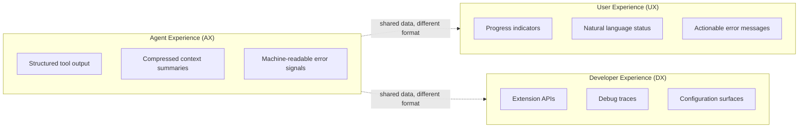

# AX/UX/DX Triad

> Agent Experience (AX), User Experience (UX), and Developer Experience (DX) are distinct design surfaces. Optimizing for one often degrades the others -- treat each as a first-class concern with its own interface contract.

## The Problem

Agent systems have three audiences: the LLM, the end user, and the developer. Most scaffolds conflate at least two -- feeding human-facing logs to the model, or exposing raw traces to end users. The CCA framework formalized this separation after finding that optimizing for one audience routinely degraded another ([CCA paper](https://arxiv.org/abs/2512.10398)). The distinction is independently recognized in the API design community: agents need structured, machine-readable interfaces rather than human-readable affordances ([Nordic APIs](https://nordicapis.com/what-is-agent-experience-ax/)).

## Three Layers



### Agent Experience (AX)

What the model sees. Curate context for inference quality, not human readability:

- **Structured tool output** -- JSON or typed returns, not prose descriptions
- **Compressed summaries** -- preserving goals, decisions, TODOs, and error traces near context limits, improving Claude Sonnet 4 from 42.0% to 48.6% on SWE-Bench-Pro ([CCA ablation](https://arxiv.org/abs/2512.10398))
- **Machine-readable error signals** -- stack traces and [RFC 9457 structured error fields](../tool-engineering/rfc9457-machine-readable-errors.md), not user-friendly messages
- **Hindsight failure notes** -- recording failed approaches for cross-session learning, yielding 53.0% to 54.4% improvement on a 151-instance subset ([CCA paper §5.3](https://arxiv.org/abs/2512.10398))

Human-readable output is often *worse* for the model -- verbose messages and decorative formatting consume context without improving inference.

### User Experience (UX)

What the human sees. Clear status, predictable behavior, actionable feedback:

- **Progress indicators** -- streaming status, not raw tool call logs
- **Natural language summaries** -- what was done and why, not the internal reasoning chain
- **Actionable error messages** -- what went wrong and what to try, not stack traces

Feeding raw agent traces to users is the most common conflation -- iterative reasoning full of dead ends does not help users understand current state.

### Developer Experience (DX)

What the builder configures and debugs. Composable extension points and observable internals:

- **Extension APIs** -- typed interfaces for adding tools and memory backends without modifying core scaffold code
- **Debug traces** -- reasoning chains, tool call sequences, and token usage on demand
- **Configuration surfaces** -- behavior tuning without code changes

DX degrades when internals are opaque or when AX concerns leak into the extension API.

## Why Conflation Fails

| Conflation | What happens |
|-----------|-------------|
| AX = UX | Human-facing logs waste model context on formatting; agent sees prose where it needs structured data |
| AX = DX | Debug traces in agent context add noise; configuration complexity leaks into prompts |
| UX = DX | End users exposed to debug interfaces; developers forced to polish internal tools |

CCA's explicit separation contributed to 52.7% on SWE-Bench-Pro with Claude Sonnet 4.5 -- outperforming stronger models on weaker scaffolds ([CCA paper](https://arxiv.org/abs/2512.10398)).

## Why It Works

Each conflation introduces a specific failure mode at the information channel level. AX suffers from *context overflow and spurious anchors* when human-readable formatting (whitespace, decorative headings, verbose status prose) fills the model's context budget without adding inference value. UX degrades when information is trimmed to fit context limits -- users lose observability. DX becomes harder when agent-facing and human-facing representations are entangled, because extension authors must reason about both audiences simultaneously ([CCA paper §3](https://arxiv.org/abs/2512.10398)).

The triad works by routing the same underlying data through separate transformation layers -- each optimized for one consumer's constraints.

## When This Backfires

The AX/UX/DX separation adds engineering overhead. It is less valuable when:

- **Simple single-user tools**: a CLI agent with one consumer doesn't need three output formats; one well-structured log serves all audiences.
- **Prototype or exploratory work**: maintaining separate transformation layers slows iteration when requirements change frequently.
- **Thin context budgets**: adding a transformation layer near context limits requires care; naive separation can introduce overhead of its own.
- **Scale constraints from CCA's own evaluation**: performance degrades substantially for multi-file edits (57.8% for 1--2 files to 44.1% for 5--6 files) and context management requires configurable scopes to be effective -- the triad doesn't remove complexity, it relocates it ([CCA paper §6](https://arxiv.org/abs/2512.10398)).

## Applying the Triad

Audit each information flow against three questions:

1. **Who consumes this output?** If the answer is "both the model and the user," you need two formats.
2. **What format serves that consumer?** Structured data for agents, natural language for users, typed APIs for developers.
3. **Where does the boundary live?** An explicit transformation layer between AX and UX prevents one from drifting toward the other.

## Example

A file-search tool returns results. Each layer gets a different representation of the same data:

```python
# AX layer — structured data for the model
def tool_return_ax(results):
    return {"matches": [{"path": f, "score": s} for f, s in results]}

# UX layer — human-readable summary
def tool_return_ux(results):
    return f"Found {len(results)} files. Top match: {results[0][0]}"

# DX layer — full debug payload
def tool_return_dx(results, query, elapsed_ms):
    return {"query": query, "elapsed_ms": elapsed_ms,
            "matches": results, "index_version": "v3"}
```

The model receives compact JSON it can parse. The user sees a one-line summary. The developer gets timing and index metadata for debugging. One data source, three format contracts.

## Key Takeaways

- AX, UX, and DX are distinct design surfaces with different optimization targets
- The most common failure is conflating AX and UX -- feeding human-formatted output to models or raw agent traces to users
- Scaffold quality dominates model capability: weaker models with strong scaffolds outperform stronger models with weaker scaffolds
- Each boundary needs an explicit transformation layer -- shared data, different format

## Related

- [Harness Engineering](harness-engineering.md) -- AX/UX/DX separation is an architectural principle within harness design
- [Controlling Agent Output](controlling-agent-output.md) -- matching response format to consumer needs, a direct AX-aware application
- [Memory Synthesis from Execution Logs](memory-synthesis-execution-logs.md) -- hindsight failure notes implement log synthesis
- [Context Compression Strategies](../context-engineering/context-compression-strategies.md) -- structured compression near context capacity
- [Agent Backpressure](agent-backpressure.md) -- feedback signals are AX-layer concerns that must not leak into UX
- [Progressive Disclosure for Agent Definitions](progressive-disclosure-agents.md) -- loading context proportional to task complexity is an AX optimization
- [Agent Debugging](../observability/agent-debugging.md) -- DX-layer concerns for diagnosing agent behavior
- [Agent Turn Model](agent-turn-model.md) -- turn-level structure shapes what the model sees (AX) at each step
- [Agent Loop Middleware](agent-loop-middleware.md) -- middleware layers can enforce AX/UX/DX separation per iteration
