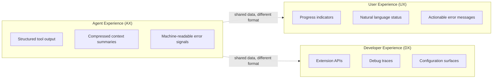

# AX/UX/DX Triad

> Agent Experience (AX), User Experience (UX), and Developer Experience (DX) are distinct design surfaces. Optimizing for one often degrades the others -- treat each as a first-class concern with its own interface contract.

## The Problem

Agent systems have three audiences consuming the same runtime: the LLM (agent), the end user, and the developer. Most scaffolds conflate at least two -- feeding human-facing logs directly to the model, or exposing raw agent traces to end users.

The Confucius Code Agent (CCA) framework formalized this as three "first-class and distinct design principles" after finding that improvements targeting one audience routinely degraded another ([CCA paper](https://arxiv.org/abs/2512.10398)).

## Three Layers

### Agent Experience (AX)

What the model sees. Curate context for inference quality, not human readability:

- **Structured tool output** -- JSON or typed returns, not prose descriptions
- **Compressed summaries** -- CCA's Architect Agent produces context summaries preserving "task goals, decisions made, open TODOs, and critical error traces" when approaching context limits, improving Claude Sonnet 4 from 42.0% to 48.6% on SWE-Bench-Pro [unverified]
- **Machine-readable error signals** -- stack traces and error codes, not user-friendly messages
- **Hindsight failure notes** -- recording failed approaches and their resolutions for cross-session learning, yielding 53.0% to 54.4% improvement with reduced token cost [unverified]

Human-readable output is often *worse* for the model. Verbose status messages, decorative formatting, and conversational tone consume context budget without improving inference.

### User Experience (UX)

What the human sees. Clear status, predictable behavior, actionable feedback:

- **Progress indicators** -- streaming status, not raw tool call logs
- **Natural language summaries** -- what was done and why, not the internal reasoning chain
- **Actionable error messages** -- what went wrong and what to try, not stack traces

Feeding raw agent traces to users is the most common conflation. Agent reasoning is iterative, branching, and full of dead ends -- none of which helps the user understand current state.

### Developer Experience (DX)

What the builder configures and debugs. Composable extension points and observable internals:

- **Extension APIs** -- CCA's ConfuciusSDK provides typed interfaces for adding tools, memory backends, and custom agents without modifying core scaffold code
- **Debug traces** -- full reasoning chains, tool call sequences, and token usage available on demand
- **Configuration surfaces** -- behavior tuning without code changes

DX degrades when agent internals are opaque (can't debug) or when AX concerns leak into the extension API (developers forced to reason about prompt formatting when adding a tool).

## Why Conflation Fails

| Conflation | What happens |
|-----------|-------------|
| AX = UX | Human-facing logs fed to the model waste context on formatting and filler; agent sees prose where it needs structured data |
| AX = DX | Debug-level traces in agent context add noise; configuration complexity leaks into model prompts |
| UX = DX | End users exposed to debug interfaces; developers forced to maintain user-facing polish on internal tools |

The scaffold becomes the wrong thing for everyone. CCA's explicit separation contributed to achieving 52.7% on SWE-Bench-Pro with Claude Sonnet 4.5 -- outperforming stronger models running weaker scaffolds. [unverified]

## Applying the Triad

Audit each information flow against three questions:

1. **Who consumes this output?** If the answer is "both the model and the user," you need two formats.
2. **What format serves that consumer?** Structured data for agents, natural language for users, typed APIs for developers.
3. **Where does the boundary live?** An explicit transformation layer between AX and UX prevents one from drifting toward the other.

Practical boundaries:

- **Tool returns**: emit structured JSON (AX), render a human summary in the UI layer (UX), log the full payload for debugging (DX)
- **Error handling**: return error codes and context to the model (AX), show a recovery suggestion to the user (UX), preserve the full stack trace in telemetry (DX)
- **Progress reporting**: update agent state machine (AX), stream status text to the user (UX), emit structured events for monitoring dashboards (DX)

## Key Takeaways

- Agent Experience, User Experience, and Developer Experience are distinct design surfaces with different optimization targets
- The most common failure is conflating AX and UX -- feeding human-formatted output to models or raw agent traces to users
- Scaffold quality dominates model capability: CCA demonstrated weaker models with strong scaffolds outperforming stronger models with weaker scaffolds
- Each boundary needs an explicit transformation layer -- shared data, different format
- Audit information flows by asking who consumes the output and what format serves that consumer

## Unverified Claims

- CCA's performance figures (52.7% on SWE-Bench-Pro with Claude Sonnet 4.5, 42.0% to 48.6% improvement from Architect Agent) are self-reported and not independently replicated [unverified]
- The 53.0% to 54.4% cross-session improvement from hindsight failure notes is from CCA's own evaluation [unverified]
- The claim that CCA with Claude Sonnet 4.5 "exceeds OpenAI's reported 56.0%" at 59% with GPT-5.2 involves potentially different benchmark conditions [unverified]

## Related

- [Harness Engineering](harness-engineering.md) -- the broader discipline of designing agent environments; AX/UX/DX separation is a specific architectural principle within it
- [Controlling Agent Output](controlling-agent-output.md) -- matching agent response format to consumer needs, a direct application of AX-aware design
- [Memory Synthesis from Execution Logs](memory-synthesis-execution-logs.md) -- CCA's hindsight failure notes are a concrete implementation of execution log synthesis
- [Context Compression Strategies](../context-engineering/context-compression-strategies.md) -- CCA's Architect Agent performs structured compression when context approaches capacity
- [Agent Backpressure](agent-backpressure.md) -- automated feedback signals are AX-layer concerns that should not leak into UX
- [Progressive Disclosure for Agent Definitions](progressive-disclosure-agents.md) -- loading context proportional to task complexity is an AX optimization
- [Agent Debugging](../observability/agent-debugging.md) -- DX-layer concerns for debugging and diagnosing agent behavior
