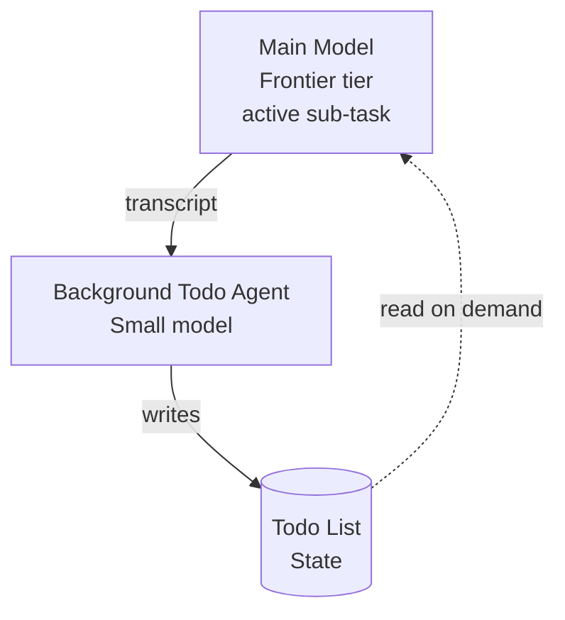

# Background Todo Agent

> Route the agent's todo-list maintenance loop to a small background model so the frontier model spends its attention budget on the active sub-task instead of bookkeeping.

A background todo agent is a separate, smaller model that owns the agent's plan and progress state. The frontier model focuses on the active step; the lightweight model reads partial outputs and updates the todo list out-of-band, keeping the plan out of the main model's prompt.

It is a specialisation of [cognitive reasoning vs execution separation](cognitive-reasoning-execution-separation.md) — the brain/hands principle applied to plan maintenance rather than tool execution — and presupposes per-role [model routing](../agent-readiness/bootstrap-reasoning-execution-routing.md).

## Why Bookkeeping Is Small-Model-Shaped

Plan maintenance and plan *use* are structurally different. Maintenance is transcription-and-classification: given the main model's recent output, decide which list items moved, which are blocked, which were added. The output space is bounded, the ground truth is the prior list, and the input is the last few turns. That shape — bounded extraction with structured output — is what small models are sized for.

Plan *use* is open-ended reasoning, and belongs on the frontier model. Carrying the full todo list in the main model's prompt every turn is a constant attention tax for a task the main model is not doing. [Anthropic's context engineering guidance](https://www.anthropic.com/engineering/effective-context-engineering-for-ai-agents) treats keeping context lean as a first-order discipline; a background todo agent applies that discipline to plan maintenance specifically.

## How VS Code 1.119 Implements It

VS Code 1.119 (May 2026) ships this pattern as an experimental Copilot Chat feature, *Optimized token usage for managing todo lists*. From the [release notes](https://code.visualstudio.com/updates/v1_119):

> By offloading todo list management to a lightweight background agent, the main model can focus on the actual task while a smaller model keeps progress tracking in sync.

- Setting: `github.copilot.chat.agent.backgroundTodoAgent.enabled` — disabled by default.
- While enabled, the main agent loses access to the todo tool; the background agent reads main-agent activity and synchronises the list independently.
- Explicit `#todo` invocation, or a custom agent that lists the todo tool, bypasses the background agent.

The opt-in default and explicit override are themselves design signals: users who care precisely about todo-list correctness are expected to bypass the feature.



The main model never re-receives the todo list per turn. The background model writes to a shared state surface; the main model reads it only when it needs to re-orient.

## When the Pattern Pays Off

| Condition | Why it helps |
|-----------|--------------|
| Long sessions (≥ many turns) | Per-turn todo updates compound — moving them off the main model's prompt frees attention budget |
| Large or volatile todo lists | Carrying the list in main context dominates accumulated state |
| Routine bookkeeping classification | Status updates are extraction-shaped, not reasoning-shaped |
| Multi-model harness already in place | Coordination overhead is amortised across other routing |

## When It Backfires

Three failure modes recur, and the [release notes](https://code.visualstudio.com/updates/v1_119) hint at all three by shipping opt-in with an explicit override:

- **Plan drift from misclassification.** The small model sees a forwarded transcript, not the main model's reasoning. A pivot, an invalidated step, or a branched sub-task can be misread as completion. The main model then reads a desynced list and trusts it — and every downstream decision compounds the error.
- **Short sessions.** When the todo list is small and infrequently updated, coordination overhead exceeds token savings; the simpler single-model architecture is cheaper, more correct, and easier to debug.
- **High-correctness work.** Security review, refactors, migrations — any context where a desynced plan is worse than a slightly more expensive prompt — should keep plan ownership on the main model. The `#todo` bypass exists for exactly this case.

[Cursor's Codex harness post-mortem](https://cursor.com/blog/codex-model-harness) documents the broader risk: reasoning-trace handoffs between models can lose information one of the models depended on. The small model's view of "what's done" is mediated by whatever the harness chose to forward.

## Composition

The pattern presupposes — and pairs with — patterns already in the catalogue: [cognitive reasoning vs execution](cognitive-reasoning-execution-separation.md) (the broader brain/hands split), [bootstrap reasoning–execution model routing](../agent-readiness/bootstrap-reasoning-execution-routing.md) (the per-role model pinning it depends on), [goal monitoring and progress tracking](goal-monitoring-progress-tracking.md) (durable progress files solve the *across-session* version of the same problem; this pattern solves the *within-session* version), and [cost-aware agent design](cost-aware-agent-design.md) (the broader route-by-complexity rule).

For sessions long enough that both apply, the background todo agent maintains the in-flight list while a session-end progress file durably records what was done — the two are not alternatives.

## Example

Enabling the background todo agent in VS Code Copilot Chat (1.119+):

```json
// .vscode/settings.json
{
  "github.copilot.chat.agent.backgroundTodoAgent.enabled": true
}
```

While this setting is on, the main agent does not see the todo tool. To bypass the background agent for a single request — for example, on a security-sensitive change where todo-list correctness matters — invoke the todo tool explicitly in the chat:

```
#todo Add the auth-token rotation step before the migration runs.
```

That invocation reverts to the standard behaviour for the request — the main model owns the todo update — without changing the global setting. Source: [VS Code 1.119 release notes](https://code.visualstudio.com/updates/v1_119).

## Key Takeaways

- Plan maintenance is bounded extraction; plan use is open-ended reasoning. Routing them to different model classes matches each subtask to the model class sized for it.
- The pattern earns its complexity at long session lengths, large or volatile todo lists, and routine bookkeeping work. Short sessions and high-correctness work keep plan ownership on the main model.
- VS Code 1.119 ships the first surfaced production implementation. The opt-in default and explicit `#todo` override signal that the maintainer treats plan correctness as the user's call.
- Plan drift from small-model misclassification is the dominant failure mode — once a "done" status is wrong, downstream decisions compound the error.

## Related

- [Cognitive Reasoning vs Execution: A Two-Layer Agent](cognitive-reasoning-execution-separation.md)
- [Bootstrap Reasoning–Execution Model Routing](../agent-readiness/bootstrap-reasoning-execution-routing.md)
- [Goal Monitoring and Progress Tracking](goal-monitoring-progress-tracking.md)
- [Cost-Aware Agent Design](cost-aware-agent-design.md)
- [Reasoning Budget Allocation](reasoning-budget-allocation.md)
