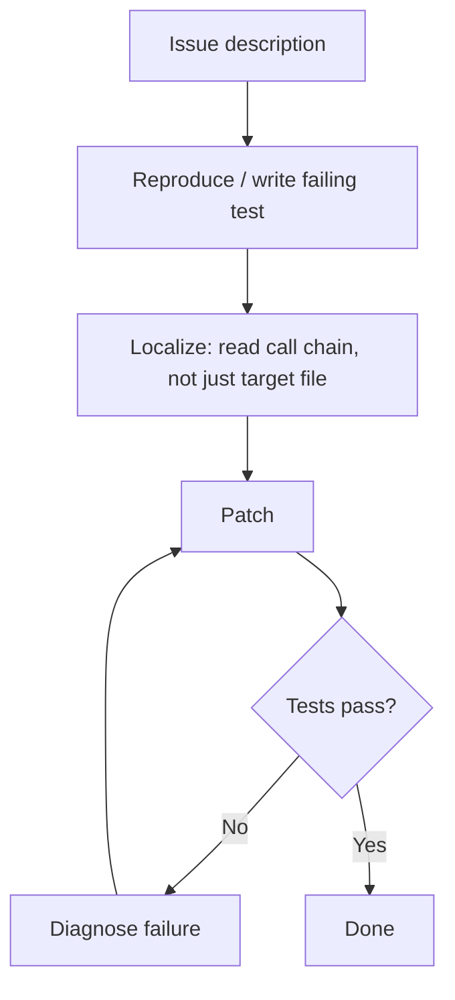

# Behavioral Drivers of Coding Agent Success and Failure

> Aggregate resolve rates conceal why agents fail. Behavioral trajectory analysis reveals four failure clusters and three patterns that consistently predict success.

## The Resolve Rate Problem

SWE-bench Verified gives each agent a single percentage. State-of-the-art agents still fail more than 20% of tasks as of February 2026. The score obscures a more useful signal: two agents with identical resolve rates can have almost non-overlapping failure sets — they fail on different tasks for different reasons.

Analysis of 9,374 trajectories across 19 agents, 8 frameworks, and 14 LLMs on 500 tasks confirms this ([arXiv:2604.02547](https://arxiv.org/abs/2604.02547)). Task heterogeneity is the structural problem: no single agent dominates across task types.

## Four Failure Clusters

Trajectories group into four failure modes:

| Cluster | What fails | Diagnostic signal |
|---------|-----------|-------------------|
| **Reproduction** | Cannot reproduce the bug or trigger described behavior | No test written; agent proceeds on assumptions |
| **Localization** | Reads the wrong file or function — correct understanding, wrong location | Patch applied to unrelated code; tests pass on wrong surface |
| **Patch generation** | Identifies the correct location but produces an incorrect fix | Correct file targeted; implementation breaks adjacent tests |
| **Verification** | Applies a plausible patch without confirming it resolves the issue | No test run after patch; PR opened with untested changes |

Framework-level failures concentrate in reproduction and verification — the first and last steps. Model capability has the most leverage on localization and patch generation.

## Three Behavioral Predictors of Success

Three patterns correlate with higher resolve rates across agents and frameworks ([arXiv:2604.02547](https://arxiv.org/abs/2604.02547)):

### 1. Exploration Before Execution

Agents that read related files, trace call chains, and inspect tests before touching the implementation succeed at higher rates. The pattern is `read → read → read → write`, not `read → write`. It is decision ordering, not token count: an agent that understands the call graph before patching makes fewer localization failures.

### 2. Post-Patch Verification Loops

Agents that run tests after patching and iterate on failures resolve more tasks than those that patch without verification:

```
patch → test → diagnose failure → repatch → test → ...
```

Frameworks that terminate after the first patch prevent this pattern regardless of model capability.

### 3. Deep Context Loading

Agents that trace imports, read caller context, and inspect adjacent tests outperform agents that read only the directly mentioned file. Depth along relevant call chains, not exploration volume.



## Framework Constrains Model Behavior

The LLM is the primary driver of both outcome and behavior. Agents sharing an LLM agree on more tasks than agents sharing a framework, and the framework performance gap shrinks each LLM generation ([arXiv:2604.02547](https://arxiv.org/abs/2604.02547)).

The framework still sets hard limits: without a test-execution step, no model produces a verification loop. Framework prompts influence tactics, though the effect diminishes with stronger LLMs.

**Framework audit questions** (constraints even capable LLMs cannot bypass):
- Does the agent execute tests after patching?
- Does test failure output route back for a repatch attempt?
- Does the iteration cap allow at least two repatch cycles?
- Does the agent read related files and tests before writing?

## Ensemble Strategy for Task Heterogeneity

Combining agents beats picking the best single agent when failure sets are non-overlapping. Two agents at 60% resolve each, failing on different tasks, cover substantially more of the task space under oracle selection ([arXiv:2604.02547](https://arxiv.org/abs/2604.02547)).

Practical approaches:
- **Majority vote**: run three agents, take the most common patch
- **Confidence-weighted**: route to a [specialized agent](specialized-agent-roles.md) by task characteristics (reproduction-heavy vs. localization-heavy)
- **Sequential fallback**: if A fails its tests, route to B

Gain is proportional to failure-set divergence. Agents with different frameworks and exploration strategies diverge more than agents sharing a framework with different models.

## When This Backfires

Behavioral-pattern auditing and ensembling have diminishing returns in several conditions:

- **LLM gap dominates**: when the model is weaker than alternatives, framework tweaks yield less than a model upgrade — framework auditing is premature.
- **Benchmark divergence**: the four clusters come from SWE-bench Verified, which skews toward well-specified single-file bugs. Production tasks (architecture changes, multi-repo work, ambiguous requirements) may have different dominant failure modes.
- **Benchmark integrity**: OpenAI retired SWE-bench Verified after finding 59.4% of audited problems had flawed tests, and METR observed reward-hacking in 30%+ of frontier-model runs ([OpenAI, 2026](https://openai.com/index/why-we-no-longer-evaluate-swe-bench-verified/); [Berkeley RDI, 2026](https://rdi.berkeley.edu/blog/trustworthy-benchmarks-cont/)). Treat the trajectory-derived clusters as directional, not ground truth.
- **Low divergence**: agents sharing an LLM with different prompts often have overlapping failure sets — coverage gains are much smaller than the 60%-overlap example implies.

## Key Takeaways

- Two agents with identical resolve rates can have non-overlapping failure sets — headline score is an insufficient comparison metric
- Four failure clusters (reproduction, localization, patch generation, verification) require different responses; most framework failures concentrate at reproduction and verification
- Three behavioral patterns predict success: exploration before execution, post-patch verification loops, deep context loading along call chains
- LLM capability is the primary driver of outcome; framework design sets hard limits on which behavioral patterns are structurally possible (no model can produce a verification loop in a framework with no test-execution step) but matters less as LLMs improve
- Ensembling agents with divergent failure profiles produces higher coverage than optimizing a single agent

## Related

- [Agentless vs Autonomous: When Simple Beats Complex](agentless-vs-autonomous.md) — two-phase constrained approaches outperforming autonomous agents on SWE-bench
- [Agent Self-Review Loop](agent-self-review-loop.md) — implementing the post-patch verification loop pattern
- [Harness Engineering](harness-engineering.md) — environment design as the primary lever on agent behavioral patterns
- [Agent Harness: Initializer and Coding Agent Pattern](agent-harness.md) — structuring long-running agent work with initializer and execution phases
- [Wink: Classifying and Auto-Correcting Coding Agent Misbehaviors](wink-agent-misbehavior-correction.md) — trajectory-level misbehavior classification (30% misbehavior rate in production)
- [Evaluator-Optimizer Pattern](evaluator-optimizer.md) — two-role loop for iterative quality improvement
- [Cross-Vendor Competitive Routing](cross-vendor-competitive-routing.md) — routing tasks across competing agents to select the best result
- [Loop Strategy Spectrum](loop-strategy-spectrum.md) — choosing accumulated vs fresh context for iteration cycles
- [Reasoning Budget Allocation](reasoning-budget-allocation.md) — allocating compute across exploration and execution phases
