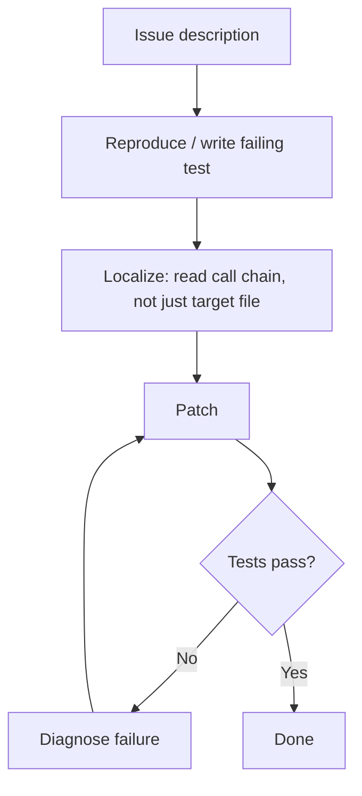

# Behavioral Drivers of Coding Agent Success and Failure

> Aggregate resolve rates conceal why agents fail. Behavioral trajectory analysis reveals four failure clusters and three patterns that consistently predict success.

## The Resolve Rate Problem

SWE-bench Verified gives each agent a single percentage. State-of-the-art agents still fail more than 20% of tasks as of February 2026, and that number climbs sharply on harder benchmarks. The headline score obscures a more useful signal: two agents with identical resolve rates can have almost non-overlapping failure sets — meaning they fail on completely different tasks for completely different reasons.

Analysis of 9,374 trajectories across 19 agents, 8 frameworks, and 14 LLMs on 500 tasks confirms this ([arXiv:2604.02547](https://arxiv.org/abs/2604.02547)). Task heterogeneity is the structural problem. Agents are not interchangeable, and no single agent dominates across all task types.

## Four Failure Clusters

Trajectories group into four distinct failure modes. Each requires a different response:

| Cluster | What fails | Diagnostic signal |
|---------|-----------|-------------------|
| **Reproduction failure** | Agent cannot reproduce the bug or trigger the described behavior | No test written; agent proceeds on assumptions |
| **Localization failure** | Agent reads the wrong file or function — correct understanding, wrong location | Patch applied to unrelated code; tests pass on wrong surface |
| **Patch generation failure** | Agent identifies the correct location but produces an incorrect fix | Correct file targeted; implementation breaks adjacent tests |
| **Verification failure** | Agent applies a plausible patch without confirming it resolves the issue | No test run after patch; PR opened with untested changes |

Most framework-level failures concentrate in reproduction and verification — the first and last steps of the cycle [unverified]. Localization and patch generation are where model capability has the most leverage.

## Three Behavioral Predictors of Success

Three observable behavioral patterns correlate with higher resolve rates across agents and frameworks ([arXiv:2604.02547](https://arxiv.org/abs/2604.02547)):

### 1. Exploration Before Execution

Agents that read more context before writing any code succeed at higher rates. Specifically: reading related files, tracing call chains, and inspecting test files before touching the implementation. The pattern is `read → read → read → write`, not `read → write`.

This is not about token count — it is about decision ordering. An agent that understands the call graph before patching makes fewer localization failures.

### 2. Post-Patch Verification Loops

Agents that run tests after applying a patch — and iterate on failures — resolve significantly more tasks than agents that patch without verification. The successful cycle is:

```
patch → test → diagnose failure → repatch → test → ...
```

Framework designs that terminate after the first patch (no test execution step, no feedback loop) structurally prevent this pattern regardless of model capability.

### 3. Deep Context Loading

Agents that trace through imports, read caller context, and inspect adjacent test files before acting outperform agents that read only the directly mentioned file. This is distinct from exploration volume — it is exploration depth along relevant call chains.



## Framework Constrains Model Behavior

A stronger LLM driving the same framework produces different behavioral profiles than a weaker one — but the framework constrains what behavior is possible. If the framework does not include a test-execution step, no model can produce a verification loop.

This means behavioral pattern failures are often harness failures, not model failures. Auditing your framework against the three predictors is more actionable than upgrading the model.

**Framework audit questions:**
- Does the agent execute tests after applying a patch?
- Does the framework route test failure output back to the agent for a repatch attempt?
- Is there a maximum iteration count that allows at least two repatch cycles?
- Does the agent read related files and tests before writing, or does it jump directly to the target file?

## Ensemble Strategy for Task Heterogeneity

Because failure sets are non-overlapping, combining agents is more effective than selecting the best single agent. Two agents with 60% resolve rates — failing on different tasks — can cover substantially more of the task space in an oracle selection scenario [unverified].

Practical approaches:
- **Majority vote**: run three agents on the same task, apply the most common patch
- **Confidence-weighted selection**: route to a specialized agent based on task characteristics (reproduction-heavy vs. localization-heavy)
- **Sequential fallback**: if agent A fails (detected by test suite), route to agent B

The ensemble gain is proportional to failure-set divergence. Agents using different frameworks with different exploration strategies diverge more than agents using the same framework with different models.

## Key Takeaways

- Two agents with identical resolve rates can have non-overlapping failure sets — headline score is an insufficient comparison metric
- Four failure clusters (reproduction, localization, patch generation, verification) require different responses; most framework failures concentrate at reproduction and verification
- Three behavioral patterns predict success: exploration before execution, post-patch verification loops, deep context loading along call chains
- Framework design constrains which behavioral patterns are possible — model upgrades cannot compensate for a framework without a test-execution step
- Ensembling agents with divergent failure profiles produces higher coverage than optimizing a single agent

## Unverified Claims

- The exact resolution-rate uplift from adding verification loops is not linked to a specific figure — the directional finding (higher success with loops) is sourced; the magnitude is not [unverified]
- Whether majority-vote ensembling consistently reaches the oracle upper bound depends on task distribution details not specified here [unverified]
- Framework-level failures concentrating in reproduction and verification is based on the paper's framing in the issue context — specific cluster proportions are not independently verifiable [unverified]
- The oracle-selection ensemble coverage figure is illustrative of the non-overlap principle, not a specific empirical result from the paper [unverified]

## Related

- [Agentless vs Autonomous: When Simple Beats Complex](agentless-vs-autonomous.md) — two-phase constrained approaches outperforming autonomous agents on SWE-bench
- [Agent Self-Review Loop](agent-self-review-loop.md) — implementing the post-patch verification loop pattern
- [Harness Engineering](harness-engineering.md) — environment design as the primary lever on agent behavioral patterns
- [Wink: Classifying and Auto-Correcting Coding Agent Misbehaviors](wink-agent-misbehavior-correction.md) — trajectory-level misbehavior classification (30% misbehavior rate in production)
- [Evaluator-Optimizer Pattern](evaluator-optimizer.md) — two-role loop for iterative quality improvement
- [Cross-Vendor Competitive Routing](cross-vendor-competitive-routing.md) — routing tasks across competing agents to select the best result
- [Loop Strategy Spectrum](loop-strategy-spectrum.md) — choosing accumulated vs fresh context for iteration cycles
- [Reasoning Budget Allocation](reasoning-budget-allocation.md) — allocating compute across exploration and execution phases
