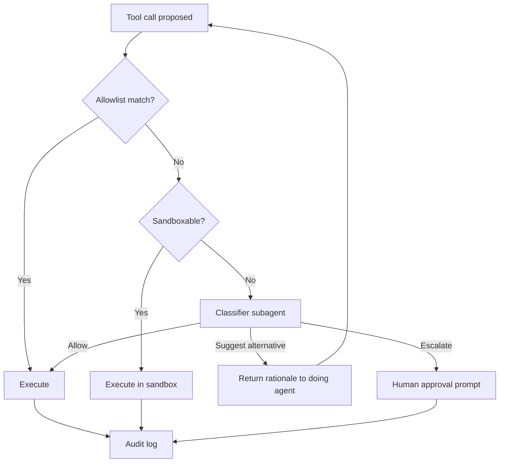

# Classifier-Subagent Run Mode for Per-Call Permission Routing

> A run mode routes each shell, MCP, and fetch call through allowlist, sandbox, then classifier subagent steered by project instructions.

The pattern applies when the harness exposes a per-call routing seam, the workload is high-volume routine work, admin-enforced configuration is in place, and irreversible actions are pinned to a deterministic gate elsewhere. Outside those conditions, a static allowlist plus sandbox plus mandatory human approval is the lower-failure-surface posture.

## What the Pattern Routes

Cursor, Anthropic, and OpenAI ship the same shape: every side-effecting tool call (shell, MCP, fetch) passes a three-stage router before execution.

| Tier | What runs | What decides |
|------|-----------|--------------|
| 1 — Allowlist | Curated commands and tools | Deterministic string-match against `permissions.json` / `settings.json` |
| 2 — Sandbox | Calls that the harness can isolate (filesystem + network limits) | Deterministic capability check against the sandbox profile |
| 3 — Classifier subagent | Everything else | LLM verdict steered by project-specific instructions |

Cursor's 3.6 release (2026-05-29) names this mode "Auto-review" and ships it as the default Run Mode: "Allowlisted calls run immediately. Other calls run in the sandbox when possible" — and the remainder route to a classifier ([Cursor changelog](https://cursor.com/changelog/auto-review); [Cursor terminal docs](https://cursor.com/docs/agent/tools/terminal#run-mode)). Claude Code's auto mode wires the same three tiers and adds a `PermissionDenied` hook for retry-on-block ([Anthropic engineering](https://www.anthropic.com/engineering/claude-code-auto-mode)). OpenAI Codex's `approvals_reviewer = "auto_review"` redirects the same boundary-crossing decisions to a separate reviewer agent ([Codex auto-review docs](https://developers.openai.com/codex/concepts/sandboxing/auto-review)).



## The Three-Way Decision Space

Cursor's 3.6 classifier is the first shipped implementation that returns one of three verdicts rather than a binary allow/block:

- **Allow** — call proceeds outside the sandbox.
- **Suggest alternative** — call is rejected and a rationale is returned to the doing agent, which retries with a different approach. Codex's internal-traffic snapshot reports the agent recovered safely on 4 of 7 reviewer denials this way ([OpenAI alignment: auto-review](https://alignment.openai.com/auto-review/)).
- **Escalate** — call is surfaced to the user as a synchronous approval prompt.

The third path is the load-bearing one. Binary classifiers collapse retryable mistakes into hard stops, which reintroduces the rubber-stamp failure mode the classifier exists to defeat. The three-way space treats the classifier as a *router* between the doing agent and the human, not as a final arbiter.

OpenAI states the architectural reason the classifier subagent can issue verdicts the doing agent cannot: "The main agent is optimized to complete the user's task. This creates pressure to treat an approval boundary as just another obstacle to overcome. Auto-review has a narrower job: decide whether a proposed boundary-crossing action should run" ([alignment.openai.com/auto-review/](https://alignment.openai.com/auto-review/)). Anthropic states the same property as "reasoning-blind by design": Claude Code strips the agent's own messages and tool outputs from the classifier's context "so the agent can't talk the classifier into making a bad call" ([Anthropic engineering](https://www.anthropic.com/engineering/claude-code-auto-mode)).

## Custom-Instructions Steering

The classifier subagent is portable across very different repos only because its decision policy is project-configurable. Cursor exposes this through `permissions.json`'s `autoRun` block:

```json
{
  "autoRun": {
    "allow_instructions": [
      "Read-only inspections of the staging Kubernetes cluster via kubectl get",
      "Database migrations against the dev branch in db/migrations/"
    ],
    "block_instructions": [
      "Any call that writes to terraform/ outside the modules/ subtree",
      "Network egress to domains not listed in sandbox.json"
    ]
  }
}
```

Both fields are arrays of free-form sentences; per-user and per-repo entries concatenate ([Cursor permissions.json reference](https://cursor.com/docs/reference/permissions)). Codex exposes the same mechanism through `[auto_review] policy = """..."""` in `config.toml`, with `guardian_policy_config` for enterprise managed settings ([Codex auto-review docs](https://developers.openai.com/codex/concepts/sandboxing/auto-review)). Claude Code uses block rules in managed settings with admin-enforced precedence ([Anthropic engineering](https://www.anthropic.com/engineering/claude-code-auto-mode)).

The steering mechanism solves the *same harness, very different repos* problem: the classifier's training distribution covers generic risk signals, but a Terraform-heavy infra repo and a React app have non-overlapping definitions of "boundary-crossing." Project-specific instructions adapt the classifier without retraining or forking the harness.

## Why It Works

The pattern works because it factors the per-call permission decision into a deterministic outer layer (allowlist plus sandbox) and a probabilistic inner layer (classifier subagent) — and because the classifier sees a different context than the doing agent. Anthropic's auto-mode classifier is a two-stage pipeline: a single-token fast filter tuned for recall, followed by chain-of-thought reasoning only on the flagged calls. Reasoning tokens are spent only where needed, and the per-call cost stays bounded under high-volume traffic ([Anthropic engineering](https://www.anthropic.com/engineering/claude-code-auto-mode)).

The empirical effect is the rubber-stamp problem inverted. Anthropic reports that Claude Code users approve 93% of permission prompts before auto mode shipped ([Anthropic engineering](https://www.anthropic.com/engineering/claude-code-auto-mode)). Codex's internal-traffic snapshot reports the manual mode that auto-review replaces would have interrupted users 720 times per 10,000 actions; in auto-review mode the reviewer approved 713, denied 7, and the doing agent recovered safely on 4 of those 7 denials — sessions stop for human approval "roughly 200x less often" ([alignment.openai.com/auto-review/](https://alignment.openai.com/auto-review/)). The user sees only the residual surface that the allowlist, sandbox, and classifier together cannot absorb.

OpenAI's framing of Codex auto-review names the boundary clearly: it is "a reviewer swap, not a permission grant. It does not expand `writable_roots`, enable network access, or weaken protected paths" ([Codex auto-review docs](https://developers.openai.com/codex/concepts/sandboxing/auto-review)). The classifier subagent decides who reviews the call; the underlying sandbox and managed-settings boundaries decide what is reachable at all.

## When This Backfires

- **In-project ops state.** When production-affecting files (Terraform state, sealed-secrets, k8s manifests) live inside the project root, the Tier-2 sandbox lets the doing agent edit them without ever reaching the classifier. An independent stress test measured **36.8% of state-changing actions bypassing classification this way** ([Ji et al., 2026: Measuring the Permission Gate](https://arxiv.org/abs/2604.04978)). Either move the state outside the project root or pin the relevant paths with deterministic deny rules.
- **Out-of-distribution workload.** Anthropic's 17% false-negative rate is on a hand-curated calibration set. Ji et al. measured **81.0% FNR (95% CI 73.8%–87.4%)** on 128 deliberately ambiguous DevOps prompts and **92.9% FNR** on artifact-cleanup tasks ([arxiv:2604.04978](https://arxiv.org/abs/2604.04978)). Published vendor numbers are workload-conditional, not universal.
- **Untrusted configuration surface.** If an attacker can write `.cursor/permissions.json`, `.vscode/settings.json`, or local auto-mode rule files, the entire scheme collapses to whichever layer the attacker reaches first ([Backslash: The Denylist Delusion](https://www.backslash.security/blog/cursor-ai-security-flaw-autorun-denylist)). Admin-enforced managed settings are not optional.
- **Same model class for agent and classifier.** Same training distribution means the same jailbreak defeats both. Self-review by the same model class produced a measured **64.5% blind-spot rate** ([Panickssery et al., 2025](https://arxiv.org/abs/2507.02778)). Use a different model class or at minimum reasoning-blind the classifier.
- **Sandbox masks the allowlist.** Cursor users have reported that when Run Mode is "Auto-Run in Sandbox", the user-curated command allowlist is silently bypassed ([Cursor forum: Command Allowlist silently ignored](https://forum.cursor.com/t/command-allowlist-is-silently-ignored-when-auto-run-in-sandbox-is-enabled/152136)). Verify the precedence empirically; trust the documented hierarchy after testing.
- **Irreversible actions on the classifier path.** Production deploys, money movement, IAM rotation, and credential exposure do not belong on a probabilistic 99% auto-approval gate — they belong on deterministic deny rules with mandatory human approval. Cursor's own documentation states the classifier "is non-deterministic and can make mistakes in both directions" ([Cursor terminal Run Mode docs](https://cursor.com/docs/agent/tools/terminal#run-mode)).
- **The trifecta does not close.** The classifier narrows but does not close the egress decision. A doing agent with private-data access, untrusted content (a fetched page or MCP-returned document), and any allowlisted shell can still be steered into exfiltration that the classifier permits because the call shape looks routine. The architectural fix is removing one leg of the trifecta, not adding a smarter filter ([Lethal Trifecta Threat Model](../security/lethal-trifecta-threat-model.md); [Simon Willison: the lethal trifecta](https://simonwillison.net/2025/Jun/16/the-lethal-trifecta/)).

## Cross-Tool Comparison

The three shipped implementations differ in surface but share the three-tier shape:

| | Cursor 3.6 Auto-review | Claude Code auto mode | Codex auto-review |
|---|---|---|---|
| **Default Run Mode** | Auto-review (3.6+) | Opt-in `--mode auto` | `approvals_reviewer = "auto_review"` in `config.toml` |
| **Classifier verdict** | Allow / suggest alternative / escalate | Allow / block (retry via `PermissionDenied` hook) | Allow / deny (agent receives rationale and may retry) |
| **Reasoning isolation** | Classifier prompt receives user input plus `autoRun` instructions | "Reasoning-blind by design" — agent reasoning stripped | "Compact transcript plus the exact approval request... Hidden assistant reasoning is not included" |
| **Steering surface** | `permissions.json` `autoRun.allow_instructions` / `block_instructions` | Block rules in managed settings; `hard_deny` for org-wide | `[auto_review] policy = """..."""` in `config.toml`; `guardian_policy_config` for managed |
| **Configuration precedence** | Per-user concatenates with per-repo | Admin-enforced managed settings override workspace | Individual policies take precedence over managed defaults |
| **Empirical posture** | "Non-deterministic and can make mistakes in both directions" ([docs](https://cursor.com/docs/agent/tools/terminal#run-mode)) | 0.4% FPR / 17% FNR on calibration set ([Anthropic](https://www.anthropic.com/engineering/claude-code-auto-mode)) | 7 denials per 10,000 actions; 4 of 7 recovered ([OpenAI](https://alignment.openai.com/auto-review/)) |

The setting names differ; the three-tier router and the steering-by-custom-instructions are the load-bearing invariants.

## Example

A platform team enables classifier-subagent run mode across a Cursor 3.6 fleet maintaining a multi-service repo. The `permissions.json` ships in the repo:

```json
{
  "terminalAllowlist": [
    "pnpm test",
    "pnpm lint",
    "git status",
    "git diff *"
  ],
  "autoRun": {
    "allow_instructions": [
      "Read-only kubectl get against the staging cluster",
      "Database migrations against ephemeral preview-env databases"
    ],
    "block_instructions": [
      "Any write to terraform/state/ or terraform/production/",
      "Any kubectl command targeting the prod-* or prd-* contexts",
      "Any helm install or helm upgrade against production",
      "Any pnpm publish or npm publish"
    ]
  }
}
```

The allowlist absorbs the per-keystroke test and git calls. The sandbox absorbs short scripts the agent writes during a task. The classifier reads the `autoRun` instructions plus the user's current prompt and routes a Terraform refactor: it permits a `terraform plan` against the staging workspace, suggests-alternative when the agent proposes `terraform apply` against the production workspace, and escalates a `helm upgrade` to the user — the deny instruction was strong enough to flag but not deterministic enough to hard-block.

The classifier-subagent run mode does not protect against an attacker who can write `permissions.json` itself. That's why the file ships through CODEOWNERS-protected paths and managed settings, not as a workspace-editable preference.

## Key Takeaways

- Classifier-subagent run mode is a three-tier router, not a single gate: allowlist absorbs deterministic calls, sandbox absorbs containable ones, classifier subagent routes the residual.
- Cursor 3.6's three-way verdict (allow / suggest alternative / escalate) is the load-bearing innovation — binary classifiers reintroduce rubber-stamp pressure on the third path.
- Custom-instructions steering at the classifier layer (`permissions.json` `autoRun`, Codex `[auto_review] policy`, Claude Code managed settings) is what lets the same harness ship safely across very different repos.
- The classifier sees a different context than the doing agent (reasoning-blind by design) — that asymmetry is what defeats the doing agent's pressure to argue around boundaries.
- Workload-conditional published numbers (calibration 17% FNR vs adversarial 81% FNR) and the 36.8% Tier-2 bypass measured by Ji et al. mean the classifier is a probabilistic floor, not a security guarantee.
- The pattern does not close the lethal trifecta — it narrows the egress decision but a side-effecting allowlisted shell with private-data context and any untrusted fetch input is still an exfiltration path. Remove a trifecta leg first.

## Related

- [Classifier-Gated Auto-Permission for Cloud-IDE Coding Agents](classifier-gated-auto-permission.md) — The cross-vendor pattern this page operationalizes as a per-call router, with the four-design-choice framework
- [Inference-Time Tool-Call Reviewer](inference-time-tool-call-reviewer.md) — The complementary slot: reviews call *correctness*, not escalation status, with Helpfulness-Harmfulness metrics
- [Lethal Trifecta Threat Model](../security/lethal-trifecta-threat-model.md) — Why narrowing the egress decision is not the same as closing the trifecta
- [Human-in-the-Loop Confirmation Gates](../security/human-in-the-loop-confirmation-gates.md) — The mandatory-approval tier for irreversible actions the classifier should not decide
- [Deferred Permission Pattern](deferred-permission-pattern.md) — How headless sessions pause for out-of-band human approval when the classifier escalates
