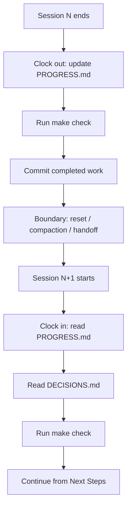

# Clock-In / Clock-Out Protocol: Bracketed Session Continuity

> A deterministic protocol that brackets every agent session: read continuity artefacts on entry, update them on exit, so the next session reaches executable state fast.

## What the Protocol Is

Long-running agentic work crosses session boundaries — context resets, compaction events, paused-and-resumed shifts, parallel forks. Without a protocol on each side, the next session pays a *rebuild cost*. The [walkinglabs lecture on continuity loss](https://github.com/walkinglabs/learn-harness-engineering/blob/main/docs/en/lectures/lecture-05-why-long-running-tasks-lose-continuity/index.md) treats that cost as the load-bearing metric: harnesses compress it from roughly 15 minutes to roughly 3 by enforcing entry and exit steps over a small artefact set.

The protocol has two halves, encoded in `AGENTS.md` so the harness enforces sequence rather than agent discretion:

```markdown
## At session start (clock in)
1. Read PROGRESS.md for current state
2. Read DECISIONS.md for important decisions
3. Run make check to confirm repo is in consistent state
4. Continue from PROGRESS.md "Next Steps" section

## Before session end (clock out)
1. Update PROGRESS.md
2. Run make check to confirm consistent state
3. Commit all completed work
```

Source: [walkinglabs lecture 05, AGENTS.md template](https://github.com/walkinglabs/learn-harness-engineering/blob/main/docs/en/lectures/lecture-05-why-long-running-tasks-lose-continuity/index.md).

## The Three-Artefact Mixed Strategy

Three overlapping layers each defend against a different failure mode.

| Artefact | Captures | Failure mode if missing |
|----------|----------|--------------------------|
| `PROGRESS.md` | Latest commit, test status, completed checklist, in-progress %, known issues, Next Steps | Duplicate work — the next session re-runs tests and reimplements partly-done features |
| `DECISIONS.md` | Choice, reasoning, **rejected alternatives**, constraints | Silent re-decision — prior choices reversed because the analysis was discarded |
| Atomic git commits | "Free, versioned state snapshots" — what changed, in what order | Implementation drift — direction shifts silently across sessions |

The three are non-redundant: PROGRESS.md says *where* work stopped, DECISIONS.md *why* this path was chosen, the commits *what* changed.



## Compaction vs Reset: Different Boundaries, Different Mitigations

Two boundary types degrade continuity differently:

- **Compaction** is in-session summarisation when context fills. The "what" survives in the prose summary; the "why" — single-instance decisions, rejected alternatives — often does not. See [context compression strategies](../context-engineering/context-compression-strategies.md) and [objective drift](../anti-patterns/objective-drift.md).
- **Reset** is full state loss between sessions, with one upside the lecture notes: a fresh session has "a clean mental state — no 'I'm running out of time' anxiety."

Per the [walkinglabs lecture](https://github.com/walkinglabs/learn-harness-engineering/blob/main/docs/en/lectures/lecture-05-why-long-running-tasks-lose-continuity/index.md), Sonnet 4.5 shows "severe context anxiety" that pushes toward reset; Opus 4.5 "greatly diminished" this, making compaction-focused approaches viable. The artefact set covers both boundaries, but delivers more value on models with worse late-context behaviour.

See [session recap](session-recap.md) for a complementary primitive at the compaction boundary: the recap is *what* the agent writes at one boundary; this protocol governs *when and how* a session reads and writes the broader artefact set.

## The 4-Question Sufficiency Check

Writing artefacts is not the same as writing *useful* ones. Four questions grade the leave-behind, each mapping to a lecture failure mode:

1. **Can a fresh agent identify recent work in under 5 minutes?** If PROGRESS.md, DECISIONS.md, and `git log` together do not surface the last unit of work and its state, the artefact is too thin or too verbose.
2. **Are blockers explicit?** "test_pagination_edge_case returns 500 on empty result sets" is actionable; "tests mostly pass" is not.
3. **Is the next-step pointer concrete?** A numbered Next Steps list stops the next session re-selecting a goal. The lecture likens drift to "a game of telephone — 'pick me up a coffee' might become 'buy me a coffee machine.'"
4. **Are decisions and their rejected alternatives preserved?** A prior session chose option B after weighing three approaches; an unaware next session chooses option A. DECISIONS.md keeps the analysis available.

Run these at clock-out — any "no" means the clock-out is incomplete.

## When the Protocol Earns Its Cost

The protocol is overhead. It pays off only when:

- **Work spans multiple sessions** — a next session exists whose rebuild cost matters
- **Agents run unsupervised** — no human carries the "we picked B because A had constraint X" memory across the boundary
- **No continuous progress file already owns the state** — clock-out duplicates `todo.md` writes if the agent updates one per step ([goal recitation](../context-engineering/goal-recitation.md), [trajectory logging](../observability/trajectory-logging-progress-files.md))
- **Sessions cross compaction or reset boundaries** — short tasks in one context window gain nothing from clock-in overhead

Outside these conditions it is pure cost: a developer pausing for an hour reads `git log -5` in 30 seconds, while two files plus `make check` plus a commit adds minutes for marginal benefit.

## When This Backfires

Even inside its intended scope, three failure modes recur:

- **Rigid template outlives the task shape.** The fixed sections of PROGRESS.md and DECISIONS.md trap the agent in the old frame when scope widens mid-session. Amp's handoff design rejects exactly this, requiring a *new* goal at the boundary rather than inferred continuity from static artefacts ([Tessl analysis of Amp's handoff retirement](https://tessl.io/blog/amp-retires-compaction-for-a-cleaner-handoff-in-the-coding-agent-context-race/), November 2025).
- **Stale clock-out makes clock-in worse than none.** Skip clock-out under time pressure and the next session reads stale state, then picks the wrong task with high confidence — better no PROGRESS.md than one three sessions behind reality.
- **Duplication with continuous progress files.** If a step-by-step `todo.md` already updates every turn, the clock-out write creates a second source of truth; the two drift, and the next session gets two seeds that disagree.

## Example

A working PROGRESS.md and DECISIONS.md pair at clock-out time, drawn from the lecture templates:

```markdown
# PROGRESS.md

## Current State
- Latest commit: abc1234 (feat: add user preferences endpoint)
- Test status: 42/43 passing (test_pagination_edge_case failing)
- Lint: passing

## Completed
- [x] User model and database migration
- [x] Basic CRUD endpoints
- [x] Auth middleware integration

## In Progress
- [ ] Pagination feature (90% - edge case test failing)

## Known Issues
- test_pagination_edge_case returns 500 on empty result sets
- Need to confirm whether deleted users should appear in listings

## Next Steps
1. Fix pagination edge case bug
2. Add "include deleted users" query parameter
3. Update API documentation
```

```markdown
# DECISIONS.md

## 2024-01-15: Use Redis for user preferences caching
- Reason: High read frequency (every API call), small data size
- Rejected alternative: PostgreSQL materialized view (high change frequency makes maintenance cost not worthwhile)
- Constraint: Cache TTL of 5 minutes, active invalidation on write
```

Run the 4-question check against this pair: a fresh agent reaches an executable state from two files and one `make check` (Q1 — yes); the failing test is named (Q2 — yes); Next Steps is numbered and concrete (Q3 — yes); the Redis-vs-materialized-view rationale survives with its rejected alternative (Q4 — yes). Clock-out is complete.

Compare an insufficient leave-behind: "PROGRESS.md: making progress on auth and pagination, some tests failing, will continue next session." Q1 passes — the agent reads one line — but Q2, Q3, and Q4 all fail. The next session has no concrete blocker, no concrete next step, and no decision history, and rebuild cost reverts to its uncontrolled baseline.

## Key Takeaways

- Clock-in/clock-out is a protocol that brackets sessions; session recap is the artefact written at one specific boundary inside it
- Three overlapping artefacts — PROGRESS.md, DECISIONS.md, atomic commits — each defend against a different failure mode (duplicate work, silent re-decision, implementation drift)
- Compaction and reset are different boundary types; the same artefact set covers both, but the value rises on models with worse late-context behaviour
- The 4-question sufficiency check turns "did we leave a good handoff?" into a measurable test against the lecture's failure modes
- The protocol is overhead — apply it only when sessions cross boundaries, agents run unsupervised, and no continuous progress file already owns the state

## Related

- [Session Recap](session-recap.md) — the goal-shaped artefact authored at a single boundary inside this protocol
- [Session Initialization Ritual](session-initialization-ritual.md) — a five-step startup sequence that operationalises the clock-in half
- [Trajectory Logging via Progress Files and Git History](../observability/trajectory-logging-progress-files.md) — the continuous alternative that can subsume PROGRESS.md
- [Context Compression Strategies](../context-engineering/context-compression-strategies.md) — the compaction mechanics the protocol mitigates against
- [Objective Drift](../anti-patterns/objective-drift.md) — the silent re-decision failure mode DECISIONS.md prevents
- [Agent Memory Patterns](agent-memory-patterns.md) — cross-session persistence one layer above per-session continuity
- [Cross-Cycle Consensus Relay](cross-cycle-consensus-relay.md) — structured handoff artefacts for long-running loops across sessions
