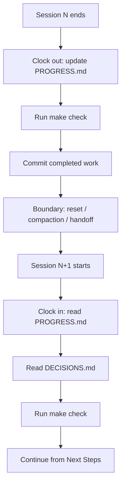

# Clock-In / Clock-Out Protocol: Bracketed Session Continuity

> A deterministic protocol that brackets every agent session — read continuity artefacts on entry, update them on exit — so a fresh session reaches an executable state in minutes rather than rebuilding context from scratch.

## What the Protocol Is

Long-running agentic work crosses session boundaries — context resets, compaction events, paused-and-resumed shifts, parallel forks. Without a deterministic protocol on each side of the boundary, the next session pays a *rebuild cost*: the time a new session needs to reach an executable state. The [walkinglabs lecture on continuity loss](https://github.com/walkinglabs/learn-harness-engineering/blob/main/docs/en/lectures/lecture-05-why-long-running-tasks-lose-continuity/index.md) frames the rebuild cost as the load-bearing metric: real-world harnesses can compress it from roughly 15 minutes to roughly 3 minutes by enforcing entry and exit steps that read and write a small set of continuity artefacts.

The protocol has two halves, encoded in `AGENTS.md` so the harness enforces sequence rather than agent discretion:

```markdown
## At session start (clock in)
1. Read PROGRESS.md for current state
2. Read DECISIONS.md for important decisions
3. Run make check to confirm repo is in consistent state
4. Continue from PROGRESS.md "Next Steps" section

## Before session end (clock out)
1. Update PROGRESS.md
2. Run make check to confirm consistent state
3. Commit all completed work
```

Source: [walkinglabs lecture 05, AGENTS.md template](https://github.com/walkinglabs/learn-harness-engineering/blob/main/docs/en/lectures/lecture-05-why-long-running-tasks-lose-continuity/index.md).

## The Three-Artefact Mixed Strategy

The protocol reads and writes three overlapping persistence layers. Each defends against a different failure mode — together they cover what a single artefact cannot.

| Artefact | Captures | Failure mode if missing |
|----------|----------|--------------------------|
| `PROGRESS.md` | Latest commit, test status, completed checklist, in-progress %, known issues, numbered Next Steps | Duplicate work and verification gap — the next session re-runs tests and reimplements partly-done features |
| `DECISIONS.md` | Date, choice, reasoning, **rejected alternatives**, constraints | Silent re-decision — the next session reverses prior choices because the analysis was discarded |
| Atomic git commits | "Free, automatically versioned state snapshots" — what changed, in what order | Implementation drift — direction silently shifts across sessions |

The lecture's framing: PROGRESS.md is the execution-state file; DECISIONS.md is the rationale file; atomic commits are the verifiable history. The three are non-redundant. PROGRESS.md tells the next session *where* work stopped; DECISIONS.md tells it *why* this path was chosen over the others; the commit history tells it *what* actually changed.



## Compaction vs Reset: Different Boundaries, Different Mitigations

Two boundary types degrade continuity in different ways, and the protocol applies to both:

- **Compaction** is in-session summarisation when context fills. The "what" survives in the prose summary; the "why" — single-instance decisions, rejected alternatives — often does not. See [context compression strategies](../context-engineering/context-compression-strategies.md) for the mechanics, and [objective drift](../anti-patterns/objective-drift.md) for the failure mode this enables.
- **Reset** is full state loss between sessions. The next session opens with a clean context and rebuilds entirely from artefacts. The lecture notes this has an upside: a fresh session has "a clean mental state — no 'I'm running out of time' anxiety" that capable models can develop late in a run.

Model behaviour shifts the calculus. Per the [walkinglabs lecture](https://github.com/walkinglabs/learn-harness-engineering/blob/main/docs/en/lectures/lecture-05-why-long-running-tasks-lose-continuity/index.md), Sonnet 4.5 exhibits "severe context anxiety" that pushes toward reset strategies; Opus 4.5 "greatly diminished" this behaviour, making compaction-focused approaches viable. The protocol is the same in both cases — the artefacts cover both boundary types — but the value-per-clock-cycle is higher on models with worse late-context behaviour.

For a complementary primitive that targets the compaction boundary specifically — a goal-shaped artefact written before summarisation fires — see [session recap](session-recap.md). The recap is *what* the agent writes at one specific boundary; the clock-in/clock-out protocol is *when and how* a session reads and writes the broader artefact set.

## The 4-Question Sufficiency Check

Writing artefacts is not the same as writing *useful* artefacts. The protocol fails silently if the clock-out step produces files the next session cannot act on. Four questions grade whether the leave-behind is sufficient. Each maps to a failure mode the lecture documents:

1. **Can a fresh agent identify recent work in under 5 minutes?** Targets the rebuild-cost metric directly. If PROGRESS.md, DECISIONS.md, and `git log` together do not surface the last unit of work and its state, the artefact is too thin or too verbose to act as a fast on-ramp.
2. **Are blockers explicit?** Targets the duplicate-work and verification-gap failure modes. "test_pagination_edge_case returns 500 on empty result sets" is actionable; "tests mostly pass" is not.
3. **Is the next-step pointer concrete?** Targets implementation drift. A numbered Next Steps list with specific actions ("Fix pagination edge case bug") prevents the next session from re-selecting a goal at random. The lecture flags drift as "like a game of telephone — after ten people pass the message, 'pick me up a coffee' might become 'buy me a coffee machine.'"
4. **Are decisions and their rejected alternatives preserved?** Targets silent re-decision. The lecture's example: "The previous session spent significant context budget analyzing three approaches and choosing option B. This session's agent doesn't know about that analysis and might re-decide based on incomplete information — potentially choosing option A." DECISIONS.md exists to keep the analysis available.

These four are this project's distillation of the lecture's failure-mode analysis, not a verbatim quote. Run them at clock-out time — if any answer is "no," the clock-out is incomplete.

## When the Protocol Earns Its Cost

The protocol is overhead. It pays off only under specific conditions:

- **Multi-session work** — there is a next session whose rebuild cost matters
- **Agents run unsupervised** — no human is in the loop to remember "we picked option B because option A had constraint X"
- **No continuous progress file already owns the state** — the protocol's clock-out duplicates `todo.md` updates if the agent already maintains one per step ([goal recitation](../context-engineering/goal-recitation.md), [trajectory logging](../observability/trajectory-logging-progress-files.md))
- **Sessions cross compaction or reset boundaries** — short tasks that complete within a single context window get nothing back from clock-in overhead

Outside these conditions the protocol is pure cost. A solo developer pausing for an hour reads `git log -5` and the file they were editing in 30 seconds — two markdown files plus a `make check` plus a commit cycle adds minutes for marginal benefit.

## When This Backfires

Even inside the protocol's intended scope, three failure modes recur:

- **Rigid template outlives the task shape.** PROGRESS.md and DECISIONS.md have fixed sections. When scope widens mid-session — a new constraint emerges, the objective splits — the template traps the agent in the old frame. Amp's handoff design rejects exactly this, requiring users to specify a *new* goal at the boundary rather than infer continuity from static artefacts ([Tessl analysis of Amp's handoff retirement](https://tessl.io/blog/amp-retires-compaction-for-a-cleaner-handoff-in-the-coding-agent-context-race/), November 2025).
- **Stale clock-out makes clock-in worse than no clock-in.** If clock-out is skipped under time pressure, the next session reads stale state and picks the wrong task with high confidence. A missing exit step poisons every subsequent entry — better to have no PROGRESS.md than a PROGRESS.md three sessions behind reality.
- **Duplication with continuous progress files.** If a step-by-step `todo.md` already updates every turn, the clock-out write creates a second source of truth. The two will drift, and the next session has two seeds that disagree.

## Example

A working PROGRESS.md and DECISIONS.md pair at clock-out time, drawn from the lecture templates:

```markdown
# PROGRESS.md

## Current State
- Latest commit: abc1234 (feat: add user preferences endpoint)
- Test status: 42/43 passing (test_pagination_edge_case failing)
- Lint: passing

## Completed
- [x] User model and database migration
- [x] Basic CRUD endpoints
- [x] Auth middleware integration

## In Progress
- [ ] Pagination feature (90% - edge case test failing)

## Known Issues
- test_pagination_edge_case returns 500 on empty result sets
- Need to confirm whether deleted users should appear in listings

## Next Steps
1. Fix pagination edge case bug
2. Add "include deleted users" query parameter
3. Update API documentation
```

```markdown
# DECISIONS.md

## 2024-01-15: Use Redis for user preferences caching
- Reason: High read frequency (every API call), small data size
- Rejected alternative: PostgreSQL materialized view (high change frequency makes maintenance cost not worthwhile)
- Constraint: Cache TTL of 5 minutes, active invalidation on write
```

Running the 4-question check against this pair: a fresh agent reaches an executable state by reading two files and one `make check` (Q1 — yes); the failing test is named specifically (Q2 — yes); Next Steps is a numbered, concrete list (Q3 — yes); the Redis-vs-materialized-view rationale survives with the rejected alternative attached (Q4 — yes). Clock-out is complete.

Compare to an insufficient leave-behind: "PROGRESS.md: making progress on auth and pagination, some tests failing, will continue next session." Question 1 is yes — the agent reads one short line — but questions 2, 3, and 4 all fail. The next session has no concrete blocker, no concrete next step, and no decision history. Rebuild cost reverts to its uncontrolled baseline.

## Key Takeaways

- Clock-in/clock-out is a protocol that brackets sessions; session recap is the artefact written at one specific boundary inside it
- Three overlapping artefacts — PROGRESS.md, DECISIONS.md, atomic commits — each defend against a different failure mode (duplicate work, silent re-decision, implementation drift)
- Compaction and reset are different boundary types; the same artefact set covers both, but the value rises on models with worse late-context behaviour
- The 4-question sufficiency check turns "did we leave a good handoff?" into a measurable test against the lecture's failure modes
- The protocol is overhead — apply it only when sessions cross boundaries, agents run unsupervised, and no continuous progress file already owns the state

## Related

- [Session Recap](session-recap.md) — the goal-shaped artefact authored at a single boundary inside this protocol
- [Session Initialization Ritual](session-initialization-ritual.md) — a five-step startup sequence that operationalises the clock-in half
- [Trajectory Logging via Progress Files and Git History](../observability/trajectory-logging-progress-files.md) — the continuous alternative that can subsume PROGRESS.md
- [Context Compression Strategies](../context-engineering/context-compression-strategies.md) — the compaction mechanics the protocol mitigates against
- [Objective Drift](../anti-patterns/objective-drift.md) — the silent re-decision failure mode DECISIONS.md prevents
- [Agent Memory Patterns](agent-memory-patterns.md) — cross-session persistence one layer above per-session continuity
- [Cross-Cycle Consensus Relay](cross-cycle-consensus-relay.md) — structured handoff artefacts for long-running loops across sessions
