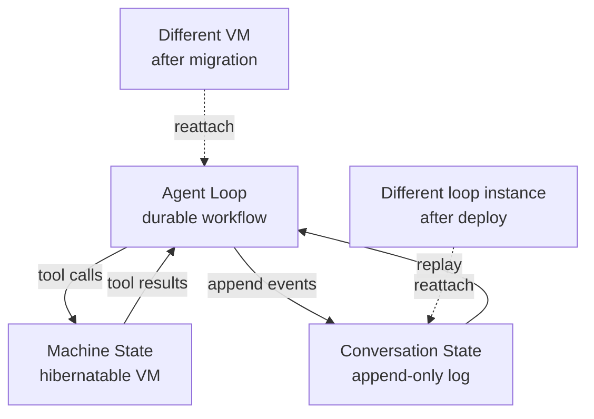

# Cloud-Agent Three-Layer State Decoupling

> Split a cloud agent into three independent layers — agent loop, machine state, conversation state — so pods, sessions, and threads recover separately.

Three-layer state decoupling keeps a cloud agent's agent loop, machine state, and conversation state as separate runtime components — each addressable and reassignable so no single infrastructure failure costs a user thread, a sandbox, or in-flight reasoning. Cursor names the pattern directly: "keep the agent loop, the machine state, and the conversation state as decoupled components" ([Cursor, 2026-05-21](https://cursor.com/blog/cloud-agent-lessons)).

## When this pattern applies

The split pays off when at least one of these holds:

- Sessions stretch across infrastructure events. The layered architecture lets a cloud agent "survive blips in inference reliability, pod hibernation and resumption, and runs that stretch across days or even weeks" ([Cursor, 2026-05-21](https://cursor.com/blog/cloud-agent-lessons)).
- Subagents fan out across different kinds of pod. A subagent "might even outlive its parent, or run on a completely different kind of pod" ([Cursor, 2026-05-21](https://cursor.com/blog/cloud-agent-lessons)).
- Pod lifecycle is optimized independently of agent identity. Readonly VMs, prewarmed VMs, and hibernation are only reachable when the loop does not pin to a machine ([Cursor, 2026-05-21](https://cursor.com/blog/cloud-agent-lessons)).

When none hold — short single-machine sessions on stable infrastructure — a coupled alternative ships faster. This is the cloud-agent variant of the general [session-harness-sandbox separation](session-harness-sandbox-separation.md); use that page for the abstract three-primitive theory.

## The three layers

| Layer | What it holds | Lifetime | Substrate | Failure mode absorbed |
|-------|---------------|----------|-----------|-----------------------|
| Agent loop | Model decisions, tool dispatch, retry control flow | Seconds to minutes per task | Durable workflow engine (Cursor runs Temporal at "more than 50 million actions per day" ([Cursor, 2026-05-21](https://cursor.com/blog/cloud-agent-lessons))) | Inference outages, harness deploys |
| Machine state | Sandbox filesystem, processes, env, dev server | Minutes to hours per session | Hibernatable VM, addressable independently of the loop | Spot reclamation, pod restart, region migration |
| Conversation state | Transcript, tool-call records, streamed events | Days to weeks per thread | Append-only storage with retry-aware sequencing | Client disconnects, mid-stream retries |

Anthropic's Managed Agents reach the same shape under different names — Session (log), Harness (stateless loop), Sandbox (execution) — and report the decoupling cut p50 time-to-first-token by ~60% ([Anthropic, 2026](https://www.anthropic.com/engineering/managed-agents)). Two independent primary sources converging is evidence the split is structural, not vendor-specific.



## Why it works

The three layers have different failure modes, lifetimes, and churn rates. Couple two and you force the union of their constraints onto both. A loop pinned to a VM cannot survive pod loss; a conversation pinned to a VM cannot survive region migration. Cursor's mechanism is operational: because the loop lives in Temporal rather than on the VM, pod lifecycles are managed independently, which enables "readonly VMs or prewarmed VMs" ([Cursor, 2026-05-21](https://cursor.com/blog/cloud-agent-lessons)). Anthropic reaches the same property through stateless harness replay — "Any Harness instance can pick up any Session and continue from where it left off" ([Anthropic, 2026](https://www.anthropic.com/engineering/managed-agents)). The durable layer is authoritative; attached compute is replaceable.

Durability also constrains loop shape — Cursor moved from "'eternal' agent workflows to multiple shorter ones that exit after completing a single task" ([Cursor, 2026-05-21](https://cursor.com/blog/cloud-agent-lessons)). The conversation layer reconciles streamed retries against what the client already saw: append-only storage "accounts for retries," letting a client "rewind its stream, and show the new data" after a failed step ([Cursor, 2026-05-21](https://cursor.com/blog/cloud-agent-lessons)).

## When this backfires

- Short sessions on stable infrastructure. When the p99 session runs under a few minutes and pods rarely reclaim, migration and hibernation payoffs never fire. Durable execution adds 10 to 50ms per activity dispatch ([AgentMarketCap, 2026](https://agentmarketcap.ai/blog/2026/04/10/durable-agent-execution-production-temporal-modal-event-sourced)) — negligible against LLM latency, but a real ongoing engineering cost.
- Pre-product-market-fit teams. The split commits the product to a fixed operational topology. A coupled prototype ships in weeks, and reworking it after the UX shifts costs more than rebuilding. Multi-agent systems share the risk — most enterprises "risk adding distributed complexity long before they have a problem worth distributing" ([InfoWorld, 2026](https://www.infoworld.com/article/4154335/multi-agent-ai-is-the-new-microservices.html)).
- Schema-evolution-heavy products. Replay correctness needs a stable event shape. When events change meaning across harness versions, old logs stop replaying under new code — the hazard [session-harness-sandbox-separation](session-harness-sandbox-separation.md) flags.
- Local-first or offline agents. Cloud failure modes justify the pattern — spot reclamation, region failover, multi-tenant scheduling. Local agents pin to one machine by default, which removes the payoff.
- Multi-agent coordination beyond a single thread. A flat conversation log is "fundamentally insufficient" for complex multi-agent coordination ([Yan, Medium, 2026-04](https://medium.com/data-science-collective/anthropic-just-shipped-three-of-the-five-harness-layers-for-managed-agent-and-the-other-two-are-on-14979cb4cf00)) — you need extra memory layers on top once subagent graphs branch beyond parent-child.

## Composition

The split is the substrate other cloud-agent patterns sit on — see [Related](#related) for the patterns that build on each layer.

## Example

A team operating a Cursor-style cloud agent product wants user threads to survive a region-wide pod restart without losing in-flight reasoning or transcript.

Before — coupled state on a single VM:

```text
VM #A
  ├── agent loop (in-process)
  ├── sandbox FS + processes
  └── conversation buffer (in-memory)

Pod restart -> all three lost. User thread dies; transcript truncates at last flush.
```

After — three layers split across substrates:

```text
Temporal workflow:  agent loop (durable, restartable)
        │
        ▼
VM #A (hibernatable):  machine state (FS + processes)
        │
        ▼
Append-only store:  conversation state (streamed to clients, retry-aware)

Pod #A reclaimed -> Temporal restarts the loop activity on a fresh VM #B,
  replays conversation events for context, attaches to a prewarmed machine.
  Client stream rewinds and replays from last acknowledged event.
```

The structural change is that no single layer holds the full agent state — each is independently restorable, and the durable substrates (workflow engine, append-only log) are the source of truth ([Cursor, 2026-05-21](https://cursor.com/blog/cloud-agent-lessons)).

## Key Takeaways

- Cloud-hosted agents survive infrastructure churn only if the agent loop, machine state, and conversation state are addressable and recoverable independently
- The split is enabled by durable substrates — a workflow engine for the loop and append-only storage for the conversation — that make compute attachments replaceable
- Two independent primary sources (Cursor, Anthropic) converged on the same three-layer architecture with different naming; the structural shape is not vendor-specific
- The pattern is overhead for short single-machine sessions, pre-PMF teams, and schema-churning products; apply it when session length and infrastructure failure rate justify the workflow infrastructure
- Composes downward with session bootstrap, prebuilt environments, and delta-channel checkpointing; the layered split is the substrate other cloud-agent patterns sit on

## Related

- [Session Harness Sandbox Separation](session-harness-sandbox-separation.md) — the general three-primitive theory under a different naming convention
- [Deep Agent Runtime](deep-agent-runtime.md) — the runtime layer underneath the harness that exposes durable runs, lifecycle, streaming, and versioning
- [Cloud-Agent Session Bootstrap](cloud-agent-session-bootstrap.md) — install/start lifecycle for the machine-state layer
- [Long-Running Agents](long-running-agents.md) — the durability, checkpointing, and resumability primitives across Anthropic, Cursor, and Google designs
- [Delta Channels: Bounded Checkpoint Storage](delta-channels-checkpoint-storage.md) — keeps the conversation layer's append-only log linear in storage cost
