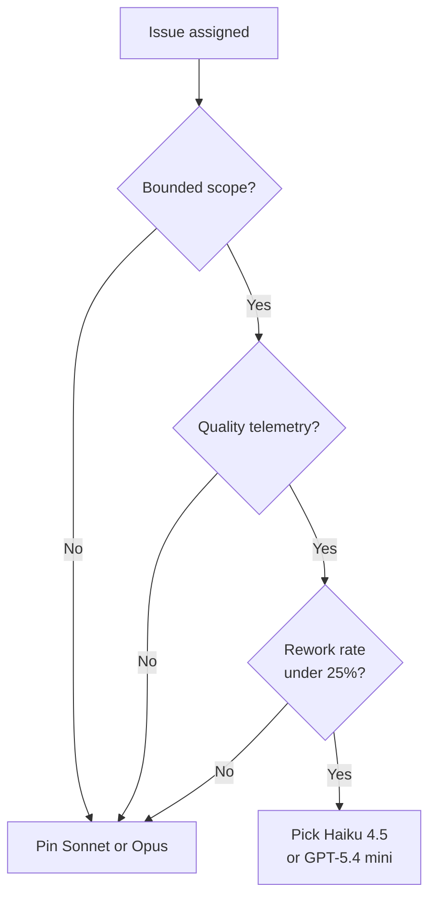

# Cloud-Agent Tiered Model Routing

> Tiered model routing picks a capability tier per cloud-agent session at dispatch; the cheap tier pays off only when scope, telemetry, and rework cost align.

Cloud-agent tiered model routing assigns each session-scope task to a capability tier — frontier, standard, or fast/cheap — at dispatch, before the session starts. GitHub's Copilot cloud agent ships this as a per-session model picker after the 2026-05-18 changelog added Claude Haiku 4.5 and GPT-5.4 mini at a 0.33x multiplier ([GitHub Changelog 2026-05-18](https://github.blog/changelog/2026-05-18-copilot-cloud-agent-fast-cost-efficient-models-for-simple-tasks/)). Billing is one premium request per session at the model's multiplier — per-task economics, not per-turn ([GitHub Docs: Copilot requests](https://docs.github.com/en/copilot/concepts/billing/copilot-requests)).

The operator picks the tier once and the session runs end-to-end on it, with no in-session escalation documented — distinguishing it from the [Utility-Model Split](utility-model-split.md), [Auto Model Selection](auto-model-selection.md), and [Cost-Aware Agent Design](cost-aware-agent-design.md) axes detailed in *Related*.

## Four Conditions for the Cheap Tier

All four must hold, or the cheap default is a net loss:

- **Bounded task scope.** Cheap-tier sessions fit dependency bumps, changelog wording, small refactors, and single-issue fixes — not security-critical work, architectural decisions, or large migrations ([Igor's Lab, 2026-05-19](https://www.igorslab.de/en/github-copilot-cloud-agent-economy-models/)).
- **Per-tier quality telemetry.** Without PR acceptance, retry, and reviewer-rejection rates broken down by `model_id`, regressions hide behind the savings — the "silent quality degradation" failure ([Tianpan: LLM Routing](https://tianpan.co/blog/2025-10-19-llm-routing-production)).
- **Bounded rework cost.** A cheap session that escalates costs 0.297 + 0.9 = 1.197 requests vs 0.9 for pinning Sonnet; above ~25% cheap-tier failure, the cheap default is the pricier one.
- **Picker exposed at the entrypoint.** Model selection is supported only when assigning an issue to Copilot on GitHub.com, mentioning `@copilot` in a pull-request comment, or starting from the agents tab/panel, GitHub Mobile, or Raycast; "where a model picker is not available, Auto will be used automatically" ([GitHub Docs: Changing the AI model](https://docs.github.com/en/copilot/how-tos/use-copilot-agents/cloud-agent/changing-the-ai-model)).

## Tiers and Multiplier Math

The cloud agent currently exposes Auto, Sonnet 4.5, Opus 4.7, Haiku 4.5, GPT-5.2-Codex, and GPT-5.4 mini.

| Model | Multiplier | Per session under Auto (−10%) |
|-------|-----------|-------------------------------|
| Claude Haiku 4.5 | 0.33 | 0.297 |
| GPT-5.4 mini | 0.33 | 0.297 |
| Claude Sonnet 4.5 / 4.6 | 1 | 0.9 |
| GPT-5.2-Codex / GPT-5.4 | 1 | 0.9 |
| Claude Opus 4.7 | 15 | 13.5 |

Source: [GitHub Docs: Copilot requests](https://docs.github.com/en/copilot/concepts/billing/copilot-requests). Each `@copilot` steering comment also bills at the session's tier: a five-round Haiku session (5 × 0.33 = 1.65) costs more than a clean Sonnet session (1.0).

## Routing Signals Before Dispatch

The cloud agent ships no automatic task-complexity classifier — the task-optimised Auto variant is "generally available in Copilot Chat in VS Code" only ([GitHub Docs: Auto Model Selection](https://docs.github.com/en/copilot/concepts/auto-model-selection)). For cloud-agent sessions the operator is the classifier: single-file edits and dependency bumps map to the cheap tier, multi-file refactors do not. If the last 10 Haiku PRs each landed in one round, the next likely will too; if three needed rework, raise the tier. When in doubt, default up: misrouting up wastes inference, down wastes review.

## Why It Works

Capability scales sub-linearly with price across tiers, so most queries need no frontier model ([Tianpan: LLM Routing](https://tianpan.co/blog/2025-10-19-llm-routing-production)). For short, scoped coding tasks the floor sits well below the frontier: Anthropic claims Haiku 4.5 "delivers similar levels of coding performance to Sonnet 4 but at one-third the cost and more than twice the speed" ([Anthropic: Claude Haiku 4.5](https://www.anthropic.com/news/claude-haiku-4-5)), and [FrugalGPT](https://arxiv.org/abs/2305.05176) shows the cascade upper bound of 98% cost reduction at GPT-4 quality. The cloud-agent variant is its manual, human-classified instance.

## When This Backfires

- **No in-session escalation.** A failed cheap-tier PR is caught at human review, after the premium request has billed; re-dispatching at Sonnet pays both multipliers (~1.2 vs 0.9).
- **Router collapse.** As cost budgets rise, "routers systematically default to the most capable and most expensive model even when cheaper models already suffice" ([arxiv:2602.03478](https://arxiv.org/abs/2602.03478)); the human picker likewise reverts to the safe default under shipping pressure.
- **Mid-session swap regressions.** GitHub warns "Switching models mid-session has shown increased cost without ample improvements in quality" ([GitHub Docs: Auto Model Selection](https://docs.github.com/en/copilot/concepts/auto-model-selection)). One VS Code reporter saw "repeated mistakes on things I'd corrected multiple times" from Auto's silent swaps, resolved only by pinning Sonnet ([microsoft/vscode#285064](https://github.com/microsoft/vscode/issues/285064)).
- **Inherited triggers bypass the picker.** Webhook and third-party orchestrators fall through to Auto's reliability-only variant, which optimises for pool health, not task fit.
- **Long-context refactors widen the gap.** Anthropic's "comparable to Sonnet 4" framing benchmarks short-context tasks; the canonical cloud-agent workload is exactly where Haiku's capability gap shows.

## Example

A platform team splits cloud-agent dispatch into two issue classes:

- **Type A (dependency bumps, changelog wording)**: bounded scope, single-file edits, reviewer-rejection rate under 10% on the last 20 Haiku PRs → pin **Claude Haiku 4.5** (0.297 premium requests per session).
- **Type B (cross-service refactors with API contract changes)**: multi-file edits, rejection rate ~35% on past Haiku PRs → pin **Claude Sonnet 4.5** (0.9 per session).

The dispatch rule lives in the team's runbook, not in code. The runbook tracks each class's monthly cheap-tier failure rate; when it crosses 25%, that class moves to the Sonnet default until it recovers.

## Key Takeaways

- The Copilot cloud agent's cheap tier (Haiku 4.5, GPT-5.4 mini at 0.33x) is operator-dispatched, not classifier-dispatched — the human picker is the routing signal.
- Four conditions have to hold together: bounded scope, per-tier quality telemetry, rework cost under ~25% escalation rate, and a picker-exposed entrypoint.
- No documented in-session escalation; a failed cheap-tier PR re-dispatched at Sonnet costs ~1.2 premium requests vs 0.9 for pinning Sonnet up front.
- Each steering comment bills at the session's tier — multi-round cheap-tier sessions can exceed a clean single-round frontier session.
- Track per-`model_id` PR acceptance, retry, and reviewer-rejection rates — without that telemetry, regressions hide behind the multiplier savings.

## Related

- [Utility-Model Split](utility-model-split.md) — splits background harness calls inside one user turn, complementary to session-level tier routing.
- [Auto Model Selection](auto-model-selection.md) — vendor-side per-request brokering; the fallback when the picker is not exposed.
- [Cost-Aware Agent Design](cost-aware-agent-design.md) — taxonomic framework for per-task tier routing across an entire harness.
- [Code-Health-Gated LLM Tier Routing](code-health-gated-tier-routing.md) — research proposal using code health as the routing signal at task dispatch.
- [Gateway Model Routing](gateway-model-routing.md) — the discovery layer beneath any tier-routing decision.
- [GitHub Copilot Cloud Agent](../tools/copilot/coding-agent.md) — the cloud-agent surface this routing pattern targets.
