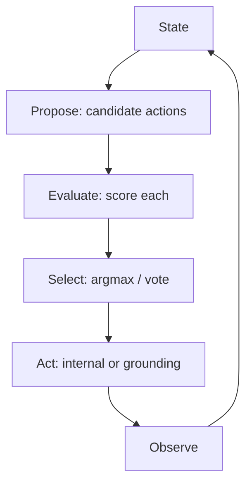

# CoALA Decision-Making Loop as an Orchestration Lens

> CoALA's propose -> evaluate -> select -> act loop is a vocabulary for locating where orchestration tactics intervene — not a runtime structure to enforce.

CoALA (Sumers et al., TMLR 2024) decomposes a language agent's decision step into a two-stage cycle: a **planning stage** that runs propose -> evaluate -> select sub-stages, followed by an **execution stage** that performs the chosen action and observes the result ([arXiv:2309.02427](https://arxiv.org/abs/2309.02427)). The framework is descriptive — the authors "retrospectively survey and organise" existing agents (ReAct, Voyager, Tree of Thoughts, Reflexion) by which sub-stages each one instantiates ([CoALA §4](https://arxiv.org/html/2309.02427v3)). Used as a lens rather than a build recipe, the four-phase vocabulary makes phase-specific tactics on this site composable.

## When This Lens Helps

Reach for it when you need a shared name for sub-stages that already exist in most agent designs but go unlabelled. Skip it when an agent is small enough that the lens adds vocabulary without organising anything new — see [When This Backfires](#when-this-backfires).

The four phases:

- **Propose** — generate one or more candidate next actions, typically via reasoning over the current state, optionally with retrieval ([CoALA §4.1](https://arxiv.org/html/2309.02427v3)).
- **Evaluate** — assign a value or verdict to each candidate via heuristic rules, LLM-as-judge, learned values, or LLM reasoning ([CoALA §4.1](https://arxiv.org/html/2309.02427v3)).
- **Select** — choose one (or reject) via argmax, softmax, or majority vote ([CoALA §4.1](https://arxiv.org/html/2309.02427v3)).
- **Act** — execute the chosen action. The action may be **internal** (reasoning, retrieval, learning) or **external grounding** (tool call, environment effect) — the same skeleton fits both ([CoALA §3](https://arxiv.org/html/2309.02427v3)).

## Locating Site Patterns on the Loop

The lens earns its keep by giving readers a way to ask "which phase does this tactic improve?" — and a search index into adjacent tactics that improve the same phase.

| Phase | Tactics documented on this site |
|-------|---------------------------------|
| Propose | [Issue Requirements Preprocessing](issue-requirements-preprocessing.md), [Interactive Clarification for Underspecified Tasks](interactive-clarification-underspecified-tasks.md), [Self-Discover Reasoning](self-discover-reasoning.md) |
| Evaluate | [Adaptive Generate-Rank-Verify](adaptive-generate-rank-verify.md), [Critic Agent Pattern](critic-agent-plan-review.md), [Evaluator-Optimizer Pattern](evaluator-optimizer.md), [Inference-Time Tool-Call Reviewer](inference-time-tool-call-reviewer.md) |
| Select | voting, argmax over candidate scores, majority-vote across parallel agents ([Graph of Thoughts](graph-of-thoughts.md) aggregation step) |
| Act + observe | [Agent Backpressure](agent-backpressure.md) and verification gates sit on the act -> observe boundary; [Agent Turn Model](agent-turn-model.md) describes the iterative inference + tool-call structure of a single act step |

ReAct is the textbook example of an agent that **skips evaluate and select**: a single reasoning step produces one grounding action with no candidate scoring ([CoALA §4.3](https://arxiv.org/html/2309.02427v3)). Tree of Thoughts is the textbook example of an agent that **makes evaluate and select explicit** — propose multiple thoughts, score each, search the tree — and it raised Game of 24 success from 4% (Chain-of-Thought) to 74% on the same model ([Yao et al., arXiv:2305.10601](https://arxiv.org/abs/2305.10601)). The phase taxonomy is what makes those two designs comparable on the same diagram.

## Why It Works

CoALA grounds the four phases in 50 years of symbolic AI cognitive architectures (Soar, ACT-R) which empirically converged on propose -> evaluate -> select as the minimum sufficient decomposition for general problem-solving ([CoALA §3](https://arxiv.org/html/2309.02427v3)). The causal reason is informational, not procedural: **evaluate exists so that the policy's confidence is legible to select; select exists so that the act decision is legible to whoever audits the trajectory**. Skipping the named sub-stages doesn't make the cycle faster — it just hides the evaluate-and-select inside an opaque single LLM call.

The empirical payoff of making the sub-stages explicit is Tree of Thoughts: the same backbone model raised Game of 24 success from 4% to 74% by exposing propose/evaluate/select to deliberate search ([Yao et al., arXiv:2305.10601](https://arxiv.org/abs/2305.10601)). The lens, used as a locator, lets you ask "which phase of this loop is hiding inside an opaque single call, and is exposing it likely to pay back?"

## When This Backfires

The lens is a vocabulary, not architecture. Treating it as a runtime structure to literally enforce loses cost without buying reliability. Skip it under any of:

- **Single-action domains.** When every state has one obvious next action — a deterministic refactor pipeline, a fixed-shape tool router — the evaluate/select sub-stages add LLM calls without information. CoALA itself notes "the proposal stage might simply include all actions" for such domains ([§4.1](https://arxiv.org/html/2309.02427v3)).
- **External verification already gates act.** When a PreToolUse hook, type-checker, test suite, or sandbox sits between the agent and any irreversible action (see [Agent Backpressure](agent-backpressure.md)), the internal evaluate sub-stage is redundant with the external check — and the external check is more reliable.
- **Tight cost or latency budgets.** Each explicit evaluate/select adds at least one LLM call per iteration. For high-throughput fan-out (bulk repo audits, parallel sub-agents at scale) the per-action overhead exceeds the per-action reliability gain.
- **Fresh-context loops.** Designs like the [Ralph Wiggum Loop](ralph-wiggum-loop.md) deliberately discard accumulating state each iteration. Reconstructing propose/evaluate/select inside each fresh-context cycle defeats the point of context freshness — the CoALA loop implicitly assumes accumulating planning state.
- **Pure routing.** Agents that exist only to dispatch among a small fixed set of tools by classifier (see [Classifier-Subagent Run Mode](classifier-subagent-run-mode.md)) don't benefit from the four-phase taxonomy — the classifier *is* the loop.

CoALA itself frames the loop descriptively, not prescriptively ("we use CoALA to retrospectively survey and organise"; [§1](https://arxiv.org/html/2309.02427v3)). The authors flag that "early agents simply use LLMs to propose an action...without intermediate reasoning or retrieval" ([§4.3](https://arxiv.org/html/2309.02427v3)) — most shipping coding agents look like ReAct, not Tree of Thoughts. Force-fit the full loop onto a production scaffold and you end up with three LLM calls where one would do.

## Key Takeaways

- The loop is propose -> evaluate -> select -> act, but ReAct-shaped agents skip evaluate and select entirely; both are valid CoALA instantiations ([CoALA §4.3](https://arxiv.org/html/2309.02427v3)).
- Use the vocabulary to locate where a tactic intervenes — ranking tactics improve evaluate, verification gates guard act, plan-mode front-loads propose.
- The payoff of making evaluate and select explicit is demonstrated by Tree of Thoughts (4% -> 74% on Game of 24 with the same backbone model) ([Yao et al., arXiv:2305.10601](https://arxiv.org/abs/2305.10601)), not by CoALA itself.
- Skip the lens when external verification already gates act, when latency budgets are tight, or when the agent is a fixed-shape router.

## Related

- [CoALA Memory Taxonomy as a Classifier](coala-memory-taxonomy-classifier.md) — The other CoALA axis: this page is the decision-making *loop*, that page is the *memory* taxonomy (working/episodic/semantic/procedural) — two distinct facets of the same framework
- [Critic Agent Pattern](critic-agent-plan-review.md) — A second model that runs the evaluate sub-stage on the planner's output
- [Adaptive Generate-Rank-Verify](adaptive-generate-rank-verify.md) — Evaluate-and-select made explicit when verification dominates cost
- [Evaluator-Optimizer Pattern](evaluator-optimizer.md) — Two-role loop where one role generates and the other evaluates
- [Graph of Thoughts](graph-of-thoughts.md) — Generalises Tree of Thoughts with an aggregate operation across propose/evaluate/select
- [Anthropic's Effective Agents Framework](anthropic-effective-agents-framework.md) — Practical workflow patterns that often skip evaluate/select in favour of external verification
