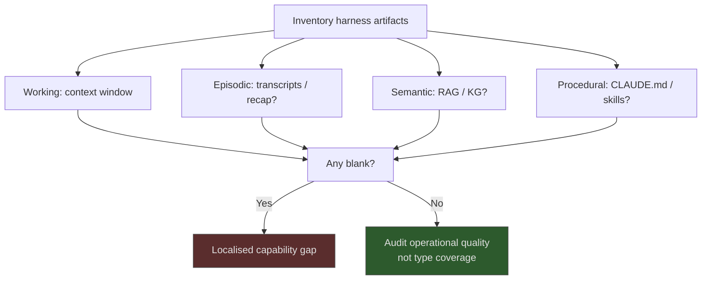

# CoALA Memory Taxonomy as a Classifier for Harness Artifacts

> Use CoALA's four memory types — working, episodic, semantic, procedural — to classify harness artifacts and surface capability gaps.

CoALA is a *descriptive* framework that maps language agents onto four memory types inherited from Soar and ACT-R ([Sumers et al., 2024](https://arxiv.org/abs/2309.02427)). Applied to a Claude Code, Copilot, or Cursor harness, it names what each artifact *is* and which memory type has no representative — not how to implement any of them.

## When the Classifier Earns Its Keep

The taxonomy pays off when a harness has enough memory surfaces that absence is non-obvious. Apply it when:

- **The harness has at least three distinct persistence surfaces** — CLAUDE.md, a transcript store, a RAG index — and you want to know what's missing.
- **You are auditing a harness you didn't build.** Naming each artifact in CoALA terms forces a complete inventory; ad-hoc inspection skips categories that aren't there.
- **A capability gap is observable but not localised.** "The agent keeps making the same mistake across sessions" maps to "no episodic memory or no learning action into procedural memory" once the inventory is in CoALA terms ([CoALA §3](https://arxiv.org/html/2309.02427v3)).

Skip it when the harness is single-session, single-file, and single-developer — there is nothing to classify.

## The Four Types, Defined by the Source

Definitions are quoted from [CoALA §3](https://arxiv.org/html/2309.02427v3); paraphrasing them loses the framework's grounding.

| Type | CoALA definition (Sumers et al., 2024) |
|------|----------------------------------------|
| **Working** | "Maintains active and readily available information as symbolic variables for the current decision cycle." |
| **Episodic** | "Stores experience from earlier decision cycles … history event flows, game trajectories from previous episodes, or other representations of the agent's experiences." |
| **Semantic** | "Stores an agent's knowledge about the world and itself" — readable from external sources or writeable from reasoning. |
| **Procedural** | "Two forms … implicit knowledge stored in the LLM weights, and explicit knowledge written in the agent's code." |

Working memory is transient and within-cycle. Episodic, semantic, and procedural are long-term ([§3.1.1–3.1.4](https://arxiv.org/html/2309.02427v3)).

## The Mapping Table

The classifier resolves cleanly onto coding-agent artifacts. The mapping is the diagnostic instrument.

| CoALA type | Concrete harness artifact | What it's good at | What it's bad at |
|------------|--------------------------|-------------------|------------------|
| **Working** | The live context window; in-turn scratchpads | Holding the current goal, recent tool results, and intermediate reasoning | Persistence — evaporates at session end and degrades inside the [context-window dumb zone](../context-engineering/context-window-dumb-zone.md) |
| **Episodic** | Session transcripts; [session recap files](session-recap.md); execution traces; [memory synthesis from execution logs](memory-synthesis-execution-logs.md) | Recalling *what was tried* in similar past situations | Generalising across episodes — raw transcripts re-injected verbatim crowd context without synthesis |
| **Semantic** | RAG indexes, vector stores, knowledge graphs, codebase symbol indexes, [structured domain retrieval](../context-engineering/structured-domain-retrieval.md) | Looking up *facts* — API signatures, schema, file locations | Tracking *whether the fact is current*; mixing facts and experiences under uniform decay produces a category error ([Roynard, 2026](https://arxiv.org/abs/2604.11364)) |
| **Procedural** | [CLAUDE.md](../instructions/claude-md-convention.md) / [AGENTS.md](../instructions/agents-md-design-patterns.md), skills, slash commands, hooks, the agent's own code | Encoding *how to act* — the procedure the agent runs every time | Reflecting recent experience — procedural memory is rarely updated mid-session; learning is offline by design ([CoALA §3.1.4](https://arxiv.org/html/2309.02427v3)) |

The CoALA paper applies the same classifier to research systems: ReAct has working memory only; Voyager has procedural learning; Generative Agents combine episodic and semantic ([Table 2](https://arxiv.org/html/2309.02427v3)). The mapping above is the equivalent for production coding-agent harnesses.

## Using the Taxonomy as a Diagnostic

The diagnostic is a single question per type: *what artifact, if any, plays this role in our harness?* Each blank answer is a candidate capability gap.

A harness with only working and procedural memory cannot learn from past sessions — the absence of episodic memory predicts the failure mode without testing. A harness with episodic but no semantic memory will repeatedly re-derive facts that should live in a lookup, the consolidation gap [tiered memory architecture](tiered-memory-architecture.md) closes. The classifier names these absences directly.

## Why It Works

The four-type split is not arbitrary. CoALA inherits it from Soar and ACT-R — cognitive architectures whose purpose is to expose which capabilities a memory system has and lacks ([Sumers et al., 2024 §2.3](https://arxiv.org/html/2309.02427v3)) — and re-applies that mapping to language agents. Sumers et al. demonstrate the mechanism in Table 2: noting ReAct "lacks semantic or episodic memory" immediately predicts its inability to retrieve from or learn across episodes ([§3](https://arxiv.org/html/2309.02427v3)). The classifier earns its keep when *absence* is the diagnostic signal — what the cognitive-architecture inheritance is designed to make legible.

## When This Backfires

The classifier describes content type, not operational mechanics. Treating the label as a build spec produces real architectural bugs.

- **Category error: facts versus experiences under uniform decay.** Labelling a writeable RAG index "semantic memory" implies it inherits properties — abstraction, consolidation, integration with episodic memory — that it lacks. [Roynard (2026)](https://arxiv.org/abs/2604.11364) identifies this directly: CoALA "lacks an explicit Knowledge layer with its own persistence semantics," so harnesses applying the same update mechanics to facts and experiences silently corrupt one or both.
- **Ambiguous boundaries on writeable stores.** An index the agent queries *and* writes to is partly semantic memory, partly an external action target. The classifier produces a category dispute rather than insight; the memory/environment boundary is not crisp for digital agents as it is for embodied ones.
- **Trivial agents pay ceremony without yield.** A one-file CLAUDE.md and a context window need no taxonomy. The classifier's value is proportional to how much memory surface there is to classify; on small surfaces the description is the inventory.
- **Mislabelling implies false architectural depth.** A team claiming "all four CoALA memory types" can ship a harness whose semantic memory is one embedded JSON file and whose episodic memory is the session window — labels present, capabilities absent. Type coverage is necessary but not sufficient; operational quality is a separate audit.

Lead with the artifacts, then use [CoALA's full three-axis framework](../frameworks/coala-cognitive-architecture-language-agents.md) to *name* them and surface gaps. Do not let the labels imply mechanics the underlying artifacts don't have.

## Example

Inventorying a typical Claude Code coding-agent harness with CoALA:

| Artifact in this harness | CoALA type | Notes |
|--------------------------|------------|-------|
| Live context window | Working | Standard; subject to [dumb-zone degradation](../context-engineering/context-window-dumb-zone.md) past ~50% fill |
| `.claude/state/*.jsonl` session logs, [session recap](session-recap.md) at compaction | Episodic | Recap is goal-shaped, not raw transcript — already a step beyond verbatim replay |
| No vector index, no knowledge graph | **Semantic — missing** | Reader looks up library APIs via Bash + `WebFetch` every time; gap predicts repeated re-derivation cost |
| `CLAUDE.md` + `.claude/skills/` + `.claude/agents/` + hooks | Procedural | Rich procedural layer; the harness's strongest type |

The inventory says: missing semantic memory. The capability prediction follows directly: the agent will keep paying retrieval cost on facts that should sit in a lookup, and any "agent kept getting the API signature wrong" failure traces to that absence — not to a working-memory or procedural-memory bug. Adding a small semantic index ([context hub](../context-engineering/context-hub.md), [repository map pattern](../context-engineering/repository-map-pattern.md)) is the next architectural move.

## Key Takeaways

- CoALA's four memory types map cleanly onto production coding-agent artifacts; the mapping is the diagnostic tool.
- The classifier earns its keep on multi-layer harnesses where absence of a memory type is non-obvious by inspection; it adds ceremony without value on trivial agents.
- The four-type lens describes content type, not operational mechanics — a labelled type can still be operationally broken, and writeable stores blur memory-versus-environment boundaries.
- [Roynard (2026)](https://arxiv.org/abs/2604.11364) identifies a category-error risk: applying uniform decay or update mechanics to facts and experiences under the same "long-term memory" label silently corrupts one or both.
- Use the taxonomy to *name* what you already have, not as a build recipe — the implementation pages remain the source of truth for how each memory type actually works.

## Related

- [CoALA Decision-Making Loop as an Orchestration Lens](coala-decision-making-loop.md) — The other CoALA axis: this page classifies the *memory* surfaces, that page traces the *decision-making* loop (propose -> evaluate -> select -> act) — two distinct facets of the same framework
- [Agent Memory Patterns: Learning Across Conversations](agent-memory-patterns.md) — scope-based memory architecture for cross-session learning
- [Continual-Learning Layers](continual-learning-layers.md) — companion taxonomy organised by update-target / persistence-scope, distinct from this classify-what axis
- [Tiered Memory Architecture](tiered-memory-architecture.md) — operationalising episodic-to-semantic consolidation
- [Episodic Memory Retrieval](episodic-memory-retrieval.md) — episode-keyed recall implementation
- [Memory Synthesis from Execution Logs](memory-synthesis-execution-logs.md) — converting traces into persistent knowledge
- [Session Recap: Goal-Shaped Handoff at Context Boundaries](session-recap.md) — episodic-memory artifact for compaction boundaries
- [Cognitive Architectures for Language Agents (CoALA): A Classifier for Agent Harnesses](../frameworks/coala-cognitive-architecture-language-agents.md) — the full three-axis framework this memory taxonomy is one axis of
