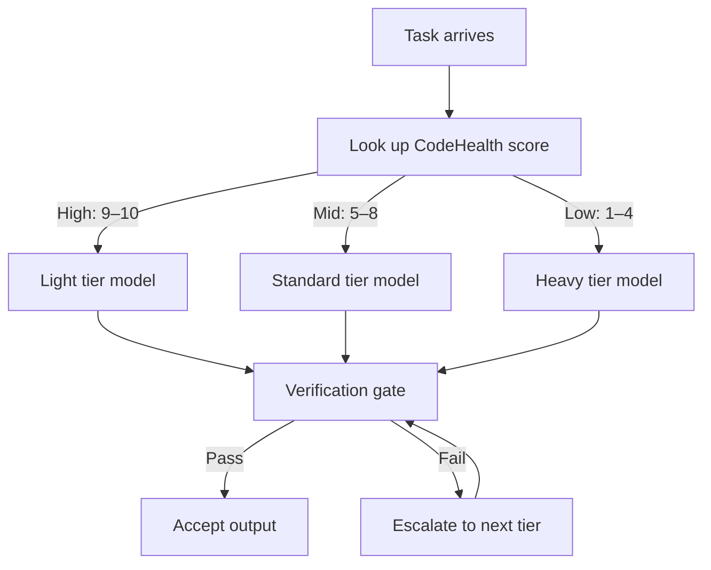

# Code-Health-Gated LLM Tier Routing

> Route software engineering tasks to the cheapest model tier whose output passes the same verification gate as the expensive model, using pre-computed code health metrics as the routing signal.

## The Routing Signal

Generic tier routing uses task type (file search vs. implementation vs. architecture) as the assignment signal. Code-health-gated routing uses a different input: the **health of the files the task will modify**, computed before any model call is made.

The hypothesis, proposed in [Madeyski (2026)](https://arxiv.org/abs/2604.07494), is that clean, well-structured files present lower intrinsic task complexity — lighter models can resolve issues in healthy code without quality regression, while tangled files with high coupling and cyclomatic complexity require heavier models.

This is a **research proposal with stated conditions, not measured outcomes**. The evaluation against SWE-bench Lite (300 tasks, 2,700 agent runs) is pending. Apply the design pattern with that caveat.

## Three-Tier Architecture

The framework defines three capability tiers mirroring commercial model families:

| Tier | Model class | Assigned to |
|------|-------------|-------------|
| Light | Haiku-class | High-CodeHealth files — healthy, low coupling |
| Standard | Sonnet-class | Mid-range or ambiguous health signals |
| Heavy | Opus-class | Low-CodeHealth files — high coupling, complexity |

Assignment happens **pre-generation** using features stored in a code health table, not at inference time.

## CodeHealth as a Routing Input

[CodeHealth](https://arxiv.org/abs/2604.07494) is a composite score (1–10) aggregating 25+ sub-factors:

- Cyclomatic complexity
- Coupling between modules
- File size
- Code duplication
- Naming consistency

Approximate thresholds used in the framework:

| Score range | Health category |
|-------------|-----------------|
| 9–10 | Healthy — candidate for light tier |
| 5–8 | Moderate — standard tier |
| 1–4 | Unhealthy — heavy tier |

The routing signal is the score of the **file(s) the patch will touch**, not the codebase average.

## Two Conditions for Cost Savings

Routing only saves cost when both conditions hold:

**Condition 1 — Cost gate**: The light tier's pass rate on routed tasks must exceed the inter-tier cost ratio. For Haiku→Opus at current API pricing, this ratio is approximately 20% — the light model must succeed on at least 20% of assigned tasks to avoid net cost increase.

**Condition 2 — Signal gate**: CodeHealth must discriminate task difficulty with a measurable effect size (p̂ ≥ 0.56). If code health scores do not reliably predict which tier a task needs, routing on them produces no gain.

Both gates must hold before routing pays off. Either condition failing means the signal is not predictive enough to justify the routing overhead.

## The Verification Gate

The verification gate — test suite, linter, or type checker — is identical for all tiers. A light-tier output passes only when it meets the same bar as a heavy-tier output would.

The gate is deterministic — its output is the same whether the input came from the cheap or expensive model. This design separates the routing decision from the quality judgment.

## Routing Policies

Three routing approaches are described in the proposal:

**Heuristic thresholds** — assign tiers using CodeHealth score ranges directly. Transparent and easy to audit; no training required. Threshold calibration depends on your codebase characteristics.

**ML classifier** — train a classifier on code health sub-factors; use SHAP analysis to rank which sub-factors (e.g., cyclomatic complexity alone vs. composite) carry the most predictive weight. Allows sub-factor selection to reduce instrumentation overhead.

**Perfect-hindsight oracle** — a theoretical ceiling that assigns each task retroactively to the cheapest tier that would have passed. Used as a benchmark to quantify headroom between heuristic or ML policies and optimal routing.

## Applying the Pattern Without a Composite Score

If you do not have a CodeHealth composite, apply the underlying logic using a single proxy metric [unverified]:

- **Cyclomatic complexity** (per function): files with average complexity > 10 route to heavy
- **Module coupling** (fan-in/fan-out): high-coupling files route to heavy
- **File churn rate** (git log): frequently modified files correlate with instability — route to heavy

The key constraint is unchanged: the verification gate must be deterministic and identical across all tiers. Without a consistent gate, routing decisions cannot be evaluated against a shared quality standard.

## Limitations

- **No empirical results yet** — the SWE-bench Lite evaluation is pending; stated cost savings are theoretical conditions
- **Causal direction** — clean code may correlate with simpler specs and better test coverage independently, confounding the health signal as a predictor of model-tier need
- **Pricing sensitivity** — the 20% cost-gate threshold is calibrated to current Haiku/Opus pricing; changes invalidate it
- **Tier-dependent asymmetry** — the hypothesis that mid-tier models benefit more from clean code than frontier models is stated but unmeasured [unverified]

## Key Takeaways

- Use file-level code health scores, pre-computed before generation, as a routing signal to assign SE tasks to cheaper model tiers
- Two conditions must hold: the light tier's pass rate must exceed the inter-tier cost ratio, and CodeHealth must show a measurable effect size (p̂ ≥ 0.56) on task difficulty
- The verification gate must be deterministic and identical for all tiers — this is the design constraint that makes tier equivalence measurable
- If no composite score is available, proxy with cyclomatic complexity or coupling as a simpler routing heuristic
- This is a research proposal (Madeyski, 2026) with pending empirical validation — treat stated cost savings as theoretical conditions, not measured outcomes

## Unverified Claims

- Tier-dependent asymmetry: mid-tier models show more variance on code health differences than frontier models [unverified]
- SHAP analysis will identify a small number of sub-factors that carry most of the routing signal, with the composite adding little over individual metrics [unverified]
- Single proxy metrics (cyclomatic complexity > 10, high coupling, high churn) provide actionable routing signal in the absence of a composite CodeHealth score [unverified]

## Related

- [Cost-Aware Agent Design](cost-aware-agent-design.md) — generic task-to-tier routing by task type (exploration, implementation, architecture)
- [Heuristic-Based Effort Scaling](heuristic-effort-scaling.md) — effort scaling via prompt-encoded complexity tiers
- [Cross-Vendor Competitive Routing](cross-vendor-competitive-routing.md) — competitive routing across vendor agents for the same task
- [Agent Backpressure: Automated Feedback for Self-Correction](agent-backpressure.md) — using deterministic tooling (tests, linters) as self-correction feedback
- [Reasoning Budget Allocation](reasoning-budget-allocation.md) — allocating reasoning compute proportionally across agent phases
- [Evaluator-Optimizer Pattern](evaluator-optimizer.md) — generator-evaluator loop as a quality control mechanism
- [Verification-Centric Development](../workflows/verification-centric-development.md) — making verification the organizing principle of agent workflows
