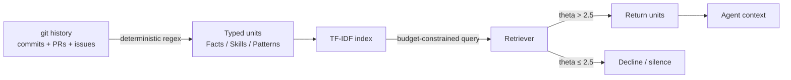
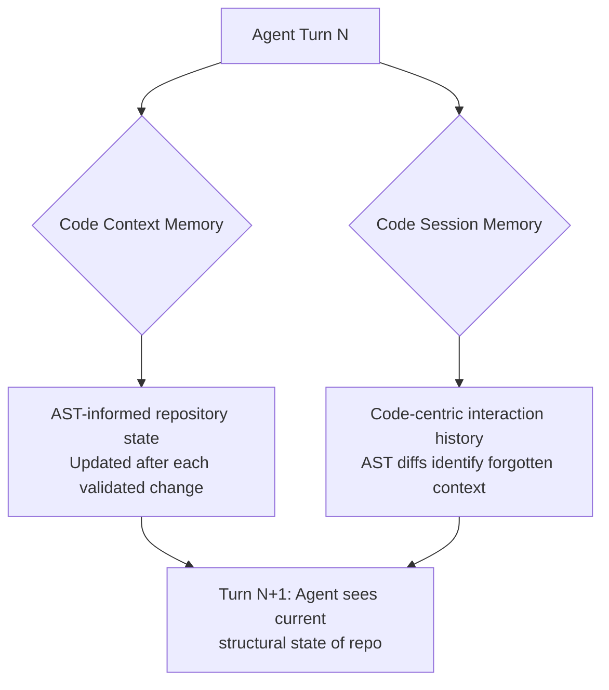

# Code-Native Memory Substrates for Coding Agents

> Code-native memory roots agent state in codebase artifacts — VCS history, AST diffs, git-backed task graphs — so structure replaces lossy natural-language summaries.

Natural-language memory summaries lose what coding agents most need: which symbols changed, which conventions hold, which work is done. Code-native substrates store memory in machine-readable structures rooted in codebase artifacts rather than free text. Three designs cover the spectrum — typed units distilled from git history, AST diffs that track structural code state, and a git-backed task graph that records work state across sessions. Each trades summary fidelity for the structure the codebase already carries.

## Typed memory from VCS history (CommitDistill)

Typed memory extracts structured prior knowledge from commits, PRs, and issues with deterministic extractors, then exposes it to the agent through a budget-constrained retriever. The reference implementation, CommitDistill, reports a 0.750 hit-rate over BM25 (0.333) and `git log` grep (0.083) at a 256-character query budget, but no statistically detectable lift on headline LLM-as-judge metrics in head-to-head evaluation ([Chukkapalli et al. 2026 — arXiv:2605.18284](https://arxiv.org/abs/2605.18284)). It is a budget-conditional optimization, not a default upgrade.

Apply only when all four conditions hold:

- High-quality commit hygiene — conventional commits, structured PR descriptions, linked issues. 90% of 5,000 randomly sampled GitHub commits are assessed low quality ([Tian et al. 2022](https://arxiv.org/pdf/2202.02974)); low-quality input yields a low-signal index.
- Tight retrieval budget — the typing advantage shrinks as budget grows; unconstrained retrieval converges with BM25 ([Chukkapalli et al. 2026](https://arxiv.org/abs/2605.18284)).
- Slow-evolving codebase — extracted Facts and Patterns reflect commit-time state; quarterly-refactoring repos encode conventions the codebase no longer follows.
- Repository scale — small repos let the agent read raw `git log` directly; indexing only amortizes once linear scans exceed the budget.

The CommitDistill design has three components: a deterministic extractor (regex over commit messages, PR descriptions, issue threads — no embeddings, 10,000 commits in under 4 seconds on a laptop); typed knowledge units that act as a coarse-grained retrieval filter — Facts (discrete information: a config value, an API constraint), Skills (procedural: how a migration runs), and Patterns (recurring conventions: file-naming, error handling); and a budget-constrained TF-IDF retriever with a calibrated silence threshold (theta = 2.5) that declines out-of-distribution queries rather than returning irrelevant top-k matches.



The typed structure acts as a category filter under tight budgets because TF-IDF's lexical noise dominates when the query carries few tokens; splitting the corpus into three disjoint pools lets the retriever route before scoring. The silence threshold is the second load-bearing element — it returns nothing when no unit clears the bar, the same calibrated-silence move [abstention-aware retrieval](memory-retrieval-as-control.md) generalizes. An independent finding supports the broader approach: [Wang et al. 2025](https://arxiv.org/abs/2510.01003) shows augmenting a code-localization agent with historical commits, linked issues, and module-functionality summaries improves repository-level bug-fix localization — the gain comes from the combined signal, not commits alone.

When this backfires: on fast-evolving codebases, extracted Patterns conflict with current conventions and the index becomes a confident source of wrong answers; outdated information in RAG knowledge bases reduces response accuracy even when current information is available ([Ouyang et al. 2025](https://arxiv.org/abs/2503.04800)). Each commit captures the diff but not the rejected alternatives — the Decision Shadow is already lost, and no extractor recovers what was never recorded. The fix is to instrument capture from now on, as the Lore protocol does with git trailers ([Stetsenko 2026](https://arxiv.org/abs/2603.15566)), rather than mining historical noise.

## AST-guided memory (CodeMEM)

As multi-turn sessions grow, agents lose track of validated fixes and reintroduce resolved errors. Natural-language summaries lose structural relationships — "fixed the pagination logic" does not encode which AST nodes changed or how they relate to dependent code paths. CodeMEM stores memory as AST representations instead of text, with two AST-informed components ([CodeMEM — arXiv:2601.02868](https://arxiv.org/abs/2601.02868)):



Code Context Memory maintains live repository state via AST-informed operations; after each validated change the memory reflects current structural relationships, preventing conflicting modifications. Code Session Memory builds a code-centric interaction history using AST diff analysis to identify forgotten context — when proposed changes regress toward a previously abandoned approach, AST diffs surface the discrepancy.

| Failure Mode | Text Summary | AST Representation |
|---|---|---|
| Structural loss | "Fixed the auth middleware" — no encoding of which functions changed | Preserves exact node-level changes and dependency-graph position |
| Ambiguity | "Updated the validation logic" could mean input, schema, or auth | AST nodes are unambiguous — specific functions, parameters, control flow |
| Diff blindness | Cannot mechanically compare current state against memory | AST diff identifies when current code matches a previously abandoned version |

CodeMEM reports 12.2% current-turn and 11.5% session-level improvement in instruction following, with 2-3 fewer rounds per task at competitive token efficiency ([arXiv:2601.02868](https://arxiv.org/abs/2601.02868)). Round reduction is the main practical finding — each avoided round saves wait time and token budget. Independent work on Tree-sitter-based knowledge graphs for code exploration reports comparable efficiency: 10× fewer tokens and 2.1× fewer tool calls at 83% of file-exploration answer quality across 31 real-world repositories ([arXiv:2603.27277](https://arxiv.org/abs/2603.27277)).

When this backfires: Tree-sitter and similar parsers cover most mainstream languages, but domain-specific languages, templating systems, and binary formats cannot produce AST diffs — text summaries remain the only option. Config files (YAML, TOML), prose, and documentation have no AST representation, so agents mixing code and config edits still face [scope-based memory loss](agent-memory-patterns.md) for the non-code portions. Maintaining live AST state requires integrating a parser into the agent runtime, tracking file versions, and computing diffs after each change — overhead single-session or throwaway agents do not recover. The benefit scales with session length; for 1-3 turn tasks the round-reduction advantage is meaningless and the AST-state overhead is pure cost.

## Git-backed task graphs (Beads)

Agents restart cold each session and rediscover completed steps, re-derive task order, and generate redundant plans — Steve Yegge's ["50 First Dates" problem](https://steve-yegge.medium.com/introducing-beads-a-coding-agent-memory-system-637d7d92514a). Markdown plan files make it worse: agents produce new plans each session until `plans/` holds hundreds of overlapping, partially-complete files, and under context pressure agents hallucinate completion and skip phases. [Beads (`bd`)](https://github.com/steveyegge/beads) stores tasks in a [Dolt](https://github.com/dolthub/dolt)-powered database committed to git as a `.beads/` directory — giving agents both queryability and git versioning, a task graph that records work state where AST and typed-unit memory record code and convention state.

Each task is a first-class object with a status (`open`, `in_progress`, `blocked`, `closed`), a priority (0 critical to 4 backlog), dependency edges (`blocks`, `depends_on`, `relates_to`, `parent-child`), and a hash-based ID (`bd-a1b2`) that reduces merge conflicts across parallel agents. Tasks nest into epics with dotted IDs (`bd-a3f8.1.1`).

```bash
bd init                                 # initialise in project root
bd create "Add auth middleware" -p 1    # create a priority-1 task
bd dep add bd-a1b2 bd-c3d4              # bd-a1b2 blocks bd-c3d4
bd update bd-a1b2 --claim              # atomically claim (assignee + in_progress)
bd ready                               # list unblocked tasks
bd close bd-a1b2 "Done"                 # mark closed
```

The core agent interface is `bd ready`, which lists tasks with no open blockers — agents query it at session start instead of reading plans. `--claim` sets assignee and status atomically, preventing two parallel agents from acquiring the same task. Closed tasks are semantically summarized over time, bounding context overhead so long-lived projects do not pay an unbounded cost for completed history. Beads tracks work state — what is done, blocked, or next — and does not replace knowledge memory ([CLAUDE.md](../instructions/claude-md-convention.md)), which tracks learned conventions. A single line in AGENTS.md (`Start each session with bd ready`) activates the pattern.

When this backfires: if the entire project fits in one context window, `bd ready` adds tooling friction over a plain TASKS.md. `--claim` is atomic but has no watchdog — a crashed agent leaves a task stuck `in_progress` until reset. Semantic compaction is irreversible: closed-task summaries discard the why. Dolt runs as a per-project server by default and can exhaust ports on machines running many projects. Agent compliance decays with context — the `bd ready` ritual fades as session context grows, so harness hooks are more reliable than prompt instructions. Hash IDs reduce but do not eliminate merge conflicts; Yegge describes Beads as ["a crummy architecture that requires AI in order to work around all its edge cases"](https://steve-yegge.medium.com/beads-best-practices-2db636b9760c) — viable because agents resolve the mess, not because it does not occur.

## Example

A coding agent fixes a pagination bug by changing `fetchPage(offset)` to `fetchPage(offset, limit)` in `api/list.py`. Two turns later it refactors the same file and reverts to `fetchPage(offset)`.

Text memory stored `"Fixed pagination to include limit parameter."` — the agent cannot mechanically detect that the refactored version matches the pre-fix state.

AST memory stored the structural diff:

```
CallExpression: fetchPage
  args: [offset] → [offset, limit]
  file: api/list.py:42
```

When the agent proposes the refactored version, the AST diff against stored memory shows the `limit` argument was dropped — the same structural pattern as the original bug. Session memory flags the regression before the change is applied. A text summary cannot make that comparison; the code-native structure can.

## Key Takeaways

- Code-native memory roots agent state in codebase artifacts — typed VCS units, AST diffs, git-backed task graphs — so structure replaces lossy natural-language summaries.
- Typed memory from VCS history is a budget-conditional optimization: it beats BM25 only under tight query budgets and good commit hygiene, with no headline LLM-as-judge lift otherwise.
- AST diffs mechanically detect regression toward abandoned solutions that text summaries cannot; round reduction (2-3 fewer turns) is the highest-impact benefit.
- A git-backed task graph (`bd ready`) gives agents dependency-resolved work state across sessions without re-parsing plan files; all three substrates need eviction or compaction discipline as they grow.

## Related

- [Memory Retrieval as a Control Decision](memory-retrieval-as-control.md) — the calibrated-silence / abstention mechanism the typed retriever depends on
- [Agent Memory Patterns: Learning Across Conversations](agent-memory-patterns.md) — scope-and-temporal memory taxonomy these substrates slot into as cross-session sources
- [Memory Synthesis from Execution Logs](memory-synthesis-execution-logs.md) — extracting causal lessons from traces; a memory source that does not depend on commit hygiene
- [Tiered Memory Architecture](tiered-memory-architecture.md) — episodic-to-semantic promotion as a different shape of structured memory
- [Episodic Memory Retrieval](episodic-memory-retrieval.md) — episode-level retrieval, closer to raw observation streams, less structured than typed units
- [Session Initialization Ritual](session-initialization-ritual.md) — the startup sequence that pairs with `bd ready` for full session orientation
- [Context Compression Strategies](../context-engineering/context-compression-strategies.md) — structural compression for context management
- [Wiki Memory: Agent-Maintained Compressed Knowledge Base](wiki-memory-agent-maintained-knowledge-base.md) — the general, prose-and-files counterpart to these code-rooted substrates
  - long-form
