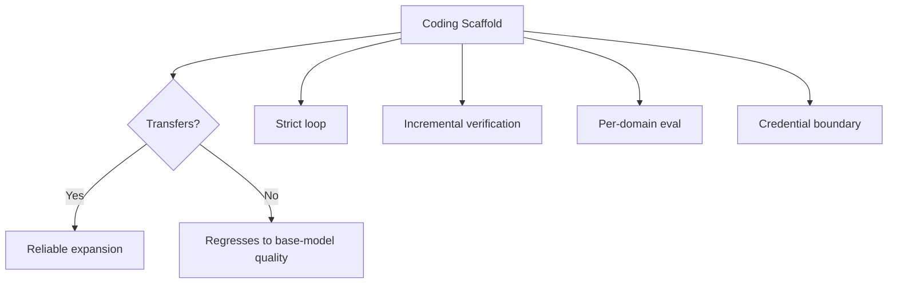

# Coding Agent Scope Expansion: When to Extend Beyond the Codebase

> Extending a coding agent into browser, ops, and knowledge-work only works when the coding scaffold — loops, verification, evals, credential boundaries — carries into the new domain. Without that transfer, the generalist agent regresses to base-model behavior on unfamiliar tasks.

## The Expansion Decision

OpenAI's April 2026 Codex release adds background computer use, an in-app browser, image generation, 90+ plugins (Jira, GitLab, Microsoft Suite, Slack, Notion), memory, and self-scheduled automations that wake up across days or weeks ([OpenAI, 2026-04-16](https://openai.com/index/codex-for-almost-everything/)). Two weeks later OpenAI reported weekly users growing from 3M to 4M and named customers deploying Codex for code review (Ramp), cross-repo reasoning (Cisco), and incident response (Rakuten) ([OpenAI, 2026-04-21](https://openai.com/index/scaling-codex-to-enterprises-worldwide/)).

The question is not whether a coding agent *can* expand. It is whether the reliability that held inside the codebase survives outside it.

## Why the Scaffold — Not the Model — Decides

Harness-only changes, no model upgrade, moved Terminal Bench 2.0 from 52.8% to 66.5% ([LangChain](https://blog.langchain.com/improving-deep-agents-with-harness-engineering/)). Coding agents work because their scaffold carries strict loops, incremental verification (tests, compile, lint), tool-use discipline, and trajectory-level evals.

When scope expands, the scaffold either transfers or does not:



## Conditions for a Safe Expansion

Expansion pays off when all four hold:

- **Per-domain evals exist before rollout.** Anthropic warns that "optimizing for one kind of input can hurt performance on other inputs" ([Building Effective Agents](https://www.anthropic.com/engineering/building-effective-agents)). Coding pass rates do not measure browser automation quality, PR-comment review tone, or incident-triage correctness. Each new domain needs its own eval loop before production traffic.
- **Verification signal exists in the new domain.** Compile and test are the coding agent's ground truth. Outside code, substitute signals must exist — a schema the browser output conforms to, a runbook step that succeeds, a ticket that transitions state. Without a signal, there is no self-correction loop.
- **Credentials are isolated per task-type.** The [lethal trifecta](../security/lethal-trifecta-threat-model.md) — private data, untrusted input, external communication — appears on nearly every task once the agent reads Gmail, writes Jira tickets, and browses untrusted pages. Each task-type needs its own credential scope and egress policy; one agent with union-of-all credentials is a governance regression.
- **Long-horizon work has progress checkpoints.** Self-scheduled work across days ([OpenAI](https://openai.com/index/codex-for-almost-everything/)) amplifies both reward hacking and objective drift without compile/test anchors. Force periodic progress artifacts (summaries, diffs, decision logs) a human or critic agent can verify.

## When Expansion Backfires

- **Generalization without evals.** The coding-specific eval suite stays green while non-coding tasks silently regress. You discover the regression from user reports, not dashboards.
- **Credential sprawl.** Each new plugin adds secrets. Revocation and audit become intractable; the trifecta is now the default.
- **Long automations without checkpoints.** Multi-day tasks drift from the original objective because no verification signal runs between wake-ups.
- **Enterprise rollout outrunning governance.** GSI-driven deployments ([OpenAI](https://openai.com/index/scaling-codex-to-enterprises-worldwide/)) land before permission design and audit trails exist.

## The Alternative: Narrow Agents, Shared Scaffold

When the conditions do not hold, the better design is separate narrowly scoped agents — code, PR review, incident triage, research — each with its own eval, credentials, and audit trail, sharing the harness but not the permission surface. See [Task-Specific vs Role-Based Agents](task-specific-vs-role-based-agents.md) and [Specialized Agent Roles](specialized-agent-roles.md).

## Example

A team running Codex inside a monorepo wants to extend it to incident response.

**Before expansion** — coding scope only, with matching scaffold:

```yaml
# Coding agent — scoped, evaluated, verifiable
scope: [repo/src, repo/tests]
tools: [read, edit, run_tests, git]
evals: swe-bench-live, internal-pr-regression
credentials: read-only git token
```

**Expanded — only after per-domain scaffold is in place**:

```yaml
# Incident-response agent — separate scope, separate evals, separate creds
scope: [pagerduty, grafana, runbooks/]
tools: [query_metrics, read_runbook, post_status_update]
evals: runbook-replay, synthetic-incident-triage
credentials: read-only observability token, write-limited to status channel
# No shared credentials with the coding agent. No shared context window.
```

Two narrow agents with shared scaffold patterns beat one general agent with a union of all credentials.

## Key Takeaways

- Scope expansion works when the coding scaffold — loop, verification, eval, credential boundary — transfers into each new domain.
- No per-domain eval means silent regression; coding pass rates do not measure non-coding quality.
- Credential isolation per task-type is the only defense against the lethal trifecta becoming the default.
- Long-horizon automations need progress checkpoints to substitute for compile/test signals.
- When the conditions do not hold, prefer separate narrow agents sharing a harness over one generalist.

## Related

- [Delegation Decision](delegation-decision.md)
- [Task-Specific vs Role-Based Agents](task-specific-vs-role-based-agents.md)
- [Specialized Agent Roles](specialized-agent-roles.md)
- [Scaffold Architecture Taxonomy](scaffold-architecture-taxonomy.md)
- [Lethal Trifecta Threat Model](../security/lethal-trifecta-threat-model.md)
- [Harness Engineering](harness-engineering.md)
