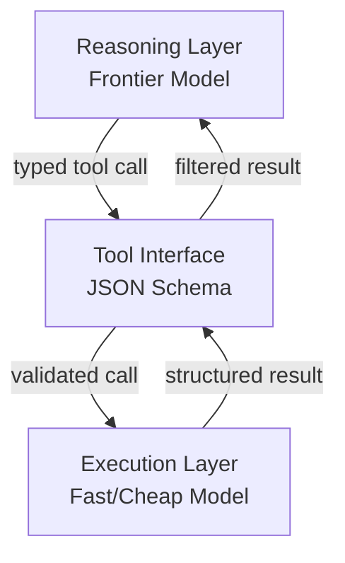

# Cognitive Reasoning vs Execution: A Two-Layer Agent Architecture

> Separate the agent layer that decides what to do from the layer that acts — typed tool interfaces enforce the boundary and make each independently testable.

## The Split

Production LLM agents mix two concerns that should be structurally separate:

- **Reasoning layer** — determines which tools to call, in what order, and how to interpret results. Contains no execution logic.
- **Execution layer** — receives typed tool calls and acts on them. Contains no decision logic.

The [arXiv:2602.10479 survey of production agent architectures](https://arxiv.org/abs/2602.10479) identifies this split as the foundational pattern for scaling agentic systems. When the layers are conflated, the reasoning layer fills with implementation details that obscure intent, and the execution layer accumulates decision branches that can't be tested in isolation.

## Typed Tool Interfaces as the Seam

The contract between layers is a JSON schema parameter definition. Each tool the reasoning layer can invoke is described by name, purpose, and typed inputs. The reasoning layer resolves which tool to call based on the schema description; the execution layer validates the call against the schema before acting.

[Anthropic's advanced tool use research](https://www.anthropic.com/engineering/advanced-tool-use) describes how tool results can be routed programmatically rather than always returned to the model's context window [unverified — the source discusses tool use patterns broadly; the specific claim about scratchpad routing to a secondary storage layer is not directly stated].

## How Claude Code Models This

Claude Code's [sub-agent architecture](https://code.claude.com/docs/en/sub-agents) makes the split concrete. Sub-agents receive scoped tool permissions rather than broad access: an exploration sub-agent holds read-only tools with no write permissions, while an orchestrating sub-agent holds decision and delegation tools. The constraint is enforced at the tool permission level, not by instruction [unverified].

## Dynamic Tool Discovery

Loading every tool definition into the reasoning layer's context at startup is waste. [Anthropic's context engineering patterns](https://www.anthropic.com/engineering/effective-context-engineering-for-ai-agents) discuss keeping context lean by loading only what is needed [unverified — the source addresses context management broadly; the specific just-in-time tool registry pattern described here is an inference from that guidance, not a direct recommendation].

Execution-layer tools stay available without pre-occupying reasoning context.

## Workload-Specialized Model Routing

The separation enables model routing by layer. Reasoning tasks require instruction-following depth and long-context coherence — appropriate for larger frontier models. Execution tasks are often deterministic, short-context, and high-frequency — appropriate for fast, low-cost models.

This is one of the primary cost levers in production agent systems [unverified]: running execution on cheaper models while reserving frontier capacity for reasoning reduces per-task cost.



## Independent Testability

Each layer can be validated without the other:

- **Reasoning layer**: Given a known task and known tool schemas, does the agent produce the correct tool call sequence? Feed canned execution responses to verify.
- **Execution layer**: Given a valid typed tool call, does the execution produce the expected side effect and return value? No reasoning layer required.

Without a schema contract, testing requires running the full system.

## Example

A minimal Python sketch showing the boundary between layers. The reasoning layer emits a typed call; the execution layer validates it against the schema before acting.

```python
from pydantic import BaseModel

# Tool interface — the schema contract between layers
class WriteFileCall(BaseModel):
    path: str
    content: str

# Execution layer: validates the typed call, then acts
def execute_write_file(call: WriteFileCall) -> dict:
    with open(call.path, "w") as f:
        f.write(call.content)
    return {"status": "ok", "path": call.path}

# Reasoning layer: decides what to call (LLM output parsed into typed model)
raw_tool_call = {"path": "output.txt", "content": "hello"}
validated_call = WriteFileCall(**raw_tool_call)   # schema validation at the seam
result = execute_write_file(validated_call)        # execution layer receives only typed input
```

The reasoning layer never opens files. The execution layer never decides what to write. The `WriteFileCall` schema is the enforced boundary.

## Key Takeaways

- The reasoning layer decides; the execution layer acts — no cross-layer logic belongs in either.
- Typed tool interfaces (JSON schema) are the enforced contract between layers.
- Programmatic tool calling routes intermediate execution results away from the reasoning context window.
- Claude Code sub-agents instantiate this pattern via tool permission scoping, not just by instruction.
- The split enables workload-appropriate model routing: large models for reasoning, fast models for execution.

## Unverified Claims

- Programmatic tool result routing away from context window `[unverified]`
- Claude Code sub-agent permission scoping enforced at tool level, not instruction `[unverified]`
- Just-in-time tool registry pattern `[unverified — inference from context management guidance, not a direct recommendation]`
- Model routing by layer as a primary cost lever `[unverified]`

## Related

- [Three Reasoning Spaces](three-reasoning-spaces.md)
- [Orchestrator-Worker Pattern](../multi-agent/orchestrator-worker.md)
- [Specialized Agent Roles](specialized-agent-roles.md)
- [Blast Radius Containment](../security/blast-radius-containment.md)
- [Agentic AI Architecture: From Prompt-Response to Goal-Directed Systems](agentic-ai-architecture-evolution.md)
- [Separation of Knowledge and Execution](separation-of-knowledge-and-execution.md)
- [Cost-Aware Agent Design](cost-aware-agent-design.md)
- [Agent Turn Model](agent-turn-model.md)
- [Reasoning Budget Allocation](reasoning-budget-allocation.md)
- [Agent-First Software Design](agent-first-software-design.md)
- [Classical SE Patterns and Agent Analogues](classical-se-patterns-agent-analogues.md)
- [Agent Composition Patterns](agent-composition-patterns.md)
- [Agent Harness](agent-harness.md)
- [Agent Loop Middleware](agent-loop-middleware.md)
- [Context Engineering](../context-engineering/context-engineering.md)
- [Execution-First Delegation](execution-first-delegation.md)
- [Evaluator-Optimizer Pattern](evaluator-optimizer.md)
- [Dynamic Tool Fetching Breaks KV Cache](../anti-patterns/dynamic-tool-fetching-cache-break.md)
- [Cross-Vendor Competitive Routing](cross-vendor-competitive-routing.md)
