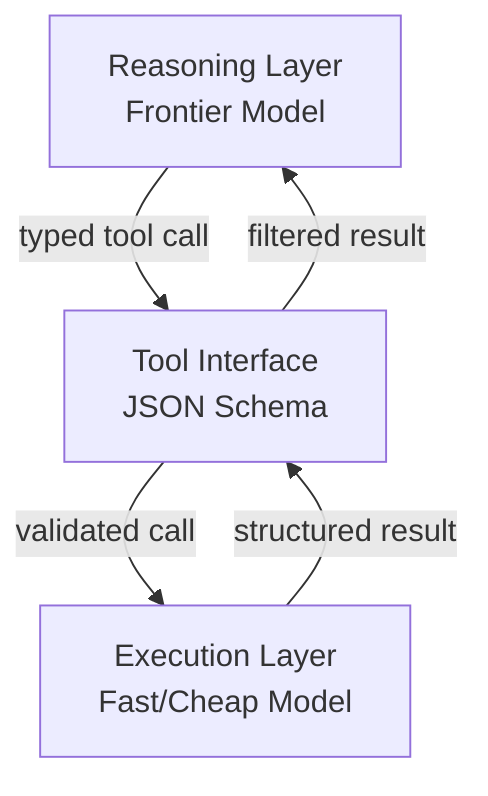

# Cognitive Reasoning vs Execution: A Two-Layer Agent Architecture

> Separate the agent layer that decides what to do from the layer that acts — typed tool interfaces enforce the boundary and make each independently testable.

## The Split

Production LLM agents mix two concerns that should be structurally separate:

- **Reasoning layer** — determines which tools to call, in what order, and how to interpret results. Contains no execution logic.
- **Execution layer** — receives typed tool calls and acts on them. Contains no decision logic.

The [arXiv:2602.10479 survey of production agent architectures](https://arxiv.org/abs/2602.10479) identifies this split as the foundational pattern for scaling agentic systems. When the layers are conflated, the reasoning layer fills with implementation details that obscure intent, and the execution layer accumulates decision branches that can't be tested in isolation.

## Typed Tool Interfaces as the Seam

The contract between layers is a JSON schema parameter definition. Each tool the reasoning layer can invoke is described by name, purpose, and typed inputs. The reasoning layer resolves which tool to call based on the schema description; the execution layer validates the call against the schema before acting.

[Anthropic's advanced tool use research](https://www.anthropic.com/engineering/advanced-tool-use) describes how tool results can be routed programmatically rather than always returned to the model's context window — intermediate results are processed in a code execution environment and only the final filtered result reaches the reasoning layer's context.

## How Claude Code Models This

Claude Code's [sub-agent architecture](https://code.claude.com/docs/en/sub-agents) makes the split concrete. Sub-agents receive scoped tool permissions rather than broad access: an exploration sub-agent holds read-only tools with no write permissions, while an orchestrating sub-agent holds decision and delegation tools. The constraint is enforced at the tool permission level, not by instruction — sub-agent definitions specify an explicit `tools` allowlist and a `permissionMode` that the runtime enforces regardless of what the system prompt says.

## Dynamic Tool Discovery

Loading every tool definition into the reasoning layer's context at startup is waste. [Anthropic's context engineering patterns](https://www.anthropic.com/engineering/effective-context-engineering-for-ai-agents) recommend keeping context lean by loading only what is needed — a principle that applies directly to tool registries: surface tool schemas to the reasoning layer on demand rather than pre-loading the full set.

Execution-layer tools stay available without pre-occupying reasoning context.

## Workload-Specialized Model Routing

The separation enables model routing by layer. Reasoning tasks require instruction-following depth and long-context coherence — appropriate for larger frontier models. Execution tasks are often deterministic, short-context, and high-frequency — appropriate for fast, low-cost models.

Running execution on cheaper models while reserving frontier capacity for reasoning reduces per-task cost — this model routing is one of the main cost levers the layer separation enables.



## Why It Works

Layer separation works because it eliminates two categories of failure that compound in monolithic agents. First, when a reasoning model must also manage implementation details — file handles, retry loops, API pagination — those details compete with planning content in the context window and degrade decision quality. Keeping execution logic out of the reasoning context preserves the signal-to-noise ratio for the reasoning model. Second, execution failures become isolated and attributable: a failed tool call can be retried or rerun independently without re-invoking the reasoning layer, and side effects (writes, API calls) are confined to the execution layer where they can be audited or rolled back without touching reasoning state.

## When This Backfires

The split adds overhead that is not always justified:

- **Short-lived single-turn tasks**: For tasks that complete in one or two tool calls, the typed-interface seam adds schema validation and context-passing overhead with no testability benefit — a simple function call is often clearer.
- **High-latency layer seams**: If the execution layer is a remote service, every reasoning-to-execution round-trip adds network latency. Tight feedback loops (reactive agents, streaming responses) may need collocated logic instead.
- **Schema versioning churn**: Typed interfaces become a maintenance burden when tool signatures change frequently — the schema contract must be versioned and both layers kept in sync, which offsets the testing advantages in fast-iteration codebases.

## Independent Testability

Each layer can be validated without the other:

- **Reasoning layer**: Given a known task and known tool schemas, does the agent produce the correct tool call sequence? Feed canned execution responses to verify.
- **Execution layer**: Given a valid typed tool call, does the execution produce the expected side effect and return value? No reasoning layer required.

Without a schema contract, testing requires running the full system.

## Example

A minimal Python sketch showing the boundary between layers. The reasoning layer emits a typed call; the execution layer validates it against the schema before acting.

```python
from pydantic import BaseModel

# Tool interface — the schema contract between layers
class WriteFileCall(BaseModel):
    path: str
    content: str

# Execution layer: validates the typed call, then acts
def execute_write_file(call: WriteFileCall) -> dict:
    with open(call.path, "w") as f:
        f.write(call.content)
    return {"status": "ok", "path": call.path}

# Reasoning layer: decides what to call (LLM output parsed into typed model)
raw_tool_call = {"path": "output.txt", "content": "hello"}
validated_call = WriteFileCall(**raw_tool_call)   # schema validation at the seam
result = execute_write_file(validated_call)        # execution layer receives only typed input
```

The reasoning layer never opens files. The execution layer never decides what to write. The `WriteFileCall` schema is the enforced boundary.

## Key Takeaways

- The reasoning layer decides; the execution layer acts — no cross-layer logic belongs in either.
- Typed tool interfaces (JSON schema) are the enforced contract between layers.
- Programmatic tool calling routes intermediate execution results away from the reasoning context window.
- Claude Code sub-agents instantiate this pattern via tool permission scoping, not just by instruction.
- The split enables workload-appropriate model routing: large models for reasoning, fast models for execution.

## Related

- [Separation of Knowledge and Execution](separation-of-knowledge-and-execution.md)
- [Three Reasoning Spaces](three-reasoning-spaces.md)
- [Orchestrator-Worker Pattern](../multi-agent/orchestrator-worker.md)
- [Execution-First Delegation](execution-first-delegation.md)
- [Cost-Aware Agent Design](cost-aware-agent-design.md)
- [Dynamic Tool Fetching Breaks KV Cache](../anti-patterns/dynamic-tool-fetching-cache-break.md)
- [Reasoning Budget Allocation](reasoning-budget-allocation.md)
- [Context Engineering](../context-engineering/context-engineering.md)
