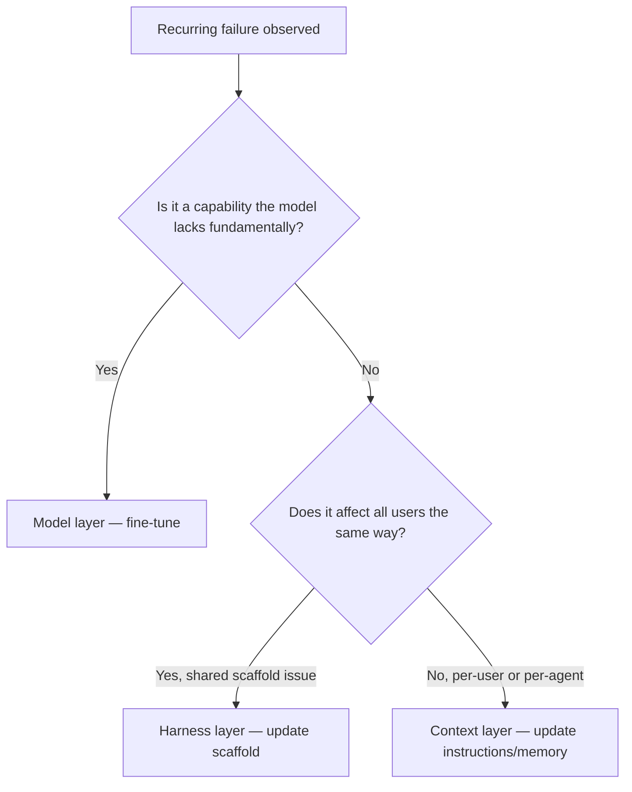

# Continual Learning for AI Agents: Three Layers of Knowledge Accumulation

> AI agents can accumulate knowledge at three distinct layers — model, harness, and context — and routing an improvement to the wrong layer wastes effort or produces no lasting change.

## The Three Layers

[LangChain's analysis](https://blog.langchain.com/continual-learning-for-ai-agents/) defines three update targets in any agentic system:

| Layer | What it covers | Update mechanism |
|-------|---------------|-----------------|
| **Model** | Neural network weights | Fine-tuning (SFT, RL) |
| **Harness** | Scaffold code plus instructions and tools that are always present | Code changes, prompt rewrites |
| **Context** | Instructions, skills, and memory that live outside the harness and configure it per agent/user/org | File edits, memory writes |

These are not a hierarchy — they are independent update targets. A failure at the context layer does not require a model update, and vice versa.

## Model Layer

Model-layer learning updates the weights themselves. Techniques include supervised fine-tuning (SFT) and reinforcement learning methods such as GRPO.

The central challenge is **catastrophic forgetting**: new training degrades performance on previously-handled tasks. This is an open research problem.

In practice, model updates target the agent level — one model trained for a specific agentic system. Per-user weight updates (e.g., LoRA per user) remain a research direction; production deployments are rare.

Model updates are expensive, slow, and the hardest to reverse. Use them when the capability gap cannot be closed by better instructions or retrieved context.

## Harness Layer

The harness is the scaffold code that drives the agent, plus instructions and tools always present for every instance. Harness-layer learning rewrites the scaffold.

The Meta-Harness approach formalizes this: run the agent over a batch of tasks, store execution traces, then run a coding agent over those traces to propose scaffold changes. [LangChain applied this to Deep Agents](https://blog.langchain.com/improving-deep-agents-with-harness-engineering/) and improved Terminal Bench 2.0 from 52.8% to 66.5% through harness changes alone — no model change.

Harness updates affect every instance of the agent. A fix generalizes immediately across all users and sessions. The tradeoff: changes require code review and deployment, and a bad harness change degrades everyone at once.

## Context Layer

Context sits outside the harness and configures it: skills, instructions, and memory specific to a particular agent instance, user, or organization. This layer is also referred to as agent memory.

Context updates can be scoped at multiple levels:

- **Agent level** — a persistent configuration the agent updates across sessions (e.g., OpenClaw's [SOUL.md](https://docs.openclaw.ai/concepts/soul), which the agent updates over time)
- **User/tenant level** — per-user context that accumulates preferences and conventions (e.g., [Hex Context Studio](https://hex.tech/product/context-studio/), [Decagon Duet](https://decagon.ai/blog/introducing-duet))
- **Org level** — shared context across a team or organization

These scopes coexist: an agent can update its own SOUL.md, accept user-level corrections, and pull from org-level rules simultaneously.

Updates happen in two modes:

- **Offline (batch)** — after execution, a background job analyzes traces and extracts insights to update context. OpenClaw calls this ["dreaming"](https://docs.openclaw.ai/concepts/memory-dreaming).
- **Hot path (inline)** — the agent updates its memory while executing the current task, either when instructed by the user or when its harness directs it to.

Context-layer updates are the cheapest and easiest to reverse. Edit a file, reload context. The tradeoff: context has limited scope — it does not improve base model capability and only affects instances that load that context.

## Choosing the Right Layer

The most common anti-pattern is reaching for fine-tuning when a context update would suffice. Fine-tuning is expensive, slow, and risks catastrophic forgetting. A user convention is a context update — not a model problem.

### Trade-offs at a glance

| Dimension | Model | Harness | Context |
|-----------|-------|---------|---------|
| Reversibility | Hard — requires retraining | Medium — requires deploy | Easy — edit a file |
| Generalization | Broadest — all instances, all tasks | All instances of this agent | Scoped to target level |
| Cost | Highest | Medium | Lowest |
| Latency to deploy | Days–weeks | Hours–days | Minutes |
| Risk of regression | Catastrophic forgetting | Breaks all instances | Scoped to loaded context |

## Traces as the Common Substrate

All three update flows consume execution traces. The mechanism differs per layer:

- Model: collect traces, label outcomes, fine-tune
- Harness: feed traces to a coding agent that proposes scaffold changes
- Context: extract conventions and preferences from traces, write to memory files

Trace collection quality is a prerequisite for improvement at any layer.

## Example

**Claude Code** maps cleanly to the three layers:

- **Model**: `claude-sonnet` or similar — updated by Anthropic
- **Harness**: the Claude Code application itself — updated when you upgrade the CLI
- **Context**: `CLAUDE.md`, `/skills`, `mcp.json` — updated by you or the agent per project and session

A project-specific convention (e.g., always use `assert_raises` instead of `pytest.raises`) belongs in context (`CLAUDE.md` or a skill file). A systematic reasoning failure belongs at the model layer and is Anthropic's problem to fix. A tool that is broken for every Claude Code user belongs in the harness.

## Key Takeaways

- Agents accumulate knowledge at three layers: model (weights), harness (scaffold), and context (external configuration). Each has a different cost, reversibility, and scope.
- Most improvement opportunities target the context layer — it is cheapest, fastest, and easiest to reverse.
- Model fine-tuning is rarely the right first response to a recurring agent failure; exhaust context and harness options first.
- Traces are the input for improvements at all three layers; trace collection quality determines improvement velocity.

## Related

- [Agentic Flywheel: Self-Improving Agent Systems](agentic-flywheel.md)
- [Harness Engineering](harness-engineering.md)
- [Agent Memory Patterns](agent-memory-patterns.md)
- [Scaffold Architecture Taxonomy for Coding Agents](scaffold-architecture-taxonomy.md)
- [Continuous Agent Improvement](../workflows/continuous-agent-improvement.md)
