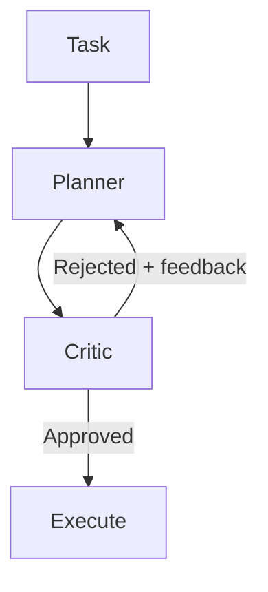

# Critic Agent Pattern

> A second model reviews the primary agent's plan before execution begins, catching structural errors early when recovery is cheap.

## Structure

The critic agent pattern inserts a dedicated review agent between the planning phase and execution:

1. **Planner** — the primary agent reads the task, explores context, and produces a structured plan
2. **Critic** — a complementary model reviews the plan for risks, gaps, and incorrect assumptions
3. **Gating decision** — execution proceeds only if the critic approves; otherwise the planner receives structured feedback and revises

The critic is a distinct agent role, not self-review. Using a different model creates genuine disagreement — the critic is not subject to the same blind spots as the planner.

## Why Plan-Gating Matters

The pattern's value is timing. The [evaluator-optimizer pattern](evaluator-optimizer.md) applies a reviewer inside a generation loop — useful for iterative refinement. The critic agent applies review at the plan stage, before any tool calls or code changes execute.

Plan-stage errors are cheap. A structurally flawed plan caught before execution costs one extra model call. The same error caught mid-execution requires rollback, re-planning, and re-execution — often at 3–5× the token cost [unverified].

Multi-step agentic plans amplify single errors. If step 3 of a 10-step plan assumes the wrong environment state, every subsequent step inherits that assumption. A critic that reviews the full plan detects cross-step inconsistencies that per-step review misses.

## When to Apply

The pattern pays off when:

- The task involves multiple sequential steps with compounding dependencies
- Mistakes are expensive to reverse (destructive operations, external API calls, database writes)
- The primary model has a documented tendency to miss a specific class of error (e.g., environment assumptions, API contract mismatches)

Skip it when:

- The task is short enough that re-running from scratch is cheaper than critic overhead
- The plan has no branching — a single-step task has nothing for a critic to evaluate
- Evaluation criteria are vague; a critic without clear scoring criteria produces inconsistent verdicts

## Copilot CLI Implementation

Copilot CLI [v1.0.18](https://github.com/github/copilot-cli/releases/tag/v1.0.18) (April 4, 2026) introduced an experimental critic agent that automatically reviews plans and complex implementations using a complementary model to catch errors early. The feature is available in experimental mode for Claude models.

The Copilot CLI implementation does not require manual configuration — the critic fires automatically when experimental mode is enabled [unverified]. Whether the complementary model is a different vendor model or a different reasoning configuration (e.g., extended thinking) is not specified in the release notes [unverified].

## Trade-offs

| Factor | Impact |
|--------|--------|
| Latency | Each plan review adds one model round-trip before execution begins |
| Token cost | One extra model call per task; most valuable when execution cost is high relative to review cost |
| Coverage | A complementary model surfaces errors the planner's reasoning style systematically misses |
| Diminishing returns | For simple one-step tasks, critic overhead exceeds the value of catching errors |

## Example

A developer runs: `copilot -p "Migrate the users table to add a new required column with no default"`

**Without a critic:** The planner generates a migration script and executes it. If the script omits a backfill step for existing rows, production fails at runtime.

**With a critic:** The critic reviews the plan and flags: "Required column with no default will fail on existing rows — backfill step missing between ALTER TABLE and constraint enforcement." Execution is blocked. The planner revises the plan to include the backfill step before the constraint is applied.

The error is caught before a single query runs.

## Key Takeaways

- The critic agent reviews the plan before execution, not output after generation — catching errors when they are cheapest to fix
- A complementary model creates genuine disagreement; self-review by the same model reproduces the same blind spots
- The pattern is most cost-effective for multi-step plans where errors compound across steps
- Copilot CLI v1.0.18 ships an experimental critic for Claude models that fires automatically
- For iterative output refinement, use the evaluator-optimizer; for pre-execution plan validation, use the critic agent

## Related

- [Evaluator-Optimizer Pattern](evaluator-optimizer.md)
- [Agent Self-Review Loop](agent-self-review-loop.md)
- [Specialized Agent Roles](specialized-agent-roles.md)
- [Rollback-First Design](rollback-first-design.md)
- [Reasoning Budget Allocation](reasoning-budget-allocation.md)
- [Copilot CLI Agentic Workflows](../tools/copilot/copilot-cli-agentic-workflows.md)
- [Cross-Vendor Competitive Routing](cross-vendor-competitive-routing.md)
- [Agent Composition Patterns](agent-composition-patterns.md)
