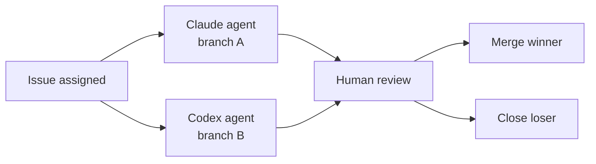

# Cross-Vendor Competitive Routing

> Assign competing vendor agents to the same task, collect independent results, and let a human (or automated gate) select the winner.

## Overview

Single-vendor routing optimizes *within* a known capability profile. Cross-vendor routing exposes *differences between* capability profiles — which is only visible when you run both agents on the same task and compare.

GitHub Agent HQ (Feb 2026) made this practical: Claude and Codex can both be assigned to the same issue in the same repo. Each agent opens its own branch and PR independently. The team reviews both and picks the best output — surfacing which vendor's strengths better fit the task type. ([Announcement](https://github.blog/news-insights/company-news/pick-your-agent-use-claude-and-codex-on-agent-hq/); [Agentic Workflows changelog](https://github.blog/changelog/2026-02-13-github-agentic-workflows-are-now-in-technical-preview/))

## How It Works

1. Assign the same issue to two or more agents from different vendors
2. Each agent works independently — no shared state, no coordination
3. Each produces an independent branch and PR
4. A reviewer selects the output that better meets the acceptance criteria
5. Winning branch is merged; losing branch is closed

The selection criteria differ from within-harness model routing. Cost and latency are less relevant — both agents run in parallel. The decision is based on *output quality differentiation*: which agent's reasoning, code structure, or edge-case handling is better for this specific task type.

## When to Use

| Situation | Rationale |
|-----------|-----------|
| Architectural decisions | Reasoning models and code-optimized models produce structurally different outputs — both worth evaluating |
| Unfamiliar task type | Competitive routing reveals which vendor's capability profile fits the domain before you commit to a routing strategy |
| High-stakes changes | Independent implementations surface issues earlier than a single agent would |
| Benchmarking new models | Systematic comparison across a task class builds routing intuition |

## Assignment Patterns

**Static competitive**: always assign both agents to a defined task class (e.g., all architectural PRs). Expensive but thorough.

**Spot-check competitive**: assign both agents to a sample of tasks (e.g., every 10th implementation PR). Calibrates confidence in your primary routing strategy without full duplication.

**Triage competitive**: assign both agents only when the primary agent's output fails review. Running a second vendor on a failing output introduces a different capability profile rather than retrying the same failure mode.

## Trade-offs

| Approach | Pros | Cons |
|----------|------|------|
| Cross-vendor competitive | Surfaces capability differences; catches failure modes of primary agent | Doubles premium request consumption; requires human review of two outputs |
| Single-vendor static routing | Predictable cost; no redundant work | Blind spots in primary agent's capability profile go undetected |

## Example

On GitHub Agent HQ, assign an issue to both Claude and Codex from the issue sidebar:

1. Open the issue on GitHub
2. In the right sidebar under **Assignees**, select both `claude[bot]` and `openai-codex[bot]`
3. Each agent picks up the issue independently, creates its own branch (`claude/fix-123`, `codex/fix-123`), and opens a PR against `main`
4. Review both PRs side by side — compare reasoning steps, code structure, and test coverage
5. Merge the stronger PR; close the other with a note explaining the decision

This is the simplest form of spot-check competitive routing: one issue, two independent implementations, one reviewer pick. The branch names and bot handles follow GitHub Agent HQ defaults as of Feb 2026.

## Relationship to Within-Harness Routing

This pattern operates at the **platform level** (which vendor agent handles the issue). [Cost-Aware Agent Design](cost-aware-agent-design.md) operates at the **harness level** (which model tier handles which sub-task within a single agent's pipeline). The two patterns compose: use competitive routing to pick the right vendor, then within-harness routing to control cost inside that vendor's pipeline.

## Key Takeaways

- Competitive routing surfaces vendor capability differences that benchmarks cannot reveal for your specific task class
- Platform-level assignment (GitHub Agent HQ) makes parallel runs practical without custom harness integration
- Selection criteria are qualitative (output quality), not quantitative (cost/latency) — each agent runs in parallel, so latency does not compound
- Spot-check competitive routing calibrates static routing strategy without full duplication cost

## Related

- [Agent Composition Patterns](agent-composition-patterns.md)
- [Classical SE Patterns as Agent Design Analogues](classical-se-patterns-agent-analogues.md)
- [Copilot vs Claude Billing Semantics](../human/copilot-vs-claude-billing-semantics.md) — premium request multipliers vs token billing
- [Cost-Aware Agent Design](cost-aware-agent-design.md)
- [Delegation Decision](delegation-decision.md)
- [Evaluator-Optimizer Pattern](evaluator-optimizer.md)
- [Event-Driven Agent Routing](event-driven-agent-routing.md)
- [Heuristic-Based Effort Scaling](heuristic-effort-scaling.md)
- [Inversion Analysis: Surface Capabilities Competitors Cannot Replicate](inversion-analysis.md)
- [Reasoning Budget Allocation](reasoning-budget-allocation.md)
- [Specialized Agent Roles](specialized-agent-roles.md)
