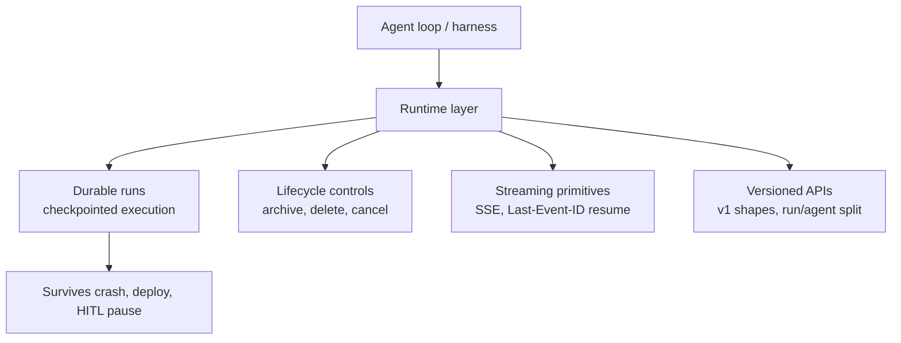

# Deep Agent Runtime: The Layer Beneath the Harness

> The harness is what you put around the model — prompts, tools, skills. The runtime is what runs underneath: durable execution, lifecycle controls, streaming, and versioned operational APIs. Long-horizon agents fail at the runtime layer first.

## Harness vs Runtime

The harness gives the agent prompts, tools, and skills inside the loop. The runtime keeps the loop running across crashes, deploys, pauses, and concurrent inputs. LangChain: "To build a good agent, you need a good harness. To deploy that agent, you need a good runtime. The runtime is everything underneath: durable execution, memory, multi-tenancy, observability, the machinery that keeps an agent running in production" ([Runkle & Trivedy, LangChain, 2026-04-20](https://www.langchain.com/blog/runtime-behind-production-deep-agents)).

Vendors converged on the layer in April 2026. Cursor reworked its Cloud Agents API "around durable agents and per-prompt runs, so follow-ups, status, streaming, and cancellation are now run-scoped" ([Cursor changelog, 2026-04-29](https://cursor.com/changelog)). Anthropic's Managed Agents formalises a Session/Harness/Sandbox split where the Session log and stateless harness loop are the runtime substrate ([Anthropic, 2026](https://www.anthropic.com/engineering/managed-agents); [Session Harness Sandbox Separation](session-harness-sandbox-separation.md)).

## The Four Runtime Concerns

### 1. Durable Runs

A twenty-minute research agent cannot restart from scratch when the worker dies. An agent waiting for human approval cannot hold a worker for three days. Both demand checkpointed execution.

LangChain ships a managed task queue with automatic checkpointing keyed by `thread_id`: "any run can be retried, replayed, or resumed from the exact point of interruption" ([Runkle & Trivedy, LangChain, 2026-04-20](https://www.langchain.com/blog/runtime-behind-production-deep-agents)). Each super-step writes to PostgreSQL; on crash, another worker picks up the lease; on HITL pause, the process hands off its slot and the run sleeps indefinitely. Cursor exposes the same property as durable agents with run-scoped operations — only one run active per agent, `409 agent_busy` on contention ([Cursor Cloud Agents API](https://cursor.com/docs/cloud-agent/api/endpoints)). Anthropic: "Any Harness instance can pick up any Session and continue from where it left off" ([Anthropic, 2026](https://www.anthropic.com/engineering/managed-agents)).

### 2. Lifecycle Controls

A long-running agent needs explicit lifecycle states beyond running and finished. Cursor adds three: "explicit agent lifecycle controls with archive, unarchive, and permanent delete" — archive is reversible suspension; delete is irreversible ([Cursor changelog, 2026-04-29](https://cursor.com/changelog)). Cancellation is run-scoped and terminal: `POST /v1/agents/{id}/runs/{runId}/cancel` returns `409 run_not_cancellable` for runs already terminal ([Cursor API](https://cursor.com/docs/cloud-agent/api/endpoints)).

LangChain's HITL primitives — `interrupt()` and `Command(resume=...)` — view the same concern from the agent side: a call that frees the worker and surfaces a payload, resume as a separate operation landing minutes, hours, or days later ([Runkle & Trivedy, LangChain, 2026-04-20](https://www.langchain.com/blog/runtime-behind-production-deep-agents)). Without these, lifecycle is implicit — buried in process state or ad-hoc timeouts.

### 3. Streaming Primitives

SSE delivers partial output as it materialises; a dropped connection without resume means missed events or a forced restart. Both runtimes ship SSE with `Last-Event-ID` reconnect:

- LangSmith: thread streaming "supports resumption via the Last-Event-ID header: the client reconnects with the ID of the last event it received, and the server replays from there with no gaps" ([Runkle & Trivedy, LangChain, 2026-04-20](https://www.langchain.com/blog/runtime-behind-production-deep-agents))
- Cursor: "first-class run streaming with SSE events, reconnect support via `Last-Event-ID`, and clearer terminal states" with typed events (`status`, `assistant`, `thinking`, `tool_call`, `heartbeat`, `result`, `error`, `done`) ([Cursor changelog, 2026-04-29](https://cursor.com/changelog); [Cursor API](https://cursor.com/docs/cloud-agent/api/endpoints))

Concurrency belongs to the runtime too. LangChain documents four [double-texting](https://docs.langchain.com/langsmith/double-texting) strategies when a new message arrives mid-run: enqueue, reject, interrupt, rollback ([Runkle & Trivedy, LangChain, 2026-04-20](https://www.langchain.com/blog/runtime-behind-production-deep-agents)).

### 4. Versioned Response Shapes

The operational API is the contract clients write against. Cursor "Standardized v1 response and error shapes, including structured error codes, `items` list responses, and separate `agent` / `run` objects" ([Cursor changelog, 2026-04-29](https://cursor.com/changelog)). The `agent` (durable identity) vs `run` (per-execution) split is the structural choice that makes lifecycle, archival, and follow-ups expressible without overloading one object.

## When the Runtime Pays — and When It Does Not

The four concerns are real for long-horizon production agents. They are premature for:

- **Short-horizon interactive agents** — when the full lifecycle fits in one HITL session, durable runtime adds vendor coupling with no reliability gain
- **Pre-PMF products iterating weekly** — the runtime fixes a contract (event schema, response versioning) when it should still be fluid; replay correctness across schema changes becomes a migration cost ([session-harness-sandbox-separation](session-harness-sandbox-separation.md) flags the same hazard)
- **Single-tenant internal agents** — multi-tenancy primitives (auth middleware, agent auth, RBAC) are dead weight with one team and one credential set

Journal-based replay requires deterministic workflows; non-deterministic LLM calls must be wrapped as activity steps whose results are recorded on first execution and never re-run on replay ([Anubhav, Medium, 2026-03](https://medium.com/data-science-collective/langgraph-vs-temporal-for-ai-agents-durable-execution-architecture-beyond-for-loops-a1f640d35f02)).

## Example

A research agent runs on Cursor's Cloud Agents API. The user fires a follow-up question while the agent is still working on the previous prompt.

**Without runtime primitives**: the second message either crashes the worker, gets dropped, or interleaves output with the in-flight run. Reconnection after a flaky network drops every event since disconnect.

**With Cursor's run-scoped runtime**:

- The follow-up hits `POST /v1/agents/{id}/runs` and queues as a new run; the API returns `409 agent_busy` if the previous run is still active, surfacing the contention to the client rather than silently corrupting state ([Cursor API](https://cursor.com/docs/cloud-agent/api/endpoints))
- The client reconnects with `Last-Event-ID: <last-id>`; the server replays buffered SSE events from that point — no missed `tool_call` or `result` events
- If the user changes their mind, `POST /v1/agents/{id}/runs/{runId}/cancel` reaches a terminal state; the agent is archived (reversibly) via `POST /v1/agents/{id}/archive` so no new runs are accepted but history remains queryable ([Cursor API](https://cursor.com/docs/cloud-agent/api/endpoints))

The same flow on LangSmith uses `client.threads.joinStream()` for thread-scoped streaming, `interrupt()` for HITL pauses, and `Command(resume=...)` to continue ([Runkle & Trivedy, LangChain, 2026-04-20](https://www.langchain.com/blog/runtime-behind-production-deep-agents)). The shape is the same; the API surface is what distinguishes hosted runtimes (LangSmith Deployment, Cursor Cloud) from self-hosted ones (LangGraph OSS, Claude Agent SDK).

## Key Takeaways

- The runtime is a distinct layer beneath the harness — durable runs, lifecycle controls, streaming primitives, versioned APIs — and the industry converged on it across LangChain, Cursor, and Anthropic in April 2026
- Durable execution is the foundation: process death does not destroy state, deploys do not interrupt missions, horizontal scaling is trivial because workers are stateless
- Run-scoped operations and explicit lifecycle states (archive, cancel, delete) make agent state machines legible to clients instead of buried in worker memory
- SSE + `Last-Event-ID` reconnect is the pragma; without it every dropped connection is a missed event or forced restart
- The runtime layer is overhead for short-horizon, pre-PMF, or single-tenant agents — the contract it fixes is its own migration cost when the agent shape is still fluid

## Related

- [Managed vs Self-Hosted Agent Harness](managed-vs-self-hosted-harness.md) — which runtime to run on, hosted vs self-hosted, with memory ownership trade-offs
- [Session Harness Sandbox Separation](session-harness-sandbox-separation.md) — the three-primitive substrate that makes durable runs work internally
- [The Agent Stack Bet](agent-stack-bets.md) — the broader architectural framing where durability is one of four bets
- [Agent Harness: Initializer and Coding Agent](agent-harness.md) — the harness layer that sits above this runtime
- [Durable Interactive Artifacts](durable-interactive-artifacts.md) — workspace artifacts that survive sessions, complementary to durable runs
- [Harness Engineering](harness-engineering.md) — the discipline at the layer above
