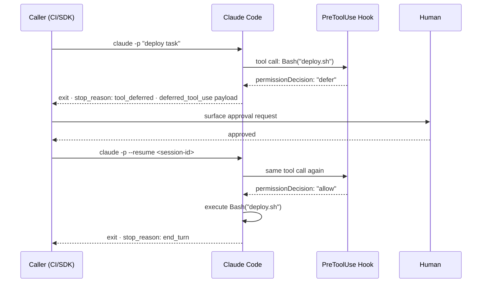

# Deferred Permission Pattern

> A `PreToolUse` hook returns `"defer"` to pause a headless Claude Code session at a tool call, exit cleanly with the pending call serialized, and resume after the caller collects human approval through its own UI.

## The Problem

Headless Claude Code sessions (invoked with `-p`) cannot display interactive permission prompts. When an agent running in CI or inside an Agent SDK subprocess reaches a sensitive operation — a deployment command, a file deletion, an `AskUserQuestion` — the session either blocks waiting for input that will never come, or it fails.

The alternatives before `"defer"` existed:

- **`"deny"`** — blocks the tool call, but the agent loses in-flight state and must start over
- **`"allow"` with broad rules** — bypasses approval entirely, removing the human gate
- **Restructure the task** — split into pre-approval and post-approval phases, complicating the agent design

`"defer"` adds a fourth path: pause cleanly, hand the pending call to the caller, and resume exactly where execution stopped.

## How It Works

`PreToolUse` hooks accept four return values for `permissionDecision`: `allow`, `deny`, `ask`, and `defer`. When a hook returns `"defer"` in headless mode ([Claude Code v2.1.89+](https://code.claude.com/docs/en/changelog)):

1. Claude Code exits immediately with `stop_reason: "tool_deferred"`
2. The `deferred_tool_use` payload — tool name, tool ID, and full input — is included in the JSON output
3. The session transcript is preserved on disk under the session ID
4. The calling process reads `deferred_tool_use`, surfaces the decision through its own UI, and waits for a human response
5. The caller resumes with `claude -p --resume <session-id>`; the PreToolUse hook runs again and returns `"allow"` with the collected answer in `updatedInput`
6. The tool executes and the session continues from where it paused



## Key Constraints

**Headless mode only.** `"defer"` only works with the `-p` flag. In interactive sessions it has no effect ([hooks reference](https://code.claude.com/docs/en/hooks)).

**Single tool call per turn.** If Claude issues multiple tool calls in one turn, `defer` is ignored with a warning. Structure prompts to elicit one tool call at a time when deferred approval is needed.

**Decision precedence.** When multiple PreToolUse hooks return different decisions, `deny > defer > ask > allow`. A `deny` from any hook overrides a `defer`.

**Same permission mode on resume.** Pass the same `--permission-mode` flag used in the original invocation when resuming. Omitting it triggers a warning and may alter behavior.

**No timeout.** Sessions persist on disk indefinitely. The caller is responsible for expiry and cleanup.

## Example: AskUserQuestion in Headless Mode

`AskUserQuestion` normally requires an interactive terminal. With defer, the caller owns the interaction. When Claude calls `AskUserQuestion`, the hook returns `"defer"`:

```json
{
  "type": "result",
  "stop_reason": "tool_deferred",
  "session_id": "abc123",
  "deferred_tool_use": {
    "id": "toolu_01abc",
    "name": "AskUserQuestion",
    "input": {
      "questions": [
        {
          "question": "Deploy to production?",
          "header": "Confirm Deployment",
          "options": [{"label": "Yes"}, {"label": "No"}],
          "multiSelect": false
        }
      ]
    }
  }
}
```

The caller surfaces this in its own UI, collects `"Yes"`, then resumes. On resume, the same hook runs and returns `"allow"` with the answer injected:

```json
{
  "hookSpecificOutput": {
    "hookEventName": "PreToolUse",
    "permissionDecision": "allow",
    "updatedInput": {
      "questions": [{"question": "Deploy to production?", "header": "Confirm Deployment",
                     "options": [{"label": "Yes"}, {"label": "No"}], "multiSelect": false}],
      "answers": { "Deploy to production?": "Yes" }
    }
  }
}
```

## Comparison with PermissionDenied Hook

v2.1.89 also added a `PermissionDenied` hook event that fires when the auto-mode classifier denies a tool call. Returning `{retry: true}` tells Claude it can retry. This is distinct from deferred permission:

| | Deferred Permission | PermissionDenied Hook |
|---|---|---|
| **Trigger** | Hook returns `"defer"` | Auto-mode classifier blocks |
| **Effect** | Session pauses, exits | Model retries the call |
| **Human involvement** | Required (caller collects input) | Optional (hook may auto-retry) |
| **State preservation** | Full session on disk | In-flight, no exit |

## Key Takeaways

- `"defer"` turns a synchronous tool call into an async pause-resume handoff — the caller's UI owns the approval moment, not Claude Code's terminal
- The session transcript is fully preserved; no work is lost and no restart is needed
- Structure tasks to produce single tool calls per turn when defer is in play — multi-tool turns silently drop the defer decision
- Pass identical `--permission-mode` on resume to avoid permission mode drift
- `"defer"` complements `PermissionDenied` hooks but solves a different problem: external human approval vs. auto-mode retry logic

## Related

- [Harness Engineering](harness-engineering.md)
- [Agent Pushback Protocol](agent-pushback-protocol.md)
- [Human-in-the-Loop Confirmation Gates](../security/human-in-the-loop-confirmation-gates.md)
- [Session Initialization Ritual](session-initialization-ritual.md)
- [Rollback-First Design](rollback-first-design.md)
