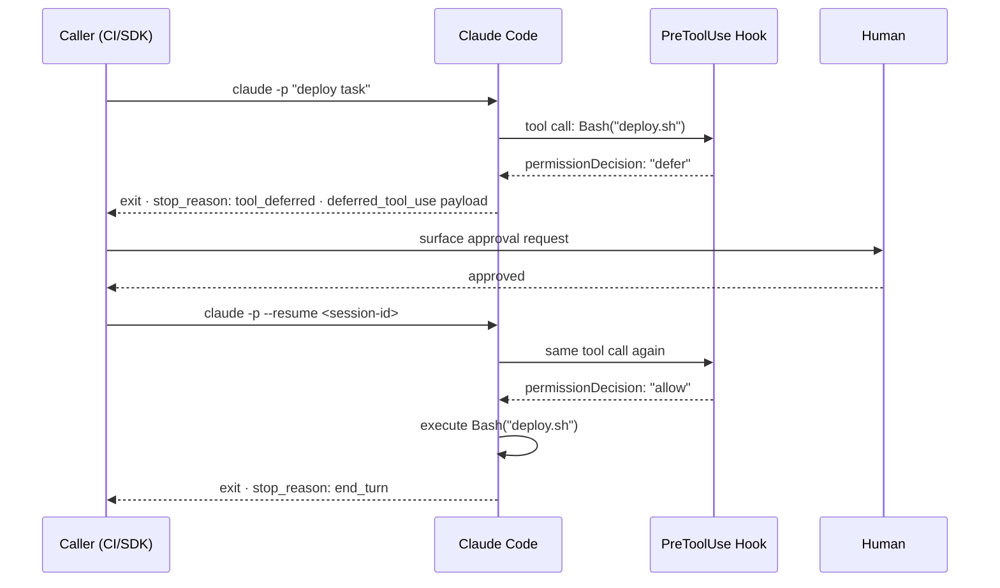

# Deferred Permission Pattern

> A `PreToolUse` hook returns `"defer"` to pause a headless Claude Code session at a tool call, exit cleanly with the pending call serialized, and resume after the caller collects human approval through its own UI.

## The problem

[Headless Claude Code sessions](../workflows/headless-claude-ci.md) (invoked with `-p`) cannot show interactive permission prompts. An agent in CI or inside an Agent SDK subprocess reaches a sensitive operation — a deployment command, a file deletion, an `AskUserQuestion`. The session blocks waiting for input that never comes, or it fails.

Before `"defer"` existed, the caller had three choices:

- `"deny"` — blocks the tool call, but the agent loses in-flight state and must start over
- `"allow"` with broad rules — skips approval and removes the human gate
- restructure the task — split it into pre-approval and post-approval phases, complicating the agent design

`"defer"` adds a fourth path: pause cleanly, hand the pending call to the caller, and resume where execution stopped.

## How it works

`PreToolUse` hooks accept four return values for `permissionDecision`: `allow`, `deny`, `ask`, and `defer`. When a hook returns `"defer"` in headless mode ([Claude Code v2.1.89+](https://code.claude.com/docs/en/changelog)):

1. Claude Code exits immediately with `stop_reason: "tool_deferred"`
2. The `deferred_tool_use` payload — tool name, tool ID, and full input — is included in the JSON output
3. The session transcript is preserved on disk under the session ID
4. The calling process reads `deferred_tool_use`, surfaces the decision through its own UI, and waits for a human response
5. The caller resumes with `claude -p --resume <session-id>`; the PreToolUse hook runs again and returns `"allow"` with the collected answer in `updatedInput`
6. The tool executes and the session continues from where it paused


```mermaid
sequenceDiagram
    participant C as Caller (CI/SDK)
    participant CC as Claude Code
    participant H as PreToolUse Hook
    participant U as Human

    C->>CC: claude -p "deploy task"
    CC->>H: tool call: Bash("deploy.sh")
    H-->>CC: permissionDecision: "defer"
    CC-->>C: exit · stop_reason: tool_deferred · deferred_tool_use payload
    C->>U: surface approval request
    U-->>C: approved
    C->>CC: claude -p --resume <session-id>
    CC->>H: same tool call again
    H-->>CC: permissionDecision: "allow"
    CC->>CC: execute Bash("deploy.sh")
    CC-->>C: exit · stop_reason: end_turn
```

## Key constraints

Headless mode only. `"defer"` works only with the `-p` flag. In interactive sessions it has no effect ([hooks reference](https://code.claude.com/docs/en/hooks)).

Single tool call per turn. If Claude issues several tool calls in one turn, `defer` is ignored with a warning. When you need deferred approval, prompt for one tool call at a time.

Decision precedence. When several PreToolUse hooks return different decisions: `deny > defer > ask > allow`. A `deny` from any hook overrides a `defer`.

Same permission mode on resume. Pass the same `--permission-mode` flag you used in the original invocation. Omitting it triggers a warning and may change behavior.

No timeout. Sessions persist on disk indefinitely. The caller is responsible for expiry and cleanup.

## Example: AskUserQuestion in headless mode

`AskUserQuestion` normally requires an interactive terminal. With defer, the caller owns the interaction. When Claude calls `AskUserQuestion`, the hook returns `"defer"`:

```json
{
  "type": "result",
  "stop_reason": "tool_deferred",
  "session_id": "abc123",
  "deferred_tool_use": {
    "id": "toolu_01abc",
    "name": "AskUserQuestion",
    "input": {
      "questions": [
        {
          "question": "Deploy to production?",
          "header": "Confirm Deployment",
          "options": [{"label": "Yes"}, {"label": "No"}],
          "multiSelect": false
        }
      ]
    }
  }
}
```

The caller surfaces this in its own UI, collects `"Yes"`, then resumes. On resume, the same hook runs and returns `"allow"` with the answer injected:

```json
{
  "hookSpecificOutput": {
    "hookEventName": "PreToolUse",
    "permissionDecision": "allow",
    "updatedInput": {
      "questions": [{"question": "Deploy to production?", "header": "Confirm Deployment",
                     "options": [{"label": "Yes"}, {"label": "No"}], "multiSelect": false}],
      "answers": { "Deploy to production?": "Yes" }
    }
  }
}
```

## Why it works

Before exiting, Claude Code serializes the full session transcript — conversation history, tool state, and the pending invocation — to disk under the session ID. `--resume` rehydrates that transcript, so the model context is byte-identical to the moment before exit. The `deferred_tool_use` payload gives the caller the tool name, ID, and input it needs to surface the approval. On resume, `PreToolUse` fires again for the same call, and `"allow"` with `updatedInput` injects the answer before execution. The design separates the approval moment, owned by the caller's UI, from the execution moment, owned by Claude Code — without blocking, polling, or restarting.

## When this backfires

`"defer"` adds caller-side complexity. Consider the alternatives when:

- task state is negligible. For short, stateless tasks, a restart can cost less than wiring up pause and resume. Splitting into pre-approval and post-approval phases is simpler.
- multi-tool turns are unavoidable. If the agent reliably issues several tool calls per turn, `"defer"` silently no-ops. Forcing single-tool turns can cost more in agent quality than it gains in safety.
- session storage is constrained. Deferred sessions persist indefinitely. High-volume CI with many concurrent agents builds up unresumed sessions, and the caller must own the cleanup.
- the caller has no UI surface. `"defer"` assumes the process can route `deferred_tool_use` to a human. A fully automated pipeline with no approval channel hangs, unless the hook falls back to `"allow"` or `"deny"` after a timeout. That fallback reintroduces the ambiguity `"defer"` was meant to resolve.

## Comparison with PermissionDenied hook

v2.1.89 also added a `PermissionDenied` hook event that fires when the [auto-mode](../tools/claude/auto-mode.md) classifier denies a tool call. Returning `{retry: true}` tells Claude it can retry. This is distinct from deferred permission:

| | Deferred permission | PermissionDenied hook |
|---|---|---|
| Trigger | Hook returns `"defer"` | Auto-mode classifier blocks |
| Effect | Session pauses, exits | Model retries the call |
| Human involvement | Required (caller collects input) | Optional (hook may auto-retry) |
| State preservation | Full session on disk | In-flight, no exit |

## Key Takeaways

- `"defer"` turns a synchronous tool call into an async pause-resume handoff — the caller's UI owns the approval moment, not Claude Code's terminal
- The session transcript is fully preserved; no work is lost and no restart is needed
- Structure tasks to produce single tool calls per turn when defer is in play — multi-tool turns silently drop the defer decision
- Pass identical `--permission-mode` on resume to avoid permission mode drift
- `"defer"` complements `PermissionDenied` hooks but solves a different problem: external human approval vs. auto-mode retry logic

## Related

- [Harness Engineering](harness-engineering.md)
- [Agent Pushback Protocol](agent-pushback-protocol.md)
- [Human-in-the-Loop Confirmation Gates](../security/human-in-the-loop-confirmation-gates.md)
- [Session Initialization Ritual](session-initialization-ritual.md)
- [Rollback-First Design](rollback-first-design.md)
- [Override Pattern: Reusing Interactive Commands in Automated Pipelines](../tool-engineering/override-interactive-commands.md)
